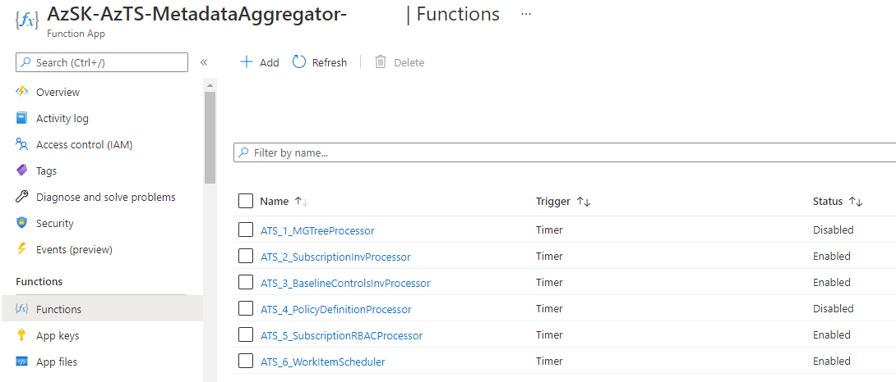

## Setting up Azure Tenant Security Solution - Step by Step
In this section, we will walk through the steps of setting up AzTS Solution.


**Note:** You can download execution script present [here](../Scripts/ExecutionScript.ps1?raw=1) which has all commands mentioned in below steps


Setup is divided into five steps:

**1. Validate prerequisites on machine**  

  i) Installation steps are supported using following OS options: 	

  - Windows 10
  - Windows Server 2019

  ii) PowerShell 5.0 or higher

  All setup steps will be performed with the help of PowerShell ISE console. If you are unaware of PowerShell ISE, refer [link](00b-Getting-Started-PowerShell-Tips#powershell-tips-for-new-azsk-users) to get basic understanding.
  Ensure that you are using Windows OS and have PowerShell version 5.0 or higher by typing **$PSVersionTable** in the PowerShell ISE console window and looking at the PSVersion in the output as shown below.) 
  If the PSVersion is older than 5.0, update PowerShell from [here](https://www.microsoft.com/en-us/download/details.aspx?id=54616).  

     


**2. Installing Az Modules:**

Az modules contains cmdlet to deploy Azure resources. These cmdlets is used to create AzTS scan solution resources with the help of ARM template.
Install Az Powershell Modules using below command. 
For more details of Az Modules refer [link](https://docs.microsoft.com/en-us/powershell/azure/install-az-ps)

``` Powershell
# Install Az Modules
Install-Module -Name Az.Accounts -AllowClobber -Scope CurrentUser -repository PSGallery
Install-Module -Name Az.Resources -AllowClobber -Scope CurrentUser -repository PSGallery
Install-Module -Name Az.Storage -AllowClobber -Scope CurrentUser -repository PSGallery
Install-Module -Name Az.ManagedServiceIdentity -AllowClobber -Scope CurrentUser -repository PSGallery
```

``` Powershell
# Install AzureAd 
Install-Module -Name AzureAD -AllowClobber -Scope CurrentUser -repository PSGallery
```

**3. Setting up scanning identity**  

The AzTS setup basically provisions your subscriptions with the ability to do daily scans for security controls.
To do the scanning, it requires a [User-assigned Managed Identity](https://docs.microsoft.com/en-us/azure/active-directory/managed-identities-azure-resources/overview) (central scanning identity owned by you) and 'Reader' access to target subscriptions on which scan needs to be performed. 

Before creating user-assigned managed identity, please connect to AzureAD and AzAccount with the tenant Id where you want to use AzTS solution.


``` Powershell
Connect-AzAccount -Tenant <TenantId>
Connect-AzureAD -TenantId <TenantId>
```

i) You can create user-assigned managed identity with below PowerShell command or Portal steps [here](https://docs.microsoft.com/en-us/azure/active-directory/managed-identities-azure-resources/how-to-manage-ua-identity-portal)

``` Powershell

# Step 1: Set context to subscription where user-assigned managed identity needs to be created
Set-AzContext -SubscriptionId <MIHostingSubId>

# Step 2: Create resource group where user-assigned MI resource will be created. 
New-AzResourceGroup -Name <MIHostingRGName> -Location <Location> 

# Step 3: Create user-assigned managed identity 
$UserAssignedIdentity = New-AzUserAssignedIdentity -ResourceGroupName <MIHostingRGName> -Name <USER ASSIGNED IDENTITY NAME>

# Step 4: Save resource id generated for user identity using below command. This will be used in AzTS Soln installation. 

$UserAssignedIdentity.Id

```

ii) Assign reader access to user-assigned managed identity on target subscriptions needs to be scanned. 


``` Powershell

# Add target subscriptionds in place of <SubIdx>
$TargetSubscriptionIds = @("<SubId1>","<SubId2>","<SubId3>")

$TargetSubscriptionIds | % {
New-AzRoleAssignment -ApplicationId $UserAssignedIdentity.ClientId -Scope "/subscriptions/$_" -RoleDefinitionName "Reader"
}

```

  **Note:** If subscriptions are organized under [Management Groups](https://docs.microsoft.com/en-us/azure/governance/management-groups/overview) (MG), you can assign reader role for user-assigned identity using MG role assignment. You need to be 'Owner' on target subscription to perform role assignment.  

**4. Download and extract deployment package**
 
 Deployment packages mainly contains 
 ARM template: Contains resource configuration details that needs to be created as part of setup
 Deployment setup script: Provides the cmdlet to run installation. 

i) Download deployment package zip from [here](https://github.com/azsk/DevOpsKit-docs/raw/users/TenantSecurity/13-Tenant%20Security%20Solution%20Setup/TemplateFiles/Deploy.zip) to your local machine.  

ii) Extract zip to local folder location

iii) Unblock the content. Below command will help to unblock files. 

``` PowerShell
Get-ChildItem -Path "<Extracted folder path>" -Recurse |  Unblock-File 
```

iv) Point current path to deployment folder and load AzTS setup script
``` PowerShell
# Point current path to extracted folder location and load setup script from deploy folder 

CD "<LocalExtractedFolderPath>\Deploy"

# Load AzTS Setup script in session
. ".\AzTSSetup.ps1"

# Note: Make sure you copy  '.' present at the start of line.

```

[Back to top…](Readme.md#contents)

**5. Run Setup Command** 

This is the last step. You need to run install command present as part setup scription with host subscription id (sub where scanning infra resources will get created). 
Setup will create infra resources and schedule daily security control scan on target subscriptions.

**Note:** Setup may take upto 5 minutes to complete.

  ``` PowerShell

  # Set the context to hosting subscription
  Set-AzContext -SubscriptionId <HostingSubId>


  2. Run installation command with required parameters given. 

  # Step 2: Run installation command. 

  Install-AzSKTenantSecuritySolution `
                  -SubscriptionId <HostingSubId> `
                  -ScanHostRGName <HostingResourceGroupName> `
                  -ScanIdentityId <ManagedIdentityResourceId> `
                  -Location <ResourceLocation> `
                  -Verbose

  # For ScanIdentityId parameter, use value created for "$UserAssignedIdentity.Id" from prerequisite section step 3 or you can get this resources id by going into Azure Portal --> Subscription where user-assigned MI resource created --> MIHostingRG --> Click on MI resource --> Properties --> Copy ResourceId. 

  # Example:

  Install-AzSKTenantSecuritySolution `
                  -SubscriptionId bbbe2e73-fc26-492b-9ef4-adec8560c4fe `
                  -ScanHostRGName AzSK-AzTS-Solution-RG `
                  -ScanIdentityId '/subscriptions/bbbe2e73-fc26-492b-9ef4-adec8560c4fe/resourceGroups/TenantReaderRG/providers/Microsoft.ManagedIdentity/userAssignedIdentities/TenantReaderUserIdentity' `
                  -Location EastUS2 `
                  -Verbose
  ```
  Output looks like below

  


**Parameter details:**

|Param Name|Description|Required?
|----|----|----|
|SubscriptionId|Hosting subscription id where Azure Tenant solution will be deployed |TRUE|
|ScanHostRGName| Name of ResourceGroup where setup resources will be created |TRUE|
|ScanIdentityId| Resource id of user managed identity used to scan subscriptions  |TRUE|
|Location|Location where all resources will get created |TRUE|
|Verbose| Switch used to output detailed log |FALSE|


## Verifying that Tenant Security Solution installation is complete

Below steps will help you to verify and understand different resources and functions created as part of setup along with purpose. 

**1: Verify resources created as part of setup** 

i) In the Azure portal, Go to hosting subscription, select the scan host resource group that has been created during the setup.

**2:** Verify below resources got created. 

	

**Resources details:**

|Resource Name|Resource Type|Description|
|----|----|----|
|AzSK-AzTS-MetadataAggregator-xxxxx|Function App| Contains functions to get inventory (subscription, baseline controls and RBAC) and queue subscription for scan |
|AzSK-AzTS-WorkItemProcessor-xxxxx|Function App | Contains function to scan subscription with baseline control |
|AzSK-AzTS-AutoUpdater-xxxxx|Function App | Contains function to scan automatically updater function apps and web service apps |
|AzSK-AzTS-LAWorkspace-xxxxx|Log Analytics workspace| Used to store scan events, inventory, subscription scan progress details|
|AzSK-AzTS-InternalMI|Managed Identity | Internal MI identity used to access LA workspace and storage for sending scan results|
|AzSK-AzTS-AppServicePlan | Function App Service Plan| Function app service plan|
|azsktsstoragexxxxx|Storage Account| Used to store the daily results of subscriptions scan|
|AzSK-AzTS-AppInsights |App Insight| Used to collect telemetry logs from functions |

 **3:** Verify below Functions got created

 **i) MetadataAggregator Functions:** 

Metadata aggregator function performs two tasks: 
1. Collects inventory required for scanning (Target subscription list to be scanned, baseline controls list and subscription RBAC details)
2. Queue subscriptions for scanning

Click on 'AzSK-AzTS-MetadataAggregator-xxxxx' function app present in scan hosting RG --> Click on 'Functions' tab in left menu



|Function Name|Description|
|----|----|
|ATS_1_SubscriptionInvProcessor| Responsible to fetch details about all the subscriptions that has been granted access as Reader using central MI. All these subscriptions will be fetched by the job and persisted into LA. These subscriptions are scanned automatically by the consecutive jobs.
|ATS_2_BaselineControlsInvProcessor| Responsible to push baseline controls metadata to LA and storage account
|ATS_3_SubscriptionRBACProcessor| Collects RBAC details of subscription to be scanned. RBAC collected used to scan the control like "Azure_Subscription_AuthZ_Dont_Use_NonAD_Identities" 
|ATS_4_WorkItemScheduler|  Responsible to queue up subscriptions as workitems for scanning. It also reconciles the errored subscriptions through retries in the end. By default it would retry to scan for 5 times for each error subscription. IF there is nothing to process for the day, it would simply ignore the run.

 **ii) WorkItemProcessor Functions:** 
 
 Read subscription list from queue and scan for baseline controls.


> **Note:** Functions are scheduled to run from UTC 00:00 time. You can also run the functions manually in sequence with an internval of 10 mins in each function trigger

Steps to trigger the functions

Click on 'AzSK-AzTS-MetadataAggregator-xxxxx' function app present in scan hosting RG --> Click on 'Functions' tab --> Select 'ATS_1_SubscriptionInvProcessor' --> Click on 'Code + Test' --> Click 'Test/Run' --> Click 'Run'

Similarly, you can trigger below functions with 10 mins internval.

 * ATS_2_BaselineControlsInvProcessor

 * ATS_3_SubscriptionRBACProcessor 
 
 * ATS_4_WorkItemScheduler 

After ATS_4_WorkItemScheduler completes pushing the messages in the queue, WorkItemProcessor will get autotrigged, start processing scan and push scan results in storage account and LA workspace. 

 **iii) AutoUpdater Functions:** 
 
 Timer based function app to automatically update other function apps(Metadataaggregator and WorkItemProcessor) and azure web service app(UI and API). User has the option to configure AutoUpdater settings like isAutoUpdateOn(user wants to auto update with new releases), VersionType(user wants to install the latest release/stable release/specific version).
 
 AutoUpdater is a cron job which runs every 5 hrs automatically to check for new release to update the apps. You can also manually trigger the AutoUpdater function if needed.
 Our AutoUpdater is robust enough to handle different configuration for each function apps or web service apps.

> **Note:** If you want to install specific version for each different apps(or a specific version for all) follow the below steps,
(i) Change the VersionType from **"stable/latest"** to the required version number eg., **"x.y.z"**,
(ii) Manually trigger the AutoUpdate function app. You can view the console/monitor logs to see appropriate status of AutoUpdater function.
(iii) After AutoUpdater function execution gets complete, you need to change **isAutoUpdateOn** to **false** through the app configuration setting for the apps where you want to keep custom version installed.

## Log Analytics Visualization

For understanding the collected data, use the querying and visualization capabilities provided by Log Analytics. 
To start, go to **Log Analytics workspace** created during setup --> Select **Logs**. 


Few more simple queries to try

#### A. Inventory summary

##### Subscription Inventory 

``` KQL

AzSK_SubInventory_CL
| where TimeGenerated > ago(1d)
| where JobId_d ==  toint(format_datetime(now(), 'yyyyMMdd'))
| where State_s != 'Disabled'
| summarize arg_max(TimeGenerated, *) by SubscriptionId
| distinct SubscriptionId, Name_s

```

##### Baseline control list supported by AzTS Scan

``` KQL
AzSK_BaselineControlsInv_CL
| where TimeGenerated > ago(1d)
| summarize arg_max(TimeGenerated, *) by ControlId_s
| project ControlId_s, ResourceType, Description_s, ControlSeverity_s, Tags_s
```

#### Role-based access control (RBAC) summary

``` KQL
AzSK_RBAC_CL
| where TimeGenerated > ago(1d) and JobId_d == toint(format_datetime(now(), 'yyyyMMdd')) 
| summarize arg_max(TimeGenerated, *) by RoleId_g, RoleId_s
| project ObjectId = UserName_g, AccountType_s,RoleName_s, IsPIMEligible_b, Scope_s
```

#### Subscription scanned today

``` KQL
AzSK_ProcessedSubscriptions_CL
|  where TimeGenerated > ago(1d) and JobId_d == toint(format_datetime(now(), 'yyyyMMdd')) and EventType_s =~"Completed"
| summarize arg_max(TimeGenerated,*) by SubscriptionId
| project ScanTimeInUTC = TimeGenerated, SubscriptionId 
```

#### B. Control Scan Summary


##### Top 20 failing controls

``` KQL

AzSK_ControlResults_CL
| where TimeGenerated > ago(2d) 
| where JobId_d == toint(format_datetime(now(), 'yyyyMMdd'))
| summarize arg_max(TimeGenerated, *) by SubId = tolower(SubscriptionId), RId= tolower(ResourceId), ControlName_s
| summarize TotalControls = count(), FailedControl = countif(VerificationResult_s =~ "Failed") by ControlName_s
| order by FailedControl desc 
| take 20

```

##### Top 10 subscription with most failing controls

``` KQL
AzSK_ControlResults_CL
| where TimeGenerated > ago(1d)
| where JobId_d == toint(format_datetime(now(), 'yyyyMMdd'))
| summarize arg_max(TimeGenerated, *) by SubscriptionId = tolower(SubscriptionId), ResourceId= tolower(ResourceId), ControlName_s
| where VerificationResult_s =~ "Failed"
| summarize FailedCount = count() by SubscriptionId
| order by FailedCount desc 
| take 10
```
