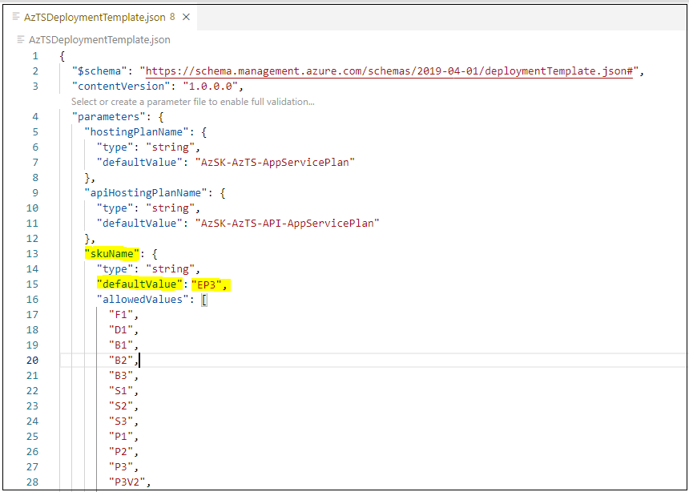
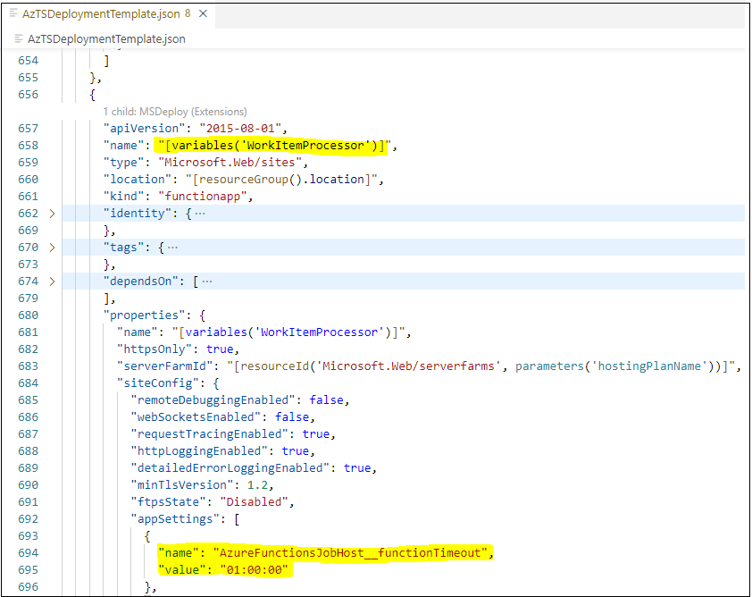

> The Azure Tenant Security Solution (AzTS) was created by the Core Services Engineering & Operations (CSEO) division at Microsoft, to help accelerate Microsoft IT's adoption of Azure. We have shared AzTS and its documentation with the community to provide guidance for rapidly scanning, deploying and operationalizing cloud resources, across the different stages of DevOps, while maintaining controls on security and governance.
<br>AzTS is not an official Microsoft product – rather an attempt to share Microsoft CSEO's best practices with the community..

</br>

# Setting up Azure Tenant Security (AzTS) Solution - Step by Step
 
</br>

##  On this page:
  - [Steps to install AzTS Solution](README.md#1-steps-to-install-AzTS-solution)
  - [Manually trigger AzTS on-demand scan for entire tenant](README.md#2-manually-trigger-azts-on-demand-scan-for-entire-tenant)
  - [Verifying that Tenant Security Solution installation is complete](README.md#3-verifying-that-tenant-security-solution-installation-is-complete)
  - [Log Analytics visualization](README.md#4-log-analytics-visualization)
  - [FAQ](README.md#faq)

--------------------------------------------------
</br>

## **1. Steps to install AzTS Solution**

In this section, we will walk through the steps of setting up AzTS Solution. This setup can take up to 30 minutes.

> _**Note:** You can download the deployment package zip from [here](../TemplateFiles/DeploymentFiles.zip?raw=1) and use **ExecutionScript.ps1** present in this package to run the commands mentioned in below steps. Before extracting the zip file, right click on the zip file --> click on 'Properties' --> Under the General tab in the dialog box, select the 'Unblock' checkbox --> Click on 'OK' button._

This setup is divided into six steps:

1. [Validate prerequisites on machine](README.md#step-1-of-6-validate-prerequisites-on-machine)
2. [Installing required Az modules](README.md#step-2-of-6-installing-required-az-modules)
3. [Download and extract deployment package](README.md#step-3-of-6-download-and-extract-deployment-package)
4. [Setup central scanning managed identity](README.md#step-4-of-6-setup-central-scanning-managed-identity)
5. [Create Azure AD application for secure authentication](README.md#step-5-of-6-create-azure-ad-application-for-secure-authentication)
6. [Run Setup Command](README.md#step-6-of-6-run-setup-command)

> _**Note**: You will need help of Azure Active Directory (AD) administrator in step 4, 5 and 6 to grant Microsoft.Graph permission._

Let's start!

### **Step 1 of 6. Validate prerequisites on machine**  

  1. a.  Installation steps are supported using following OS options: 	

      - Windows 10
      - Windows Server 2019
  
  </br>

  1. b. PowerShell 5.0 or higher
  All setup steps will be performed with the help of PowerShell ISE console. If you are unaware of PowerShell ISE, refer [link](PowerShellTips.md) to get a basic understanding.
  Ensure that you are using Windows OS and have PowerShell version 5.0 or higher by typing **$PSVersionTable** in the PowerShell ISE console window and looking at the PSVersion in the output as shown below.) 
  If the PSVersion is older than 5.0, update PowerShell from [here](https://www.microsoft.com/en-us/download/details.aspx?id=54616).  

      

</br>

[Back to top…](README.md#setting-up-azure-tenant-security-azts-solution---step-by-step)

### **Step 2 of 6. Installing required Az modules**

Az modules contain cmdlet to deploy Azure resources. These cmdlets are used to create AzTS scan solution resources with the help of ARM template.
Install Az PowerShell Modules using the below command. 
For more details of Az Modules refer [link](https://docs.microsoft.com/en-us/powershell/azure/install-az-ps).

``` PowerShell
# Install required Az modules
# Required versions: 
#   Az.Accounts >= 1.7.1
#   Az.Resources >= 1.10.0
#   Az.Storage >= 1.12.0
#   Az.ManagedServiceIdentity >= 0.7.3
#   Az.Monitor >= 1.5.0
#   Az.OperationalInsights >= 1.3.4
#   Az.ApplicationInsights >= 1.0.3
#   Az.Websites >= 1.6.0
Install-Module -Name Az.Accounts -AllowClobber -Scope CurrentUser -repository PSGallery
Install-Module -Name Az.Resources -AllowClobber -Scope CurrentUser -repository PSGallery
Install-Module -Name Az.Storage -AllowClobber -Scope CurrentUser -repository PSGallery
Install-Module -Name Az.ManagedServiceIdentity -AllowClobber -Scope CurrentUser -repository PSGallery
Install-Module -Name Az.Monitor -AllowClobber -Scope CurrentUser -repository PSGallery
Install-Module -Name Az.OperationalInsights -AllowClobber -Scope CurrentUser -repository PSGallery
Install-Module -Name Az.ApplicationInsights -AllowClobber -Scope CurrentUser -repository PSGallery
Install-Module -Name Az.Websites -AllowClobber -Scope CurrentUser -repository PSGallery

# Install AzureAd 
# Required version:
#   AzureAD >= 2.0.2.130
Install-Module -Name AzureAD -AllowClobber -Scope CurrentUser -repository PSGallery
```

[Back to top…](README.md#setting-up-azure-tenant-security-azts-solution---step-by-step)

### **Step 3 of 6. Download and extract deployment package**
 
 Deployment package mainly contains:
 1. **ARM templates** which contains resource configuration details that need to be created as part of the setup.
 2.  **Deployment setup scripts** which provides the cmdlet to run installation. <br/>

If you have already downloaded the deployment package zip, directly go to step (3.d).

3.a. Download deployment package zip from [here](../TemplateFiles/DeploymentFiles.zip?raw=1) to your local machine. </br>

3.b. Extract zip to local folder location. <br/>

3.c. Unblock the content. The below command will help to unblock files. <br/>

  ``` PowerShell
  Get-ChildItem -Path "<Extracted folder path>" -Recurse |  Unblock-File 
  ```

3.d. Point current path to deployment folder and load AzTS setup script <br/>


  ``` PowerShell
  # Point current path to extracted folder location and load setup script from the deployment folder 

  CD "<LocalExtractedFolderPath>\DeploymentFiles"

  # Load AzTS Setup script in session
  . ".\AzTSSetup.ps1"

  # Note: Make sure you copy  '.' present at the start of the line.

  ```

[Back to top…](README.md#setting-up-azure-tenant-security-azts-solution---step-by-step)

### **Step 4 of 6. Setup central scanning managed identity**  

The AzTS setup provisions your subscriptions with the ability to do daily scans for security controls.
To do the scanning, it requires a [User-assigned Managed Identity](https://docs.microsoft.com/en-us/azure/active-directory/managed-identities-azure-resources/overview) (central scanning identity owned by you) which has 'Reader' access on target subscriptions on which scan needs to be performed.

> _Note:_
> 1. _If subscriptions are organized under [Management Groups](https://docs.microsoft.com/en-us/azure/governance/management-groups/overview) (MG), you can assign reader role for central scanning identity using MG role assignment using [Azure Portal](https://docs.microsoft.com/en-us/azure/security-center/security-center-management-groups#assign-azure-roles-to-other-users). For this you need to be 'Owner' on management group level to perform role assignment._
> 
> 2. _All subscriptions and management groups fold up to the one root management group within the directory. To scan all the subscriptions in your tenant, you can assign reader role at root management group scope. Azure AD Global Administrators are the only users who can grant access at this scope._
> 

</br>

Before creating central scanning user-assigned managed identity, please log in to Azure Portal and Azure Active Directory (AD) where you want to install the AzTS solution using the following PowerShell command.

``` PowerShell
# Clear existing login, if any

Disconnect-AzAccount
Disconnect-AzureAD

# Connect to AzureAD and AzAccount
# Note: Tenant Id *must* be specified when connecting to Azure AD and AzAccount

$TenantId = "<TenantId>"
Connect-AzAccount -Tenant $TenantId
Connect-AzureAD -TenantId $TenantId
```

  **4.a. Create central scanner MI and grant 'Reader' permission on target subscriptions:** You can create a user-assigned managed identity (scanner MI)  for centrally scanning subscriptions in your tenant using the following `Set-AzSKTenantSecuritySolutionScannerIdentity` PowerShell command or Portal steps [here](https://docs.microsoft.com/en-us/azure/active-directory/managed-identities-azure-resources/how-to-manage-ua-identity-portal). The PowerShell command creates a user-assigned managed identity (scanner MI) and assigns 'Reader' access to this MI on target subscriptions. You need to be 'Owner' on target subscription to perform role assignment.

> **Note:** <br> _As a security best practice, we recommend creating central scanning identity in an isolated subscription with limited permission to secure access to this identity._

``` PowerShell
# -----------------------------------------------------------------#
# Step 1: Create central scanning user-assigned managed identity
# -----------------------------------------------------------------#

$UserAssignedIdentity = Set-AzSKTenantSecuritySolutionScannerIdentity `
                                                -SubscriptionId <MIHostingSubId> `
                                                -ResourceGroupName <MIHostingRGName> `
                                                -Location <Location> `
                                                -UserAssignedIdentityName <MIName> `
                                                -TargetSubscriptionIds @("<SubId1>","<SubId2>","<SubId3>")

# -----------------------------------------------------------------#
# Step 2: Save resource id and principal Id generated for user identity using the below command. This will be used in AzTS Soln installation. 
# -----------------------------------------------------------------#

# Resource id of the user-assigned managed identity
$UserAssignedIdentity.Id

# Object id of the user-assigned managed identity
$UserAssignedIdentity.PrincipalId 

```

**Parameter details:**
|Param Name|Description|Required?
|----|----|----|
| SubscriptionId| Subscription id in which scanner MI needs to be created.| Yes|
|ResourceGroupName| Resource group name in which scanner MI needs to be created.|Yes|
|Location| Location in which scanner MI needs to be created. For better performance, we recommend hosting the MI and resources setup using AzTS Soln installation command in one location.| Yes|
|UserAssignedIdentityName| Name of the scanner MI.| Yes|
|TargetSubscriptionIds| List of target subscription id(s) that needs to be scanned by AzTS. This command assigns 'Reader' access to user-assigned managed identity on target subscriptions.|No|

</br>

**4.b. Grant MS Graph read access:** The scanner MI requires MS Graph permission to read data in your organization's directory, such as users, groups and apps and to validate Role-based access control (RBAC) using Azure AD Privileged Identity Management (PIM). This permission is required for the evaluation of RBAC based controls in AzTS.
</br>

``` PowerShell

# Grant Graph Permission to the user-assigned managed identity.
# Required Permission: Global Administrator or Privileged Role Administrator.

Grant-AzSKGraphPermissionToUserAssignedIdentity `
                            -UserAssignedIdentityObjectId $UserAssignedIdentity.PrincipalId `
                            -MSGraphPermissionsRequired @("PrivilegedAccess.Read.AzureResources", "Directory.Read.All") `
                            -ADGraphPermissionsRequired @("Directory.Read.All") 

```


> **Note:** 
> 1. _This step requires admin consent. Therefore, the signed-in user must be a member of one of the following administrator roles: Global Administrator or Privileged Role Administrator. If you do not have the required permission, please contact your administrator to get "PrivilegedAccess.Read.AzureResources" and "Directory.Read.All" permission for your scanner MI in Azure Active Directory using [this PowerShell script](../Scripts/ScriptToGrantGraphPermissionToScannerMI.ps1?raw=1). To run this script, you need to provide the object id of the user-assigned managed identity (scanner MI) created in **step 4.a**._
> 
> 2. _You can proceed without this step, however, the AzTS Soln will run with limited functionality such as the solution will not be able to scan RBAC controls, classic administrator of a subscription will not be able to use the user interface provided by AzTS Soln (AzTS UI) to request on-demand scan, view control failures etc.,_
>
> </br>

</br>

[Back to top…](README.md#setting-up-azure-tenant-security-azts-solution---step-by-step)

### **Step 5 of 6. Create Azure AD application for secure authentication**

Tenant reader solution provides a UI-based tool that can be used to perform on-demand scans to verify your fixes sooner, check reasons for control failures and view the latest scan results. This step is required to secure the login and authentication process from UI. Use the `Set-AzSKTenantSecurityADApplication` PowerShell command below to configure the Azure AD applications.

The `Set-AzSKTenantSecurityADApplication` PowerShell command will perform the following operations:

   1. Create Azure AD application for UI, if it does not exist. 
   2. Create Azure AD application for backend API, if it does not exist. 
   3. Update UI AD application redirection URL. 
   4. Grant AD applications permission to request OAuth2.0 implicit flow access tokens. This is required for browser-based apps. 
   5. Grant 'User.Read' permission to UI AD application. This permission is used to read logged in user's details such as name, email, and photo.

> _**Note:** If you do not have the permission to run this command, please contact your administrator to complete the setup using [this PowerShell script](../Scripts/ScriptToSetupAzureADApplicationForAzTSUI.ps1?raw=1). To run this script, you need to provide the subscription id and resource group name in which AzTS solution needs to be installed._

``` PowerShell
# -----------------------------------------------------------------#
# Step 1: Setup AD application for AzTS UI and API
# -----------------------------------------------------------------#

# Add subscription id in which Azure Tenant Security Solution needs to be installed.
$HostSubscriptionId = <HostSubscriptionId>

# Add resource group name in which Azure Tenant Security Solution needs to be installed.
$HostResourceGroupName = <HostResourceGroupName>

$ADApplicationDetails = Set-AzSKTenantSecurityADApplication -SubscriptionId $HostSubscriptionId -ScanHostRGName $HostResourceGroupName

# -----------------------------------------------------------------#
# Step 2: Save WebAPIAzureADAppId and UIAzureADAppId generated for Azure AD application using the below command. This will be used in AzTS Soln installation. 
# -----------------------------------------------------------------#

# Azure AD application client (application) ids 
$ADApplicationDetails.WebAPIAzureADAppId
$ADApplicationDetails.UIAzureADAppId 

```

[Back to top…](README.md#setting-up-azure-tenant-security-azts-solution---step-by-step)

### **Step 6 of 6. Run Setup Command** 

This is the last step. You need to run install command present as part setup script with host subscription id (sub where scanning infra resources will get created). 
Setup will create infra resources and schedule daily security control scan on target subscriptions. Please validate you have 'Owner' access on the subscription where the solution needs to be installed.

> **Note:**
> 1. _Setup may take up to 5 minutes to complete._
> 2. _For better performance, we recommend using one location for hosting central scanning user-assigned MI and resources which will be created in the following installation steps using the `Install-AzSKTenantSecuritySolution` cmdlet._
>
> &nbsp;

6.a. Run installation command with required parameters. 

  ``` PowerShell
# -----------------------------------------------------------------#
# Step 1: Set the context to hosting subscription
# -----------------------------------------------------------------#
Set-AzContext -SubscriptionId <HostSubscriptionId>

# -----------------------------------------------------------------#
# Step 2: Run installation command.
# -----------------------------------------------------------------#

$DeploymentResult = Install-AzSKTenantSecuritySolution `
                -SubscriptionId <HostSubscriptionId> `
                -ScanHostRGName <HostResourceGroupName> `
                -Location <ResourceLocation> `
                -ScanIdentityId <ManagedIdentityResourceId> `
                -WebAPIAzureADAppId <WebAPIAzureADApplicationId> `
                -UIAzureADAppId <UIAzureADApplicationId> `
                -AzureEnvironmentName AzureCloud `
                -SendUsageTelemetry:$true `
                -ScanIdentityHasGraphPermission:$true `
                -SendAlertNotificationToEmailIds @('<EmailId1>', '<EmailId2>', '<EmailId3>') `
                -Verbose

  # -----------------------------------------------------------------#
  # Step 3: Save internal user-assigned managed identity name generated using the below command. This will be used to grant Graph permission to internal MI.
  # -----------------------------------------------------------------#

# Name of the user-assigned managed identity created for internal operations
  $InternalIdentityObjectId = $DeploymentResult.Outputs.internalMIObjectId.Value
                  
  ```

  Example:
  ```PowerShell
  # Example:

    $DeploymentResult = Install-AzSKTenantSecuritySolution `
                    -SubscriptionId bbbe2e73-fc26-492b-9ef4-adec8560c4fe `
                    -ScanHostRGName AzSK-AzTS-Solution-RG `
                    -ScanIdentityId '/subscriptions/bbbe2e73-fc26-492b-9ef4-adec8560c4fe/resourceGroups/TenantReaderRG/providers/Microsoft.ManagedIdentity/userAssignedIdentities/TenantReaderUserIdentity' `
                    -Location EastUS2 `
                    -WebAPIAzureADAppId '000000xx-00xx-00xx-00xx-0000000000xx' `
                    -UIAzureADAppId '000000yy-00yy-00yy-00yy-0000000000yy' `
                    -AzureEnvironmentName AzureCloud `
                    -SendUsageTelemetry:$true `
                    -ScanIdentityHasGraphPermission:$true `
                    -SendAlertNotificationToEmailIds @('User1@Contoso.com', 'User2@Contoso.com', 'User3@Contoso.com') `
                    -Verbose


<#

For '-ScanIdentityId' parameter, 
          (a) use value created for "$UserAssignedIdentity.Id" from prerequisite section step 4.
                              OR
          (b) Run Set-AzSKTenantSecuritySolutionScannerIdentity command provided in step 4.
                              OR
          (c) you can get this resources id by going into Azure Portal --> Subscription where user-assigned MI resource created --> MIHostingRG --> Click on MI resource --> Properties --> Copy ResourceId.

#>

<#

For '-WebAPIAzureADAppId' and '-UIAzureADAppId' parameter,
          (a) use value created for "$ADApplicationDetails.WebAPIAzureADAppId" and "$ADApplicationDetails.UIAzureADAppId" respectively from step 5.
                                    OR
          (b) Run Set-AzSKTenantSecurityADApplication command provided in step 5.
                                    OR
          (c) you can get this application ids by going into Azure Portal --> Azure Active Directory --> App registrations --> All applications --> Search the application by name --> Click on the AD application --> Overview --> Copy Application (client) ID.

#>
```

  6.b. **Grant MS Graph read access:** AzTS Soln creates an Internal MI identity used to perform internal operations such as access LA workspace and storage for sending scan results. Internal MI is also used by AzTS UI to read the list of security groups that the user is a member of. For this purpose, internal MI requires 'User.Read.All' permission.
  </br>

  ``` PowerShell
      # Grant 'User.Read.All' permission to internal MI
      Grant-AzSKGraphPermissionToUserAssignedIdentity `
                          -UserAssignedIdentityObjectId  $InternalIdentityObjectId  `
                          -MSGraphPermissionsRequired @('User.Read.All')

  ```

  > **Note:** 
  > 01. _This step requires admin consent. To complete this step, the signed-in user must be a member of one of the following administrator roles: </br> Global Administrator or Privileged Role Administrator.</br>If you do not have the required permission, please contact your administrator to get 'User.Read.All' permission for the internal MI in Azure Active Directory using [this PowerShell script](../Scripts/ScriptToGrantGraphPermissionToInternalMI.ps1?raw=1). To run this script, you need to provide the object id of the user-assigned managed identity (internal MI) created in this step._
  > 
  > 2. _You can proceed without this step. However, please note that if this permission is not granted, users who log in to the AzTS UI will not be able to view subscriptions where they have been granted access to a subscription through a security group._

</br>

  Output looks like below,

  


**Parameter details:**

|Param Name|Description|Required?
|----|----|----|
|SubscriptionId|Hosting subscription id where Azure Tenant solution will be deployed |TRUE|
|ScanHostRGName| Name of ResourceGroup where setup resources will be created |TRUE|
|ScanIdentityId| Resource id of user managed identity used to scan subscriptions  |TRUE|
|Location|Location where all resources will get created |TRUE|
|WebAPIAzureADAppId| Application (client) id of the Azure AD application to be used by the API. | TRUE |
|UIAzureADAppId | Application (client) id of the Azure AD application to be used by the UI. | TRUE|
|SendAlertNotificationToEmailIds| Send monitoring alerts notification to the specified email ids. | TRUE |
|AzureEnvironmentName| Name of the Azure cloud where Azure Tenant solution will be deployed. The default value is AzureCloud.|FALSE|
|ScanIdentityHasGraphPermission|Switch to enable features dependent on Microsoft Graph API from the scan. Set this to false if user-assigned managed identity does not have Graph permission. The default value is false.|FALSE|
|SendUsageTelemetry| Permit application to send usage telemetry to Microsoft server. Usage telemetry captures anonymous usage data and sends it to Microsoft servers. This will help in improving the product quality and prioritize meaningfully on the highly used features. The default value is false.|FALSE|
|Verbose| Switch used to output detailed log |FALSE|

</br>


> **Note:** 
>
> 1. Tenant Security Solution does not support customization of the App Service name.
>
> 2. By default max timeout limit of function app is set to 9 minutes. This can be modified based on the requirement of your organization. To increase function timeout, you can upgrade to a higher App Service plan and use the `AzureFunctionsJobHost__functionTimeout` app setting in App Service to set the timeout value.
>
> </br>
<br>

**Congratulations! Installation is complete with this step.**
</br>

**Next steps:**

To view scan result in AzTS UI:
1. Copy the AzTS UI link provided at the end of the installation command.
2. We recommend creating a custom domain name for your UI. For steps to create a custom domain, refer to this [link](https://docs.microsoft.com/en-us/azure/app-service/app-service-web-tutorial-custom-domain).
3. AzTS UI is \*not\* available for use immediately after installation, as it requires one round of scan to complete to show the scan result in UI. Automated AzTS scans are configured to start at approximately 1:00 AM UTC. Therefore, you can use the [On-Demand scan](README.md#2-manually-trigger-azts-on-demand-scan-for-entire-tenant) command to trigger the scan immediately after installation.
4. Update org-subscription mapping for your subscription(s) in AzTS UI. By default, there is no service mapping for your subscription. Therefore, you see the 'Unknown' value in the Service Filter dropdown in AzTS UI. To add service mapping, follow the steps provided here: 
    - [Step 1: Prepare your org-subscription mapping](/02-Monitoring%20security%20using%20AzTS/README.md#step-1-prepare-your-org-subscription-mapping)
    - [Step 2: Upload your mapping to the Log Analytics (LA) workspace](/02-Monitoring%20security%20using%20AzTS/README.md#step-2-upload-your-mapping-to-the-log-analytics-la-workspace) 


[Back to top…](README.md#setting-up-azure-tenant-security-azts-solution---step-by-step)

</br>

## **2. Manually trigger AzTS on-demand scan for entire tenant**

> **Note:** 
> _AzTS has been designed to auto-trigger the scan once every 24 hours._ 

The following section will walk you through the steps to trigger AzTS scan manually post-installation.

### **Prerequisite**

1. [Validate prerequisites on machine](README.md#step-1-of-6-validate-prerequisites-on-machine)
2. [Installing required Az modules](README.md#step-2-of-6-installing-required-az-modules)
3. [Download and extract deployment package](README.md#step-3-of-6-download-and-extract-deployment-package)

### **Trigger on-demand scan**

Run the `Start-AzSKTenantSecuritySolutionOnDemandScan` command to start scan after the installation of AzTS Soln. Please note that after running this command, AzTS UI will available in the next 2 hours depending on the number of subscriptions to be scanned.

```PowerShell
# Subscription id in which Azure Tenant Security Solution has been installed.
$HostSubscriptionId = "<HostSubscriptionId>"

# Name of ResourceGroup in which Azure Tenant Security Solution has been installed.
$HostResourceGroupName = "<HostResourceGroupName>"

Start-AzSKTenantSecuritySolutionOnDemandScan -SubscriptionId $HostSubscriptionId `
                                             -ScanHostRGName $HostResourceGroupName

```

[Back to top…](README.md#setting-up-azure-tenant-security-azts-solution---step-by-step)

## **3. Verifying that Tenant Security Solution installation is complete**

The below steps will help you to verify and understand different resources and functions created as part of the setup along with purpose. This step can take up to 30 minutes. 

#### **Step 1 of 3: Verify resources created as part of setup**

**1.a.** In the Azure portal, Go to hosting subscription, select the scan host resource group that has been created during the setup.

**1.b.** Verify below resources got created.

  	
  	

**Resources details:**

|Resource Name|Resource Type|Description|
|----|----|----|
|AzSK-AzTS-MetadataAggregator-xxxxx|Function App| Contains functions to get inventory (subscription, baseline controls and RBAC) and queue subscription for scan |
|AzSK-AzTS-WorkItemProcessor-xxxxx|Function App | Contains function to scan subscription with baseline control |
|AzSK-AzTS-WebApi-xxxxx|App Service| Contains API consumed by the AzTS user interface |
|AzSK-AzTS-UI-xxxxx|App Service| Contains AzTS user interface which can be used to view the scan result |
|AzSK-AzTS-UI-xxxxx/Staging-xxxxx| App service slot| Staging slot created to prevent UI downtime during auto-update|
|AzSK-AzTS-AutoUpdater-xxxxx|Function App | Contains function to scan automatically updater function apps and web service apps |
|AzSK-AzTS-LAWorkspace-xxxxx|Log Analytics workspace| Used to store scan events, inventory, subscription scan progress details|
|AzSK-AzTS-InternalMI|Managed Identity | Internal MI identity used to access LA workspace and storage for sending scan results|
|AzSK-AzTS-AppServicePlan | Web App Service Plan| Web app service plan|
|AzSK-AzTS-API-AppServicePlan | Function App Service Plan| Function app service plan|
|AzSK-AzTS-AutoUpdater-LogicApp-xxxxx| Logic App| Logic App required to upgrade the auto-updater service |
|azsktsstoragexxxxx|Storage Account| Used to store the daily results of subscriptions scan|
|AzSK-AzTS-AppInsights |App Insight| Used to collect telemetry logs from functions |

<br/>

[Back to top…](README.md#setting-up-azure-tenant-security-azts-solution---step-by-step)

<br/>

#### **Step 2 of 3: Verify below Functions got created**

 **2.a. MetadataAggregator Functions:** 

&nbsp;&nbsp;&nbsp;Metadata aggregator function performs two tasks: 
1. Collects inventory required for scanning (Target subscription list to be scanned, baseline controls list and subscription RBAC details)
2. Queue subscriptions for scanning
<br/>

&nbsp;&nbsp;&nbsp;Click on 'AzSK-AzTS-MetadataAggregator-xxxxx' function app present in scan hosting RG --> Click on 'Functions' tab in left menu

&nbsp;&nbsp;&nbsp;&nbsp;

|Function Name|Description|
|----|----|
|ATS_1_SubscriptionInvProcessor| Responsible to fetch details about all the subscriptions that have been granted access as Reader using central MI. All these subscriptions will be fetched by the job and persisted into LA. These subscriptions are scanned automatically by consecutive jobs.
|ATS_2_BaselineControlsInvProcessor| Responsible to push baseline controls metadata to LA and storage account
|ATS_3_SubscriptionRBACProcessor| Collects RBAC details of subscription to be scanned. RBAC collected is used to scan the control like "Azure_Subscription_AuthZ_Dont_Use_NonAD_Identities" 
|ATS_4_WorkItemScheduler|  Responsible to queue up subscriptions as workitems for scanning. It also reconciles the errored subscriptions through retries in the end. By default, it would retry to scan 5 times for each error subscription. If there is nothing to process for the day, it would simply ignore the run.
|ATS_5_MGTreeProcessor| Responsible to fetch details about all the management group that has been granted access as Reader using central MI. All these management groups will be fetched by the job and persisted into LA. This function is disabled by default. To enable this function, you need to add/update ` FeatureManagement__ManagementGroups : true ` and `ManagementGroupConfigurations__ManagementGroupId : <Root_Management_Group_id> ` application setting on Azure Portal. To update settings, go to your App Service --> Configuration --> New application settings --> Save after adding/updating the setting.

 **2.b. WorkItemProcessor Functions:** 
 
 Read subscription list from queue and scan for baseline controls.


> **Note:** Functions are scheduled to run from UTC 00:00 time. You can also run the functions manually in sequence with an interval of 10 mins in each function trigger

Steps to trigger the functions

Click on 'AzSK-AzTS-MetadataAggregator-xxxxx' function app present in scan hosting RG --> Click on 'Functions' tab --> Select 'ATS_1_SubscriptionInvProcessor' --> Click on 'Code + Test' --> Click 'Test/Run' --> Click 'Run'

Similarly, you can trigger below functions with 10 mins interval.

 * ATS_2_BaselineControlsInvProcessor

 * ATS_3_SubscriptionRBACProcessor 
 
 * ATS_4_WorkItemScheduler 

After ATS_4_WorkItemScheduler completes pushing the messages in the queue, WorkItemProcessor will get auto trigged, start processing scan and push scan results in Storage Account and LA workspace. 

 **2.c. AutoUpdater Functions:** 
 
 Timer-based function app to automatically update other function apps (Metadataaggregator and WorkItemProcessor) and Azure web service app(UI and API). User has the option to configure AutoUpdater settings like isAutoUpdateOn (user wants to auto-update with new releases), VersionType (user wants to install the latest release/stable release/specific version).
 
 AutoUpdater is a cron job which runs twice a day at 02:00 PM and 04:00 PM (UTC) to check for new release to update the apps. You can also manually trigger the AutoUpdater function if needed.
 Our AutoUpdater is robust enough to handle different configuration for each function app or web service app.

> **Note:** If you want to install a specific version for each different apps (or a specific version for all) follow the below steps,
>
> (i) Change the VersionType from **"stable/latest"** to the required version number eg., **"x.y.z"** in Auto Updater App services app setting. To update the version, go to AzSK-AzTS-AutoUpdater-xxxxx app service --> Configuration --> Add app setting `HostEnvironmentDetails__AutoUpdateConfig__<Id>__VersionType` and set value to the required version,
> </br>
>
> |App Service| Id| Example of app setting name |
> |--|--|--|
> |AzSK-AzTS-MetadataAggregator-xxxxx | 0 |HostEnvironmentDetails__AutoUpdateConfig__0__VersionType|
> |AzSK-AzTS-WorkItemProcessor-xxxxx | 1 |HostEnvironmentDetails__AutoUpdateConfig__1__VersionType|
> |AzSK-AzTS-WebApi-xxxxx | 2 |HostEnvironmentDetails__AutoUpdateConfig__2__VersionType|
> |AzSK-AzTS-UI-xxxxx | 3 |HostEnvironmentDetails__AutoUpdateConfig__3__VersionType|
>
> </br>
>
> (ii) Manually trigger the AutoUpdate function app. You can view the console/monitor logs to see the appropriate status of the AutoUpdater function.
> </br>
>
> (iii) After AutoUpdater function execution gets complete, you need to change **isAutoUpdateOn** (`HostEnvironmentDetails__AutoUpdateConfig__<id>__IsAutoUpdateOn`) to **false** through the app configuration setting for the apps where you want to keep custom version installed.

<br/>

[Back to top…](README.md#setting-up-azure-tenant-security-azts-solution---step-by-step)

#### **Steps 3 of 3: Verify AzTS UI is working as expected**

**Prerequisite:**

1. Signed in user must have one of the following permission at subscription or resource group scope: Owner, Contributor, ServiceAdministrator, CoAdministrator, AccountAdministrator, Security Reader, Security Admin.

2. Subscription scan should have completed for the day. Automated AzTS scans are configured to start at approximately 1:00 AM UTC. You can use the [On-Demand scan](README.md#2-manually-trigger-azts-on-demand-scan-for-entire-tenant) command to trigger the scan immediately after the installation.

**Steps to load AzTS UI:**

  **3.a.** Use the URL provided at the end of  ```Install-AzSKTenantSecuritySolution``` installation command (as shown below). If required, you can run the installation command again to get this URL.

&nbsp;&nbsp; 

**3.b.** Open the URL is browser.

> _**Note:** We recommend creating a custom domain name for your UI. For steps to create a custom domain, refer to this [link](https://docs.microsoft.com/en-us/azure/app-service/app-service-web-tutorial-custom-domain)._

&nbsp;&nbsp;

[Back to top…](README.md#setting-up-azure-tenant-security-azts-solution---step-by-step)

## **4. Log Analytics Visualization**

For understanding the collected data, use the querying and visualization capabilities provided by Log Analytics. 
To start, go to **Log Analytics workspace** created during setup --> Select **Logs**. 


Few more simple queries to try

#### A. Inventory summary

##### Subscription Inventory 

``` KQL

AzSK_SubInventory_CL
| where TimeGenerated > ago(1d)
| where JobId_d ==  toint(format_datetime(now(), 'yyyyMMdd'))
| where State_s != 'Disabled'
| summarize arg_max(TimeGenerated, *) by SubscriptionId
| distinct SubscriptionId, Name_s

```

##### Baseline control list supported by AzTS Scan

``` KQL
AzSK_BaselineControlsInv_CL
| where TimeGenerated > ago(1d)
| summarize arg_max(TimeGenerated, *) by ControlId_s
| project ControlId_s, ResourceType, Description_s, ControlSeverity_s, Tags_s
```

#### Role-based access control (RBAC) summary

``` KQL
AzSK_RBAC_CL
| where TimeGenerated > ago(1d) and JobId_d == toint(format_datetime(now(), 'yyyyMMdd')) 
| summarize arg_max(TimeGenerated, *) by RoleId_g, RoleId_s
| project ObjectId = UserName_g, AccountType_s,RoleName_s, IsPIMEligible_b, Scope_s
```

#### Subscription scanned today

``` KQL
AzSK_ProcessedSubscriptions_CL
|  where TimeGenerated > ago(1d) and JobId_d == toint(format_datetime(now(), 'yyyyMMdd')) and EventType_s =~"Completed"
| summarize arg_max(TimeGenerated,*) by SubscriptionId
| project ScanTimeInUTC = TimeGenerated, SubscriptionId 
```

#### B. Control Scan Summary


##### Top 20 failing controls

``` KQL

AzSK_ControlResults_CL
| where TimeGenerated > ago(2d) 
| where JobId_d == toint(format_datetime(now(), 'yyyyMMdd'))
| summarize arg_max(TimeGenerated, *) by SubId = tolower(SubscriptionId), RId= tolower(ResourceId), ControlName_s
| summarize TotalControls = count(), FailedControl = countif(VerificationResult_s =~ "Failed") by ControlName_s
| order by FailedControl desc 
| take 20

```

##### Top 10 subscription with most failing controls

``` KQL
AzSK_ControlResults_CL
| where TimeGenerated > ago(1d)
| where JobId_d == toint(format_datetime(now(), 'yyyyMMdd'))
| summarize arg_max(TimeGenerated, *) by SubscriptionId = tolower(SubscriptionId), ResourceId= tolower(ResourceId), ControlName_s
| where VerificationResult_s =~ "Failed"
| summarize FailedCount = count() by SubscriptionId
| order by FailedCount desc 
| take 10
```

[Back to top…](README.md#setting-up-azure-tenant-security-azts-solution---step-by-step)

## FAQ

<br>

#### **Today's AzTS scan has completed. How do I re-run the full scan?**

You can use the on-demand scan command provided [here](README.md#2-manually-trigger-azts-on-demand-scan-for-entire-tenant) with `-ForceFetch` flag.

<br>

#### **On running the AzTS installation command (`Install-AzSKTenantSecuritySolution`) I am getting an error message *"Tenant ID, application ID, principal ID, and scope are not allowed to be updated."***

This is probably happening because the user-assigned managed identity (internal MI) has been deleted from Azure Portal, but the role assignment of this MI is still present at the resource group scope in which the AzTS setup has been installed. The role assignment of a deleted identity looks like below,


To remove role assignment, go to resource group where AzTS solution has been installed --> Access control (IAM) --> Role assignments --> Look for deleted identity (as shown in the screenshot) --> Select the identity and click on 'Remove'.

After deleting the identity, you can run the installation command again.

<br> 

#### **The subscription scan in AzTS is getting terminated due to function timeout. How can I fix it? OR How can I upgrade the pricing tier of AzTS function apps?**

AzTS installation command (`Install-AzSKTenantSecuritySolution`) creates three function apps which are as follows:
1. AzSK-AzTS-MetadataAggregator-xxxxx
2. AzSK-AzTS-WorkItemProcessor-xxxxx
3. AzSK-AzTS-AutoUpdater-xxxxx

These function apps share a common Consumption hosting plan. Azure Functions in a Consumption plan are limited to 10 minutes for a single execution. As a result, subscription scan which take longer than 10 minutes will get terminated. Read more about hosting plans [here](https://docs.microsoft.com/en-us/azure/azure-functions/functions-scale).

In this case, we recommend upgrading to a Premium plan in which the run duration defaults to 30 minutes to prevent function timeout. In addition to this, you can modify the function timeout value using Function App Service configuration.

Following are steps to upgrade pricing tier and change function timeout value.

1. Edit **'AzTSDeploymentTemplate.json'** which is downloaded along with the installation script in [this step](README.md#step-3-of-6-download-and-extract-deployment-package).

    1.a. Change 'defaultValue' of 'skuName' parameter to desired function app hosting plan id, for example, P1V2. You can read more about the hosting plans [here](https://azure.microsoft.com/en-in/pricing/details/app-service/windows/).

    

    1.b. Increase the function timeout value of the function app which is impacted using the setting `AzureFunctionsJobHost__functionTimeout`. In this example we are increasing the timeout value of 'AzSK-AzTS-WorkItemProcessor-xxxxx' to 1 hour.

    
    
2. If not already logged in, use the following command to login to Azure using PowerShell.

    ```PowerShell
      # Clear existing login, if any

      Disconnect-AzAccount

      # Connect to AzureAD and AzAccount
      # Note: Tenant Id *must* be specified when connecting to Azure AD and AzAccount

      $TenantId = "<TenantId>"
      Connect-AzAccount -Tenant $TenantId

    ```
3. Reload the setup script downloaded along with the installation script in [this step](README.md#step-3-of-6-download-and-extract-deployment-package).


    ``` PowerShell
    # Point current path to extracted folder location and load setup script from the deployment folder 

    CD "<LocalExtractedFolderPath>\DeploymentFiles"

    # Load AzTS Setup script in session
    . ".\AzTSSetup.ps1"

    # Note: Make sure you copy  '.' present at the start of the line.

    ```

4. Finally, run the AzTS installation command (`Install-AzSKTenantSecuritySolution`) using the steps provided [here](README.md#step-6-of-6-run-setup-command).
    