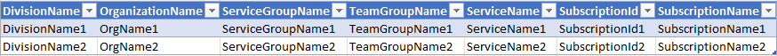
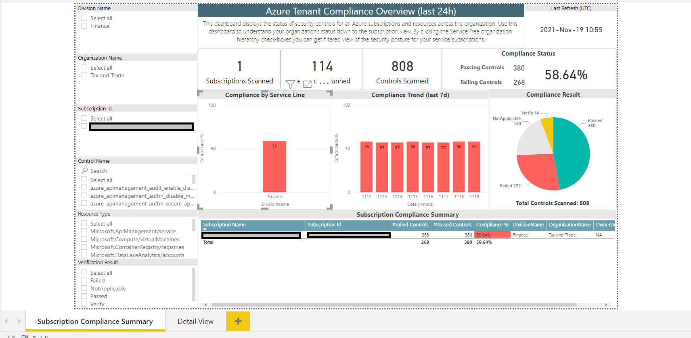
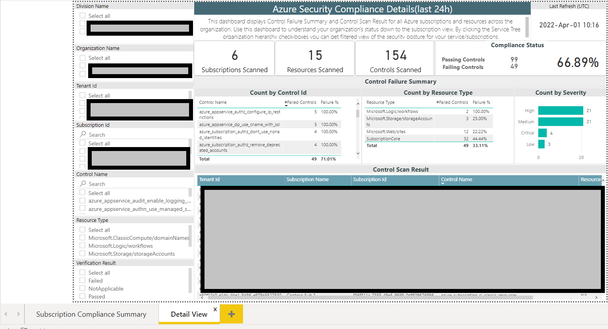
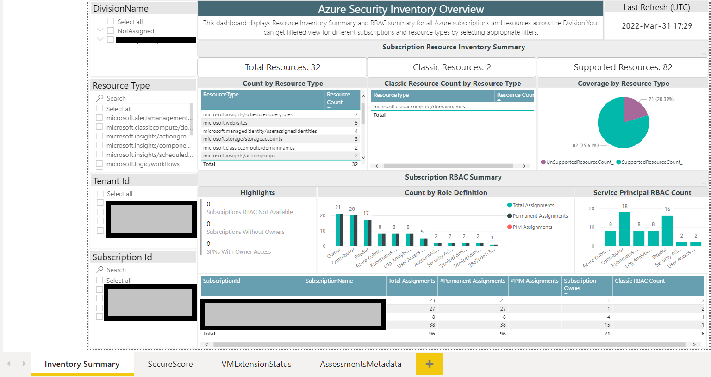
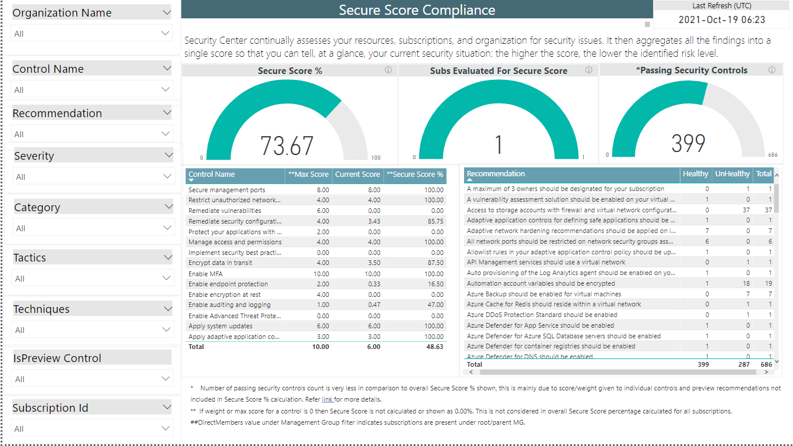
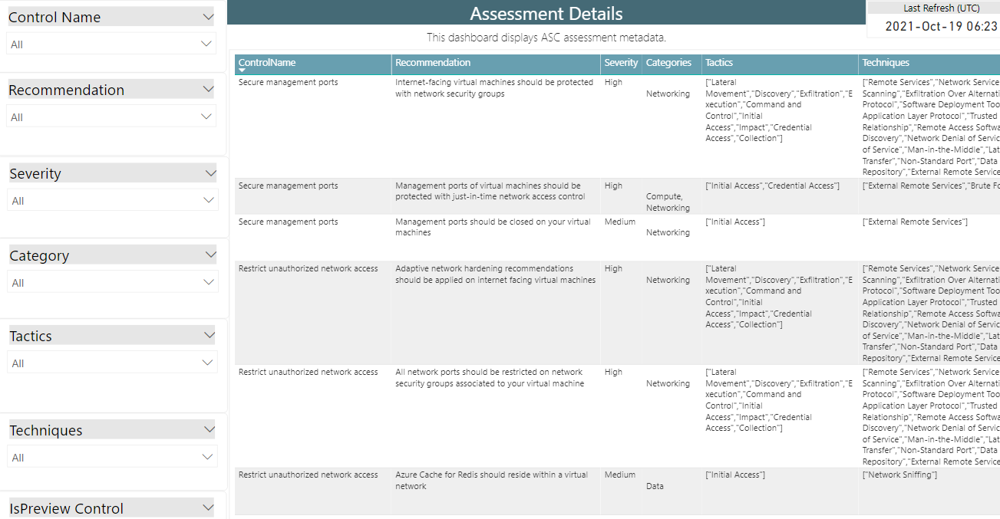
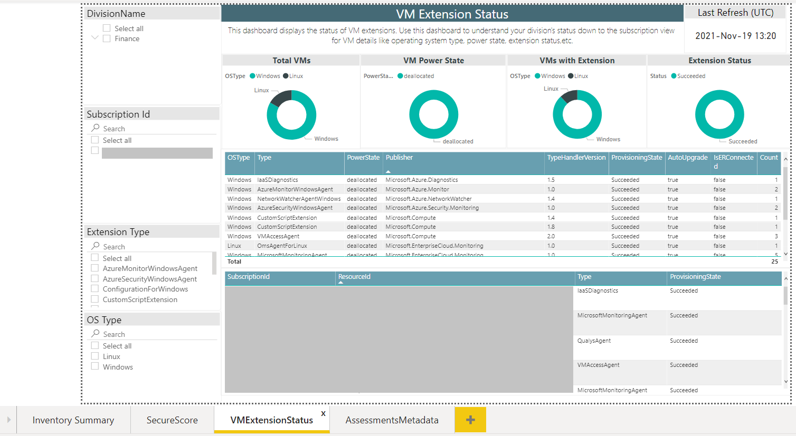

> The Azure Tenant Security Solution (AzTS) was created by the Core Services Engineering & Operations (CSEO) division at Microsoft, to help accelerate Microsoft IT's adoption of Azure. We have shared AzTS and its documentation with the community to provide guidance for rapidly scanning, deploying and operationalizing cloud resources, across the different stages of DevOps, while maintaining controls on security and governance.
 AzTS is not an official Microsoft product – rather an attempt to share Microsoft CSEO's best practices with the community..

 

# Monitoring Security Using AzTS

## On this page:

- [Tenant Security Solution - under the covers (how it works)](README.md#tenant-security-solution---under-the-covers-how-it-works)
- [Create cloud security compliance report for your org using PowerBI](README.md#create-security-compliance-monitoring-solutions)

-------------------------

## Tenant Security Solution - under the covers (how it works)
 Tenant Security Solution is built by extending what the DevOps Kit has been doing and leveraging the best of Azure native features. It is a hybrid model, which leverages the native Azure security capabilities like Azure Security Center (ASC), Azure Policies, etc., to evaluate the security controls and continue to leverage DevOps Kit scanning capabilities in the form of custom code controls to address any coverage gaps.  

It has been designed to handle huge scales in highly performant and cost efficient manner.

As a central team, you can run the scan at regular intervals and also empower your DevOps engineers to run the module independently to address control failures. 

The diagram below depicts a high level overview of the hybrid solution:

[Back to top…](README.md#tenant-security-solution---under-the-covers-how-it-works)

# Create security compliance monitoring solutions
Once you have an Tenant Security setup running smoothly with multiple subscriptions across your org, you will need a solution that provides visibility of security compliance for all the subscriptions across your org. This will help you drive compliance/risk governance initiatives for your organization. 

When you setup your Tenant Security endpoint (i.e. policy server), one of the things that happens is creation of an Log Analytics workspace for your setup. After that, whenever someone performs an AzTS scan for a subscription that is configured to use your Tenant Security, the scan results are sent (as 'security' telemetry) to your org's Log Analytics workspace. Because this workspace receives scan events from all such subscriptions, it can be leveraged to generate aggregate security compliance views for your cloud-based environments. 

## Create cloud security compliance and inventory reports for your org using PowerBI
We will look at how a PowerBI-based compliance dashboard and inventory dashboard can be created and deployed in a matter of minutes starting with a template dashboard that ships with the Tenant Security Solution (AzTS). All you need apart from the Log Analytics workspace instance is a CSV file that provides a mapping of your organization hierarchy to subscription ids (so that we know which team/service group owns each subscription).

> **Note**: This is a one-time activity with tremendous leverage as you can use the resulting dashboard (example below) towards driving security governance activities over an extended period at your organization.
>
>**As of now this feature is not supported for AzTS setup integrated to VNet.** 

#### **Step 0: Pre-requisites**
To create, edit and publish your compliance dashboard, you will need to install the latest version of PowerBI desktop on your local machine. Download it from [here](https://powerbi.microsoft.com/en-us/desktop/).

#### **Step 1: Prepare your org-subscription mapping**
In this step you will prepare the data file which will be fed to the PowerBI dashboard creation process as the mapping from subscription ids to the org hierarchy within your environment. The file is in a simple CSV form and should appear like the one below. 

> Note: You may want to create a small CSV file with just a few subscriptions for a trial pass and then update it with the full subscription list for your org after getting everything working end-to-end.

A sample template for the CSV file is [here](../TemplateFiles/OrgMapping.csv):

 

The table below describes the different columns in the CSV file and their intent.

| ColumnName  | Description | Required?	|Comments|
| ---- | ---- | ---- | ---- |
| OrganizationName | Name of Organization(s) within your enterprise | No | This you can consider as level 1 hierarchy for your enterprise |
| DivisionName | Name of Division(s) within your organization | No | This you can consider as level 2 hierarchy for your enterprise |
| ServiceGroupName | Name of Service Line/ Business Unit within an organization | No | This you can consider as level 3 hierarchy for your enterprise |
| TeamGroupName | Name of Team(s) within an organization | No | This you can consider as level 4 hierarchy for your enterprise |
| ServiceName | Name of Service(s) within your organization | No | This you can consider as level 5 hierarchy for your enterprise |
| SubscriptionId | Subscription Id belonging to a org/servicegroup | Yes |
| SubscriptionName | Subscription Name | Yes |

 

> **Note**: Ensure you follow the correct casing for all column names as shown in the table above. The 'out-of-box' PowerBI template is bound to these columns. If you need additional columns to represent your org hierarchy then you may need to modify the template/report as well.

#### **Step 2: Upload your mapping to the Log Analytics (LA) workspace**

In this step you will import the data above into the LA workspace created during Tenant Security setup. 

 **(a)** Locate the LA resource that was created during Tenant Security setup in your subscription. This should be present under Tenant Security resource group. After selecting the LA resource, copy the Workspace ID and primary key from the portal as shown below:

 
 
 **(b)** To push org Mapping details, copy and execute the script available [here](../Scripts/AzTSPushOrgMappingEvents.ps1?raw=1) (for Gov subs use script [here](../Scripts/AzTSPushOrgMappingEvents.Gov.ps1?raw=1)) in PowerShell. You will need to replace the CSV path, Workspace ID, and primary key with its appropriate value in this PowerShell script.

 > **Note**: Due to limitation of Log Analytics workspace, you will need to repeat this step every 90 days interval. 

#### **Step 3: Create a PowerBI report file**
In this section we shall create a PowerBI report locally within PowerBI Desktop using the LA workspace from Tenant Security subscription as the datasource. We will start with a default (out-of-box) PowerBI template and configure it with settings specific to your environment.

**(a)** Get the Workspace ID for your LA workspace from the portal as shown below:

**(b)** There are 2 PowerBI templates leveraged as of now:  
1) Compliance dashboard which can be used to get insights about controls compliance details for subscriptions getting scanned with AzTS. Download and copy the PowerBI template file from [here](../TemplateFiles/TenantSecurityReport.pbit?raw=1) for compliance dahboard (for Gov subs use template from [here](../TemplateFiles/TenantSecurityReport.Gov.pbit?raw=1)) to your local machine. 
2) Inventory dashboard which contains detailed inventory for resources and Secure Score for subscriptions being scanned. Download and copy the PowerBI template file from [here](../TemplateFiles/TenantSecurityInventoryReport.pbit?raw=1) for inventory dahboard. 

**(c)** Open the template (.pbit) file using PowerBI Desktop, provide the LA Workspace ID and click on 'Load' as shown below:

**(d)** PowerBI will prompt you to login to the Tenant Security subscription at this stage. Authenticate using your user account. (This step basically allows PowerBI to import the data from LA into the PowerBI Desktop workspace.)

Once you have successfully logged in, you will see the Log Analytics data in the PowerBI report along with org mapping as shown below: 

The compliance report contains 2 tabs.There is an overall/summary view of compliance and detailed view which can be used to see control 'pass/fail' details for individual subscriptions in the organization. An example of the detailed view is shown below:

###### Detailed view:

 

In Inventory dashboard, 4 tabs are present. Inventory Overview tab shows distribution of resource types and RBAC role memberships across all Azure subscriptions in the organization. SecureScore tab provides details about Secure Score for subscriptions (single score based on Security Center assessment). Assessments Metadata tab provides details about ASC assessments like recommendation, severity, etc. VM Extension status tab contains details about virtual machines scanned like OS type, extensions, power state,etc. Examples of these tabs are shown below:

###### Inventory view:

###### Secure Score:
 

###### Assessments Metadata:
 

###### VM Extension Status:
 

> Note: You can consider controlling access to the detailed view by business group.

#### **Step 4: Publish the PowerBI report to your enterprise PowerBI workspace**

**(a)** Before publishing to the enterprise PowerBI instance, we need to update LA connection string across data tables in the PowerBI report. The steps to do this are as below:

[a1] Click on "Edit Queries" menu option.

[a2] Copy the value of "LogAnalyticsConnectionString"

[a3] Replace the value of "LogAnalyticsConnectionString" with the actual connection string (e.g., LogAnalyticsConnectionString => "https://api.loganalytics.io/v1/workspaces/[LogAnalyticsWorkspaceID]]/query"). You should retain the "" quotes in the connection string.

[a4] Repeat this operation for SubscriptionInvLA, SubscriptionComplianceLast7daysLA, BaselineControlsInvLA, ControlResultsLA, ResourceInvInfoLA, and RBACSummaryLA data tables.

[a5] Click on "Close and Apply".

**(b)** You can now publish your PBIX report to your workspace. The PBIX file gets created locally when you click "Publish".

[b1] Click on Publish

[b2] Select destination workspace

[b3] Click on "Open [Report Name] in Power BI" 

**(c)** Now report got published successfully. You can schedule refresh for report with below steps

[c1] Go to Workspace --> Datasets --> Click on "Schedule Refresh" icon.

[c2] Click on "Edit credentials".

[c3] Sign in with account which has access to the Log Analytics workspace.

[c4] Add refresh scheduling timings and click on "Apply".

> **Note:** You may not see "Schedule refresh" option if step [a3] and [a4] is not completed successfully.

[Back to top…](README.md#tenant-security-solution---under-the-covers-how-it-works)
