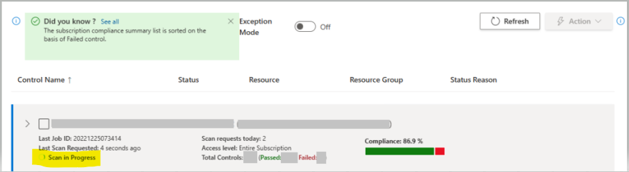

> The Azure Tenant Security Solution (AzTS) was created by the Core Services Engineering & Operations (CSEO) division at Microsoft, to help accelerate Microsoft IT's adoption of Azure. We have shared AzTS and its documentation with the community to provide guidance for rapidly scanning, deploying and operationalizing cloud resources, across the different stages of DevOps, while maintaining controls on security and governance.
<br>AzTS is not an official Microsoft product – rather an attempt to share Microsoft CSEO's best practices with the community.

</br>

# Running AzTS solution from UI

## On this page:

- [Overview](README.md#overview)
- [Prerequisite](README.md#prerequisite)
- [Introduction to AzTS UI and video tutorial](README.md#introduction-to-azts-ui)
- [Miscellaneous UI features](#miscellanoues-ui-features)
- [FAQ](README.md#frequently-asked-questions)

-----------------

## Overview

The AzTS solution provides a UI-based tool that can be used by dev-engineers to perform on-demand scans to verify fixes sooner, check reasons for control failures and view the latest scan results. This tool leverages your current subscription permissions to show you subscriptions that you have the ability to request scans for. 

To get AzTS UI's URL, follow the steps below:

**Using Azure Portal:**

On Azure Portal, go to the resource group where AzTS Solution has been installed --> Go to AzSK-AzTS-UI-xxxxx App Service (here xxxxx represents the suffix added to the name of the App Service) --> From the 'Overview' section, copy the 'URL' of the UI.

> **Note:** 
> 1. _If you have enabled `Web Application Firewall (WAF)` for AzTS UI, then you will be able to access the UI using FrontDoor's URL_.
> 2. _On Azure Portal, go to the resource group where AzTS Solution has been installed --> Go to AzSK-AzTS-UI-FrontDoor-xxxxx (here xxxxx represents the suffix added to the name of the Front Door) --> From the 'Overview' section, copy the 'URL' of the Front Door_.


**Using PowerShell:**

Link to the AzTS UI is provided at the end of the installation command ```Install-AzSKTenantSecuritySolution``` (as shown below).
&nbsp;&nbsp;

## Prerequisite

1. Signed in user must have one of the following permissions at subscription or resource group scope: Owner, Contributor, ServiceAdministrator, CoAdministrator, AccountAdministrator, Security Reader, Security Admin.
2. If the AzTS solution has been installed recently, it can take up to 24 hours to reflect the scan result.

> **Note:**
> 1. If you have been recently granted access to a subscription, you would be able to view the scan result in UI after 24 hours because AzTS solution reads the latest RBAC once in 24 hours.
>

</br>

## Introduction to AzTS UI

Azure Tenant Security (AzTS) UI tool is used to:

- See compliance summary against each subscription.
- Scan your subscription(s) manually.
- Export control scan results to CSV.

The UI is fairly self-explanatory and also has a "Guided Tour" feature that should show you the basic usage workflow. You can learn more about AzTS UI from the following video tutorials.

## Video tutorials

To see a basic introduction about AzTS UI, how it works and what are the functionalities it is having, please refer to the video below:

[](https://azts.microsoft.com/videosforpublicgithubdoc/Ext_Introduction_About_AzTS_UI.mp4)

Here are some additional video tutorials explaining the features provided by AzTS UI.

### **How to scan subscription manually**
[](https://azts.microsoft.com/videosforpublicgithubdoc/Ext_Scan_Subscription_Manually.mp4)

### **How to export control scan logs to local machine**
[](https://azts.microsoft.com/videosforpublicgithubdoc/Ext_Export_To_CSV.mp4)

## Miscellanoues UI features
- ### **Scan In Progress:**

AzTS UI can be used to trigger on-demand scan(s) for subscriptions(s) manually. Once such on-demand scan is triggered, you can get notification about scan progress status (e.g. Scan In Progress or Scan completed) by enabling Scan In Progress feature in AzTS UI. 
This feature is not enabled by default. If you have not enabled this feature in your AzTS setup yet, please follow steps mentioned below:

- Open the [Azure portal](https://portal.azure.com/).
- Navigate to AzTS host subscription -> AzTS host resource group.
- Go to required AzTS API app service(AzSK-AzTS-WebApi-xxxxx).
- Go to Configuration under Settings.
- Click on "New application setting" to add required appsettings.
- Add **FeatureManagement__OnDemandScanProgressIndicator** as the Name of the appsetting.
- Add **true** as the value of the appsetting.
- Add **UIConfigurations__OnDemandScanProgressIndicatorConfiguration__IsEnabled** as the Name of the appsetting.
- Add **true** as the value of the appsetting.
Save these settings. This will restart AzTS API app service.
- For AzTS API app service (AzSK-AzTS-WebApi-xxxxx), go to Settings -> Identity. In System assigned tab, set Status as 'On'. It will enable system assigned managed identity for this app service.
- Assign "Storage Table Data Contributor" role to Managed Identity for AzTS WebAPI(AzSK-AzTS-WebApi-xxxxx) on the Storage Account in AzTS Host Resource Group(AzSK-AzTS-Storage-xxxxx).

 Next time, when you open AzTS UI and scan subscriprion(s) manually, an indicator about Scan In Progress or scan completed will be shown.
 

### **Frequently Asked Questions**

</br>

**Q: Where can I find AzTS UI URL?**

Please contact the AzTS UI administrator for the link to the AzTS UI. If you are the administrator, follow the steps below to get UI's URL:

**Using Azure Portal:**

On Azure Portal, go to the resource group where AzTS Solution has been installed --> Go to AzSK-AzTS-UI-xxxxx App Service (here xxxxx represents the suffix added to the name of the App Service) --> From the 'Overview' section, copy the 'URL' of the UI.


**Using PowerShell:**

Link to the AzTS UI is provided at the end of the installation command ```Install-AzSKTenantSecuritySolution``` (as shown below).
&nbsp;&nbsp;
