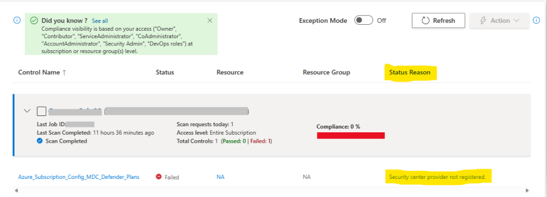

> The Azure Tenant Security Solution (AzTS) was created by the Core Services Engineering & Operations (CSEO) division at Microsoft, to help accelerate Microsoft IT's adoption of Azure. We have shared AzTS and its documentation with the community to provide guidance for rapidly scanning, deploying and operationalizing cloud resources, across the different stages of DevOps, while maintaining controls on security and governance.
 AzTS is not an official Microsoft product – rather an attempt to share Microsoft CSEO's best practices with the community.
 
# Addressing control failure

## On this page:

- [Overview](README.md#overview)

## Overview

The AzTS solution provides a UI-based tool that can be used by dev-engineers to perform on-demand scans to verify fixes sooner, check reasons for control failures and view the latest scan results. This tool leverages your current subscription permissions to show you subscriptions that you have the ability to request scans for. 

To check reason about control failure, you can refer Status Reason column in AzTS UI.

Based on Status reason, you can update resource configurations to remediate control faiures.
If you want to refer control logic details, please refer control spcs [here](../Control%20coverage/README.md/#azure-services-supported-by-azts). You can find details about Paased, Failed or other status reasons and recommendations(Azure portal based or PowerShell based) from here. Please follow recommendation steps to remediate failing controls.

There are below options available to remediate resources in bulk:
1. PowerShell based bulk remediation scripts:
Please refer more details [here](../Scripts/RemediationScripts/Readme.md/#overview).

2. Remediation by downloading scripts using AzTS UI:
You can download remediation scripts specific to failing resources and controls and run later.More details can be found [here](/04-Addressing%20control%20failure/RemediationThroughScriptsUsingUI.md/#autoremediation).
