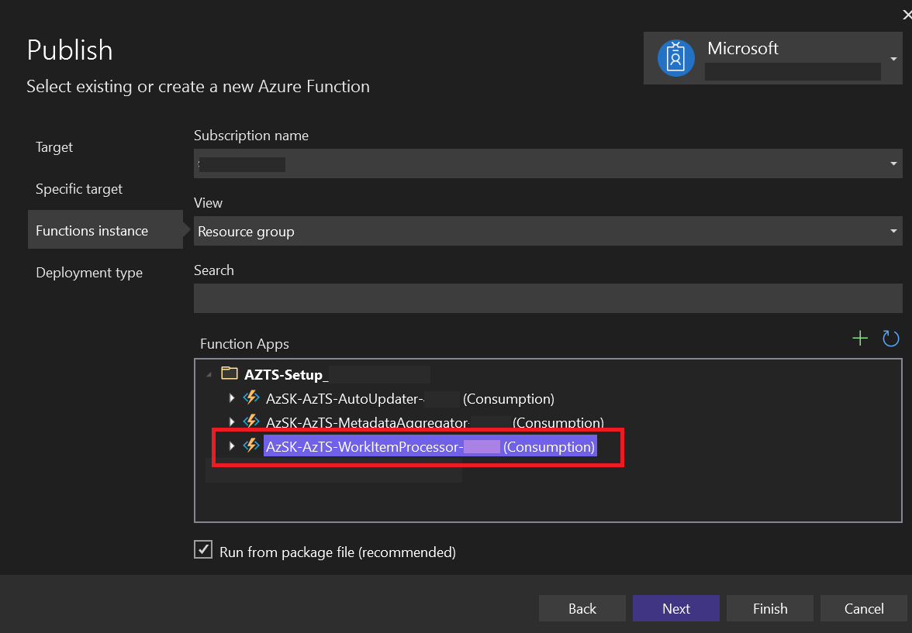
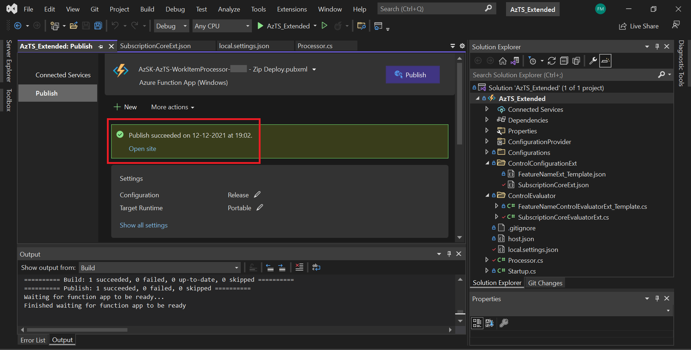

# Deploy the Extended Project in AzTS Solution

<!-- You can deploy the org policy customized project in your running AzTS Solution using CICD pipeline.  -->

You can deploy the **AzTS_Extended** function app project in your running AzTS Solution *using the Visual Studio* by following the below mentioned steps:

> Prerequisite: It is required to be logged in to your Microsoft Account in the Visual Studio.

0. Ensure that the local settings (details of Storage account, Log Analytic Workspace, etc) do not get deployed in the AzTS solution setup. These settings can be found in the `local.settings.json` which are used during debugging in your local system but the values should be removed while publish the function app as your current running AzTS solution setup has its own settings in-place.  Additionally, ensure the Subscription ID mentioned in the `Processor.cs` is the same as the host Subscription of AzTS Solution setup.   

1. In **Solution Explorer**, right-click on the **`AzTS_Extended`** project and select **Publish**.

2. For Target, choose Azure, which will publish your function app to the Microsoft Cloud.

3. For the **Specific target**, choose **Azure Function App (Windows)**, which publish a function app that runs on Windows.

4. In **Function Instance**, choose your Host Subscription and select the `AzSK-AzTS-WorkItemProcessor-xxxxx` as shown below. 

5. Select **Finish**, and on the Publish page, select **Publish** to deploy the package containing your project files in Azure.    

  After the deployment completes the root URL of the function app in Azure is shown in the Publish tab.

 
<b>Congratulations! You have successfully deployed the function app in your AzTS solution.</b>
  

**Next steps:** 

**Verify** your function in the Azure and **validate** the changes:
 You can verify your changes in the Log Analytics Workspace with the help of this [link](https://github.com/azsk/AzTS-docs/tree/main/01-Setup%20and%20getting%20started#4-log-analytics-visualization).
   Few simple queries are provided in the above link related to the inventory and Control Scan summary for reference.