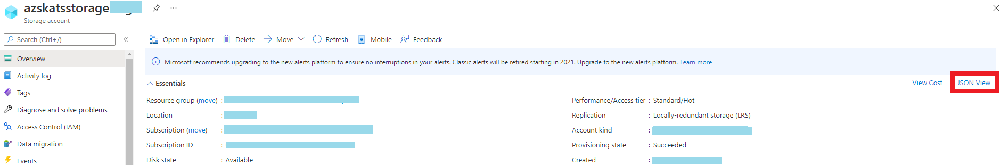
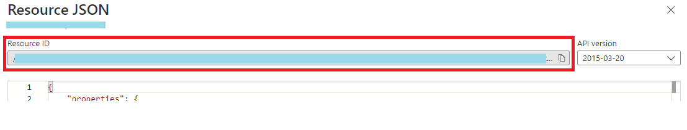
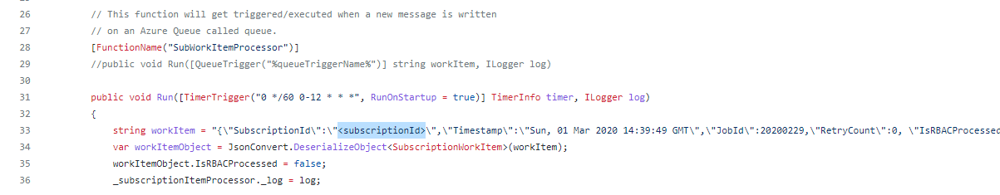
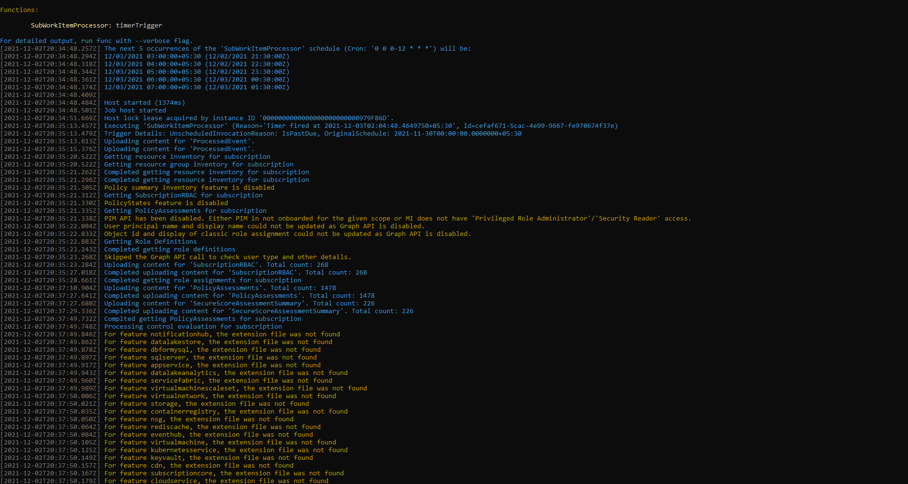
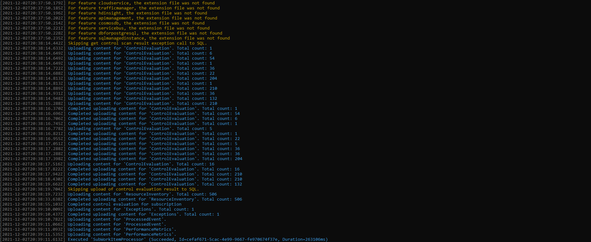

# Setting up the AzTS Extended Solution

In this section, we will walk through the steps of setting up org policy customizable AzTS Scanner in your local system.

> **Note**: You would require at least 'Reader' level access on Host subscription and 'Contributor' level access to the LA Workspace, Storage, etc.

Let's start!

<!-- TODO: Change the branch below going forward -->
1. Launch Visual Studio and clone [this](https://github.com/azsk/AzTS-Samples/tree/Extended_AzTS) GitHub repository in a new Visual Studio. This solution has the required [NuGet package](https://www.nuget.org/packages/Microsoft.AzTS.Azure.Scanner/) reference to the AzTS Solution. It will import the dependencies and libraries of the AzTS Scanner to the user's solution.
2. Go to AzTS_Extended folder and load the AzTS_Extended.sln. <br />


3. Update the following files:
   > In this step, you will configure the Extended AzTS solution by using the same properties that you are using in your current running AzTS setup such as the details of Target subscription, Application insights, Storage and LA Workspace. Please refer to [this](https://github.com/azsk/AzTS-docs/tree/main/01-Setup%20and%20getting%20started) link for reference on setting up AzTS for more context.
    * In local.settings.json file, we will add the instrumentation key of the Application insights, Log Analytic Workspace properties and Storage account properties:
         ```JSON
               {
               "IsEncrypted": false,
               "Values": {
                  "ASPNETCORE_ENVIRONMENT": "Local",
                  "AzureWebJobsStorage": "UseDevelopmentStorage=true",
                  "FUNCTIONS_WORKER_RUNTIME": "dotnet",
                  "APPINSIGHTS_INSTRUMENTATIONKEY": "", // more details on App insights instrumentation key can be found below.
                  "AzureStorageSettings__ResourceId": "", // more details on Storage Settings can be found below.
                  "LAConfigurations__WorkspaceId": "",// more details on LA Configurations can be found below.
                  "LAConfigurations__ResourceId": ""
               }
               } 
         ```
        <!-- [TODO] Make LA and Storage details options -->
      1. **Application insights** collect telemetry data from connected apps and provides Live Metrics, Log Analytics, etc. It has an instrumentation key which we need to configure into our function app i.e. APPINSIGHTS_INSTRUMENTATIONKEY and with this key app insights grab data from our app. Add instrumentation key for Application Insights by entering `APPINSIGHTS_INSTRUMENTATIONKEY`
         <br />Application insights by the name - AzSK-AzTS-AppInsights gets created while setting up the AzTS solution. 
         <br />You can find the instrumentation key as shown below for your respective App insights resource:<br />
         
      2. **Storage Account** and **Log Analytics Workspace** are used to store the scan events, inventory, subscription scan progress details and results.
	       1. Storage Account: It gets created by the name - azsktsstoragexxxxx while setting up the AzTS solution. Add 'ResourceId' of the Storage Account. 
               <br />You can find the Resource ID as shown below and enter `AzureStorageSettings__ResourceId`.<br />
               Step 1:<br />
               
               <br />Step 2:<br />
               

		    2. Log Analytics Workspace: It gets created by the name - AzSK-AzTS-LAWorkspace-xxxxx while setting up the AzTS solution. Add 'WorkspaceId' and 'ResourceId' of the LA Workspace. 
               <br />You can find the Workspace ID as shown below and enter `LAConfigurations__WorkspaceId`.<br />
               
               <br />You can find the Resource ID as shown below and enter `LAConfigurations__ResourceId`.<br />
               Step 1:<br />
               
               <br />Step 2:<br />
               
    * In Processor.cs file (line 33), mention the ID of the target subscription to be scanned:<br />
               

4. Build and Run
   - Click on the AzTS_Extended as shown below to run the project: <br />
      <br/>
   - Output should look like below:<br/>
      <br />
      
   
<b>Congratulations! Set up is complete with this step.</b>

The solution is working and the target subscription mentioned in the `Processor.cs` file is scanned. You can view the logs of the scan in the Log Analytics Workspace with the help of this query: 

``` KQL
AzSK_ControlResults_CL
| where TimeGenerated > ago(1d)
```
Few simple queries are provided in [this](https://github.com/azsk/AzTS-docs/tree/main/01-Setup%20and%20getting%20started#4-log-analytics-visualization) link related to the inventory and Control Scan summary for reference. 

Before we get started with extending the toolkit, let's understand the structure of the built solution repository. 

   

<!-- TODO : Add details about the structure -->

The following template files are also included in the solution repository to better guide the users in the authoring controls:
| Template File Name | High-level Description 
| ---- | ---- | 
| FeatureNameExt.json <br> [under the ControlConfigurationExt folder] | This file contains the setting of controls of a specific feature. A few meta-data are required for a control to be scanned which are mentioned in detail further ahead.
| FeatureNameControlEvaluatorExt.cs <br> [under the ControlEvaluator folder] | This file is used to override the base control evaluation method.

Next, we will look into basic and advanced applications of organization policy customization through this setup.
