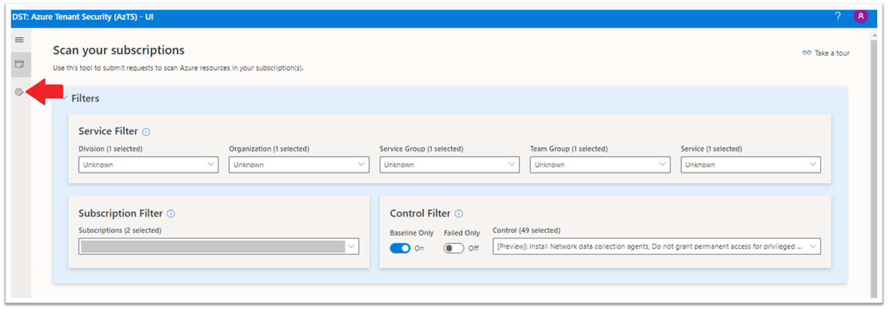
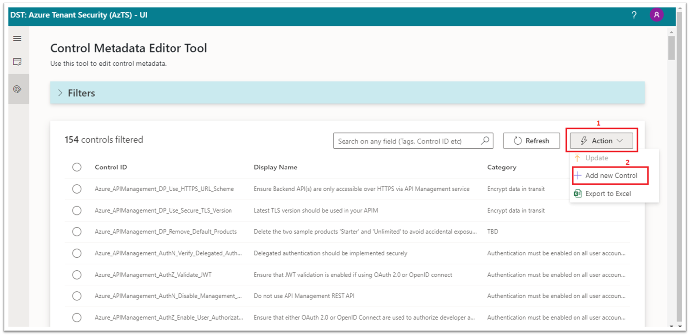
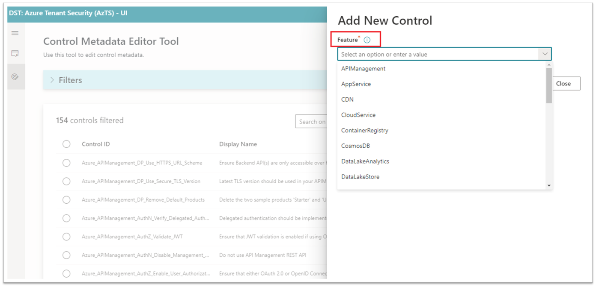

## Add new control based on ASC Assessment
Please follow the below mentioned steps to add new controls based on Azure Security Center (ASC) Assessment/Recommendation:

**Step 0:** Following prerequisites are required to add new control.
   1. This feature is not enabled by default. If you have not enabled this feature in your AzTS setup yet, please follow steps mentioned [here](Prerequisites.md#prerequisite-azts-configurations-to-add-new-control).

   2. CMET (Control metadata editor tool) is only accessible to privileged users based on AzTS API configurations. Please follow the steps mentioned [here](Prerequisites.md#access-to-cmet-control-metadata-editor-tool) to add yourself as privileged user (This is only required once per user).

**Step 1:** Get the display name of the ASC control recommendation. You can find ASC control recommendations for your subscriptions [here](https://portal.azure.com/?feature.customportal=false#blade/Microsoft_Azure_Security/SecurityMenuBlade/5).

**Step 2:** Go to **AzTS UI**. (To get AzTS UI URL, check this [FAQ](https://github.com/azsk/AzTS-docs/blob/main/03-Running%20AzTS%20solution%20from%20UI/README.md#frequently-asked-questions))

**Step 3:** Open **Control editor tool**.

**Step 4:** Click on **Action** and select **Add new control** option.

**Step 5:** Select the **Service/Feature** for which you want to add new control.
> **Note:** Currently addition of new controls is only supported for existing services evaluated by AzTS.

**Step 6:** Select either one of the existing **Security Domain** for the control or if you want to add new Security Domain, type required domain in text field.

**Step 7:** Provide the **Control ID**. Initial part of the control ID is pre-populated based on the service/feature and security domain you choose for the control (Azure_FeatureName_SecurityDomain_XXX).

> **Note:** Please don't use spaces between words instead use underscore '_' to separate words in control ID. 
To see some of the examples of existing control IDs please check out this [list](https://github.com/azsk/AzTS-docs/tree/main/Control%20coverage#azure-services-supported-by-azts).

**Step 8:** Set Control **Scan Source** to '**ASC**'.

**Step 9:** Provide **Display Name**. You can either choose ASC recommendation display name from the drop down or type display name in text field (which you have picked in step #1).

Once you select the Display Name, **Assessment Properties** field will get auto populated.

**Step 10:** Select either one of the existing **Category** (generic security specification of the control) for the control or if none of the existing categories is relevant for the control, enter/type your required category in text field.

**Step 11:** Keep **Enabled** switch to '**Yes**'.

**Step 12:** Provide **Additional details/Optional settings** for the control:

|Settings| Description| Examples|
|-------------|------|---------|
|Automated| Whether the control is manual or automated| e.g. Yes/No (keep it Yes for policy based controls)|
|Description| A basic description on what the control is about| e.g. App Service must only be accessible over HTTPS. |
|Tags| Labels that denote the control being of a specific type or belonging to a specific domain | For e.g. Baseline, Automated etc.|
|Control Severity| The severity of the control| e.g. High: Should be remediated as soon as possible. Medium: Should be considered for remediation. Low: Remediation should be prioritized after high and medium.|
|Control Requirements| Prerequisites for the control.| e.g. Monitoring and auditing must be enabled and correctly configured according to prescribed organizational guidance|
|Rationale|  Logical intention for the added control | e.g. Auditing enables log collection of important system events pertinent to security. Regular monitoring of audit logs can help to detect any suspicious and malicious activity early and respond in a timely manner.|
|Recommendations| Steps or guidance on how to remediate non-compliant resources | e.g. Refer https://azure.microsoft.com/en-in/documentation/articles/key-vault-get-started/ for configuring Key Vault and storing secrets |
|Custom Tags| Tags can be used for filtering and referring controls in the future while reporting| e.g. Production, Phase2 etc. |
|Control Settings| Settings specific to the control to be provided for the scan | e.g. Required TLS version for all App services in your tenant (Note: For ASC assessment/recommendation based contols this should be empty) |
|Comments | These comments show up in the changelog for the feature. | e.g. Added new policy based control for App Service |

**Step 13:** Click on **Add** button to save new control.

**Step 14:** Post control addition, you will get success message. Now you are good to **close** 'Add new control' window. Newly added control will reflect in control scan results from next automated schedule scan. 

**Step 15:** To **validate the control addition**, refresh the control metadata editor tool and search for newly added control. Control should be available now.

**Step 16:** As an **additional validation**, you can also trigger adhoc scan from AzTS UI for one or more subscriptions and check the control scan results for newly added control. To get information on how to trigger adhoc scan, you can refer to this [link](https://github.com/azsk/AzTS-docs/tree/main/03-Running%20AzTS%20solution%20from%20UI#how-to-scan-subscription-manually).

-----