## Features in CMET
- ### Bulk Edit

The Bulk Edit feature allows you to add custom tags to multiple controls simultaneously.

### **Enabling Bulk Edit feature in CMET**

To enable bulk edit in CMET (Control Metadata Editor Tool), you need to configure following two application settings in AzTS API App service:

1.	FeatureManagement__BulkEdit -> True
2.	UIConfigurations__ControlEditorFeatureConfiguration__IsBulkEditEnabled -> True

Please follow below steps to add these settings.
1. Open the Azure portal.
2. Navigate to AzTS host subscription -> AzTS host resource group.
3. Go to app service AzSK-AzTS-WebApi-xxxxx.
4. Go to Configuration under Settings.
5. Click on "New application setting" to add required application settings.

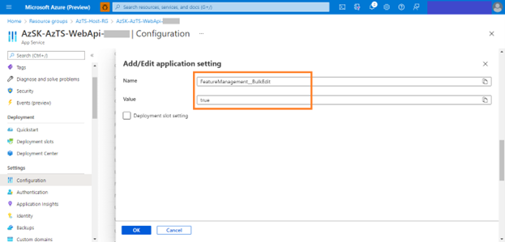

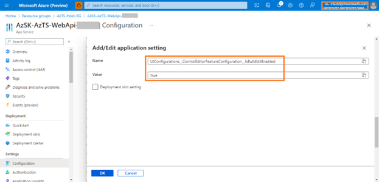

### **Using Bulk Edit feature to add Custom tags to controls** 

Once Bulk Edit Feature is enabled, follow below steps to add custom tag(s) for set of controls.

1. Open AzTS UI in new browser window.
2. Open CMET editor (To open the CMET editor, you need to have editor permissions. If you don't have the required permission, please follow the steps mentioned [here](../Extending%20AzTS/Prerequisites.md#access-to-cmet-control-metadata-editor-tool)).

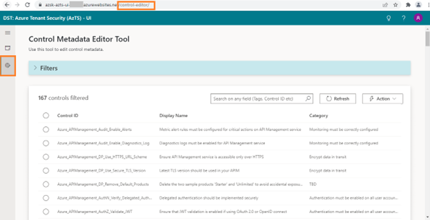

3. Select all the controls for which custom tag needs to be added. 

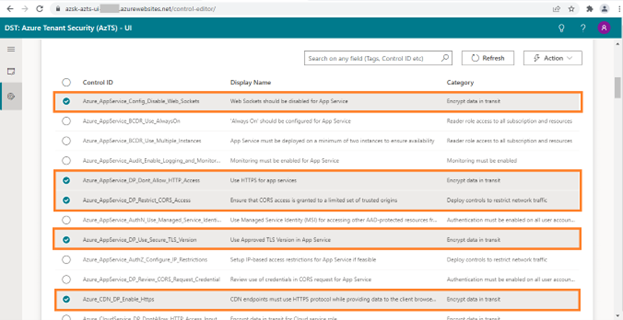

4. Go to Action -> Select 'Bulk Edit' option.

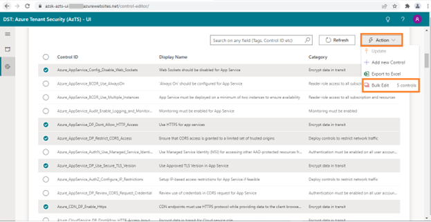

5. Toggle edit button to enable editing.

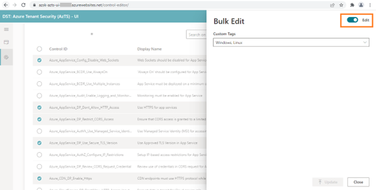

6. Enter the value for custom tag and click on 'Update'.
  >Note: Tags must be PascalCase, starting with a letter and allowing alphanumeric characters, underscores, and hyphens. Length should be 3-50 characters.

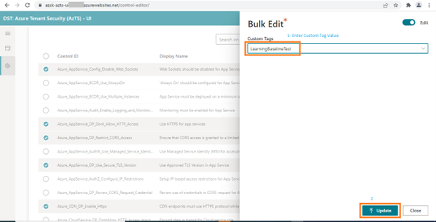

7. After the success message for bulk updates is displayed, please close the edit popup.

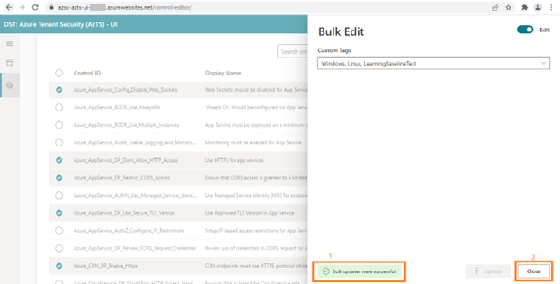

8. Currently, after adding the tags to the necessary controls, you need to trigger the Baseline control inventory from the Metadata Aggregator function list.

- Go to AzTS Metadata Aggregator function app (AzSK-AzTS-MetadataAggregator-xxxxx) and update app settings 'WebJobConfigurations__ForceFetch' with value as true. Click 'OK'.

 
- Click on Save.
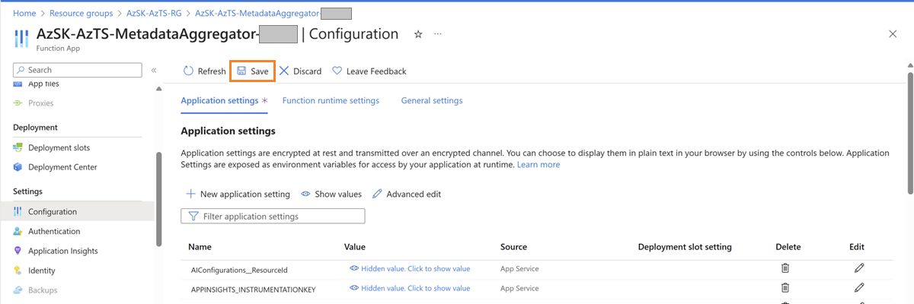

- Go to ‘Baseline control inventory processor’ in Metadata aggregator.
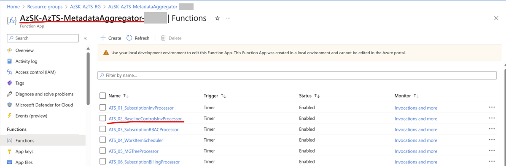

- Click on 'Code + Test'. Click on 'Test/Run' and 'Run'.
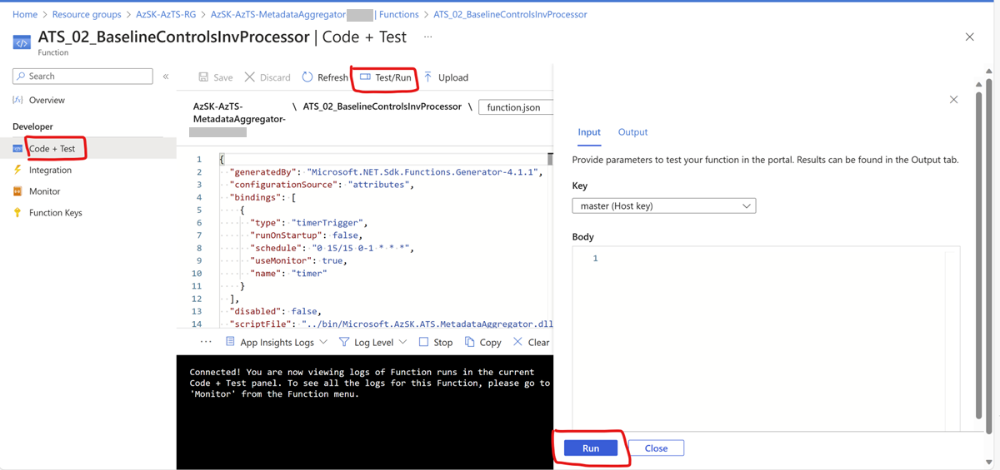

- Wait for the execution to complete.

- Revert the app setting  'WebJobConfigurations__ForceFetch' to false. Click 'OK'.
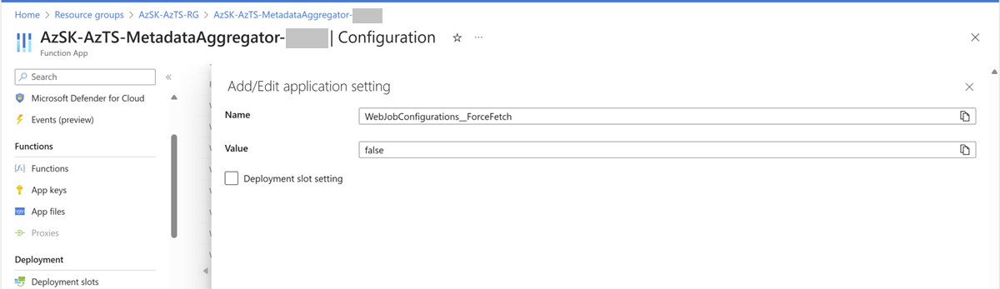

- Click on Save.
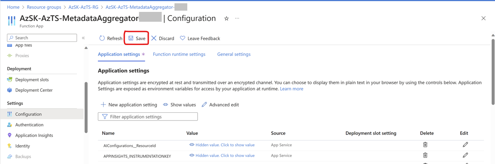

### **Validating custom tags added using Bulk Edit:**
To search controls by a newly added tag value, such as 'LearningBaselineTest' in this example, follow these steps:

1. Open the CMET editor in new browser window (it might take approx 5 min to reflect newly added tag) 

2. Look for the search textbox within the editor.

3. Enter the tag value 'LearningBaselineTest' in the search field.

4. The CMET editor will display a list of controls that have the specified tag value, allowing you to view and manage them accordingly.
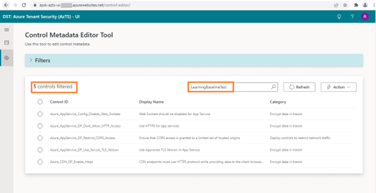

By following these steps, you can easily search for controls based on a specific tag value like 'LearningBaselineTest'.

