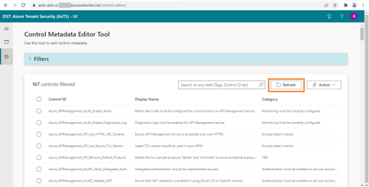

## Features in CMET
- ### Bulk Edit

With Bulk Edit feature, custom tags can be added to more than 1 controls at a time.

### **Enabling Bulk Edit feature in CMET**

To enable bulk edit in CMET (Control Metadata Editor Tool), you need to configure following two application settings in AzTS API App service:

1.	FeatureManagement__BulkEdit -> True
2.	UIConfigurations__ControlEditorFeatureConfiguration__IsBulkEditEnabled -> True

Please follow below steps to add these settings.
1. Open the Azure portal.
2. Navigate to AzTS host subscription -> AzTS host resource group.
3. Go to app service AzSK-AzTS-WebApi-xxxxx.
4. Go to Configuration under Settings.
5. Click on "New application setting" to add required application settings.

### **Using Bulk Edit feature to add Custom tags to controls** 

Once Bulk Edit Feature is enabled, follow below steps to add custom tag(s) for set of controls.

1. Open AzTS UI in new browser window.
2. Open CMET editor (for this user will require editor permission over CMET, if you don’t have permission, please follow steps mentioned [here](../Extending%20AzTS/Prerequisites.md#access-to-cmet-control-metadata-editor-tool)).

3. Select all the controls for which custom tag needs to be added. 

4. Go to Action -> Select 'Bulk Edit' option.

5. Toggle edit button to enable editing.

6. Enter the value for custom tag and click on 'Update'.
  >Note: The tag value should be without any spaces in between two words. It is recommended to use camel casing for better readability.

7. Close the edit popup after bulk updates success message is displayed.

### **Validating custom tags added using Bulk Edit:**
Once custom tag has been added for set of controls, follow below validation steps:

1. Refresh CMET editor view.

2. Search controls by newly added tag value (like ‘LearningBaselineTest’ in example), this will list all the controls which have this tag. 

