## Management Group driven Compliance Initiative
To drive compliance for specific set of controls driven on the basis of  Mangement Group hierarchy, AzTS provides feature to configure Management Group driven Compliance Initiative.

By default, this feature is not turned on. If you haven't enabled it in your AzTS setup yet, please follow the steps below:

## Steps to enable Management Group driven Compliance Initiative feature
### Option 1: Using Azure Portal
#### **Step 1 of 4: Add Required configuration to the API application settings:**
1. Go to Azure Portal.
2. Navigate to AzTS host subscription -> AzTS host resource group.
3. Go to AzTS App service AzSK-AzTS-WebApi-xxxxx.
4. Go to Configuration under Settings.
5. Click on "New application setting" to add required app settings.
6. Add new application setting 'UIConfigurations__IsManagementGroupFilterEnabled' with value as 'true'. Click 'OK'.

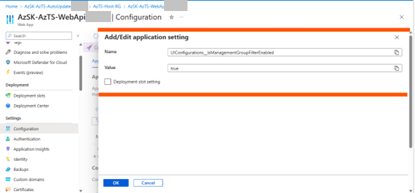

7. Add new application setting 'UIConfigurations__complianceInitiativeFeatureConfiguration__IsEnabled' with value as 'true'. Click 'OK'.

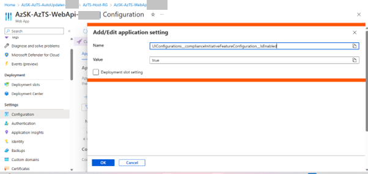

8. Add new application setting 'ComplianceInitiativeActionItem__0__PrivilegedEditorIds__0' with value as 'user object id'. Click 'OK'. This step needs to be done per user who needs access to set/update Management Group driven Compliance Initiative.(PrivilegedEditorIds is an array so should be incremented sequentially for further users being added.)

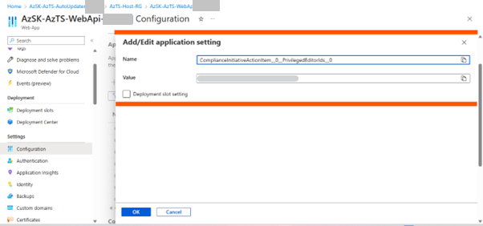

> **Note:** User's object id can be referenced from Azure AD.

9. Add new application setting 'ControlActionItem__0__PrivilegedEditorIds__0'  with value as 'user object id'. Click 'OK'. This step needs to be done per user who needs access to set/update Management Group driven Compliance Initiative(PrivilegedEditorIds is an array so should be incremented sequentially for further users being added.)
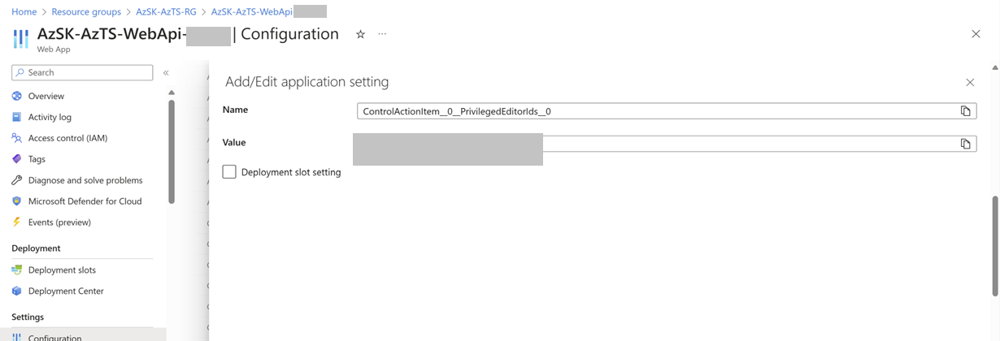
> **Note:** User's object id can be referenced from Azure AD.This step can be skipped if already completed as part of adding user as Privileged editor for CMET.

10. Add new application setting 'ControlEditorFeatureConfiguration__IsBulkEditEnabled' with value as true. Click 'OK'. 

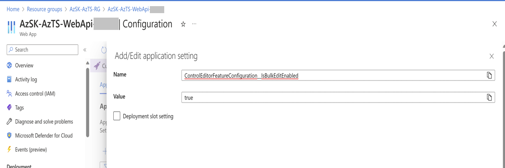

>Note: If you have already enabled [bulk edit feature for CMET](./FeaturesInCMET.md#bulk-edit), you can skip step 11 and 12.
11. Add new application setting 'FeatureManagement__BulkEdit' with value as true. Click 'OK'.

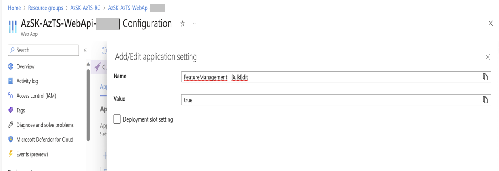

12.Add new application setting 'UIConfigurations__ControlEditorFeatureConfiguration__IsBulkEditEnabled' with value as true. Click 'OK'.

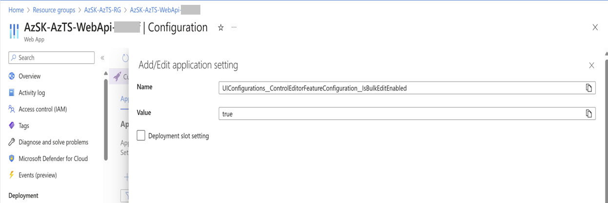

13. Click 'OK' and then click 'Save'.

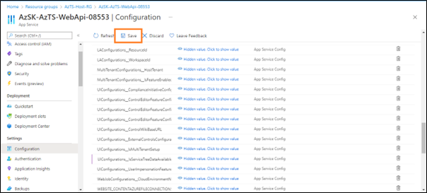


#### Step 2 of 4:	Add Required configuration to Metadata Aggregator to enable MGTreeProcessor and PIM API support


1. Go to Azure Portal.
2. Navigate to AzTS host subscription -> AzTS host resource group.
3. Go to AzTS Metadata Aggregator function app (AzSK-AzTS-MetadataAggregator-xxxxx).
4. Go to Configurations under Settings.
5. Click on ‘New application setting’ to add required app settings.
6. Add new application setting 'FeatureManagement__ManagementGroups' with value as true. Click 'OK'. 

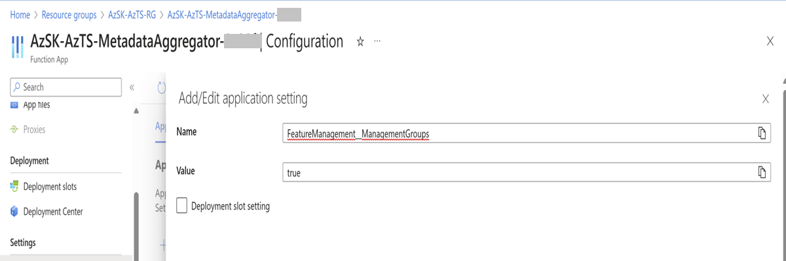

>Note: Please follow steps 7 and 8 in case of Single tenant AzTS setup. These can be skipped for Multi-Tenant AzTS setup.
7. Click on 'New application setting' to add required app settings.
8. Add new application setting 'ManagementGroupConfigurations__ManagementGroupId' with value as parent Management Group Id. Click 'OK'. 

9. Add new application setting ‘AuthzSettings__IsPIMEnabled’ with value as true. Click ‘OK’. (This to enable PIM API calls to fetch RBAC details).

10. Click 'OK' and then click 'Save'.


-----
### Option 2: Using Powershell
#### Step (1 & 2) of 4 (consolidated):
If you have already downloaded the deployment package zip, directly go to step (4).<br/>
1. Download deployment package zip from [here](../TemplateFiles/DeploymentFiles.zip) to your local machine. </br>

2. Extract zip to local folder location. <br/>

3. Unblock the content. The below command will help to unblock files. <br/>

    ``` PowerShell
    Get-ChildItem -Path "<Extracted folder path>" -Recurse |    Unblock-File 
    ```

4. Point current path to deployment folder and load AzTS setup script. <br/>


    ``` PowerShell
    # Point current path to extracted folder location and load setup script from the deployment folder 

    CD "<LocalExtractedFolderPath>\DeploymentFiles"

    # Load AzTS Setup script in session
    . ".\UpdateAzTSFeatures.ps1"

    # Note: Make sure you copy  '.' present at the start of the line.  
   ```

5. Connect to AzAccount.
    ``` PowerShell
      Connect-AzAccount -Tenant <TenantId>
    ```
  6. Invoke the configuration cmdlet.
     ``` PowerShell
      Configure-AzTSFeature 
      -SubscriptionId <AzTSHostingSubscriptionId> `
      -ScanHostRGName <AzTSHostingRGName> `
      -FeatureName "MG Compliance Initiate Editor" `
      -FeatureActionType "Enable"
     ```
    
 7. Invoke the configuration cmdlet.
    ``` PowerShell
      Add-AztsFeatureConfigurationValues 
      -SubscriptionId <AzTSHostingSubscriptionId> `
      -ScanHostRGName <AzTSHostingRGName> `
      -FeatureName "MG Compliance Initiate Editor" ` 
      -FeatureConfigValues <User`s object id>
    
    <# Note: 1) User's object id can be referenced from Azure AD.
      2) For adding multiple user, pass the user's object id value seperated by comma(',').
      For example:  
        Add-AztsFeatureConfigurationValues 
        -SubscriptionId "00000000-xxxx-0000-xxxx-000000000000" `
        -ScanHostRGName "AzTS-Solution-XX" `
        -FeatureName "MG `Compliance Initiate Editor" `
        -FeatureConfigValues "00000000-xxxx-0000-xxxx-000000000001,00000000-xxxx-0000-xxxx-000000000002,00000000-xxxx-0000-xxxx-000000000003"
    ```

#### Step 3 of 4.	Add Custom tags to controls (in bulk edit mode) for compliance initiative
Compliance initiative feature requires common tag on all controls which are part of an initiative. Common tag to a set of controls can be added by using CMET bulk edit mode. Please follow the steps mentioned [here](../../06-Customizing%20AzTS%20for%20your%20org/Extending%20AzTS/FeaturesInCMET.md) to add tags to controls.


#### Step 4 of 4. Create new compliance initiative 
Please make sure that [Step 1](#1-add-required-configuration-to-the-api-application-settings), [Step 2](#2-add-required-configuration-to-metadata-aggregator-to-enable-mgtreeprocessor-and-pim-api-support) and [Step 3](#3-add-custom-tags-to-controls-in-bulk-edit-mode-for-compliance-initiative) are completed as pre-requisite to create new compliance initiative. Please follow below steps post pre-requisites are completed:

1. Click on the CIMT(Compliance initiative metadata tool) Icon.
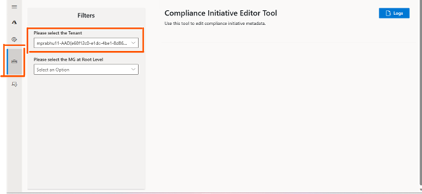

2. Click on 'New Compliance Initiative'.
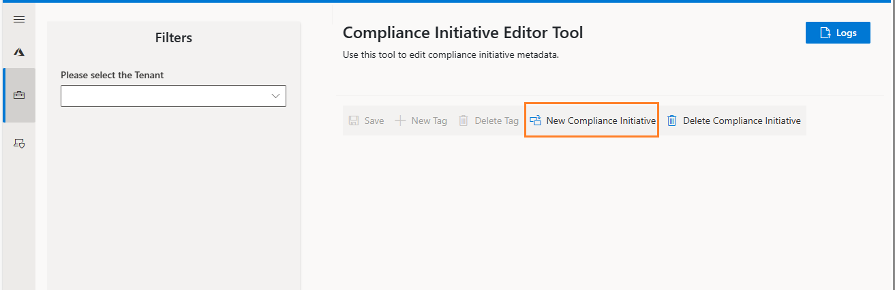

3. Fill all the required information. 'Default control tag filter' should be same tag that is added in [step-3](#3-add-custom-tags-to-controls-in-bulk-edit-mode-for-compliance-initiative). Click Save.
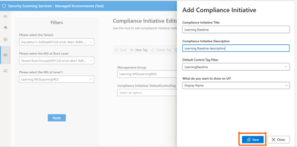


### 5. Add compliance initiative to the Mangement Group
1. Select the Root Level MG from the dropdown.
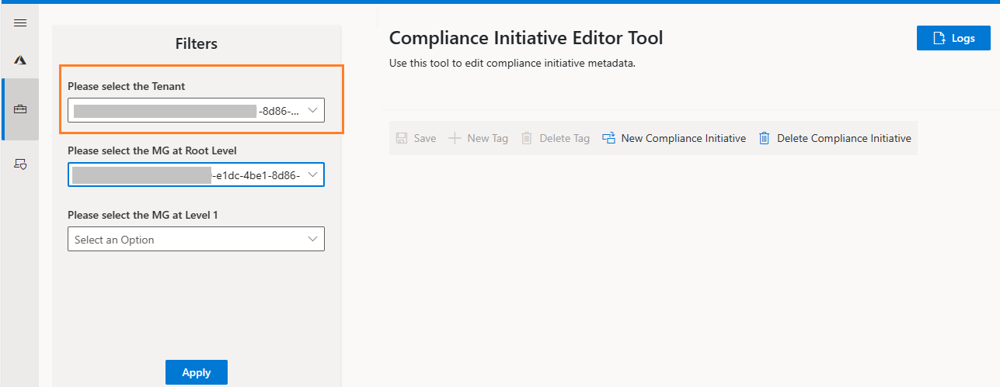

2. Select the MG where you want to configure the Compliance Initiative. Click Apply.
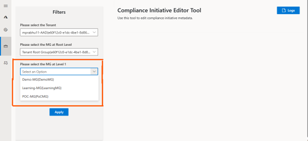

3. Click on 'New Tag' and fill all the required information.
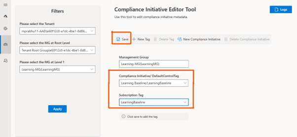

4. Click on 'Save'.

After completion of above steps, AzTS UI will have additional filter for Management Group. If Management Group is selected in this filter and it has a compliance initiative configured for it, then configured compliance initiative would become the default compliance initiative and user would see the compliance summary for only those controls which are part of the configured compliance initiative. 


