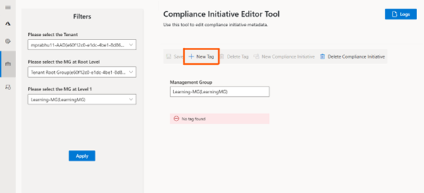

## Management Group driven Compliance Initiative
To drive compliance for specific set of controls driven on Mangement Group hierarchy, AzTS provides feature to configure Management Group driven Compliance Initiative.

This feature is disabled by default. Please follow below steps to enable the same:

### **1. Add Required configuration to the API application settings:**
1. Go to Azure Portal.
2. Navigate to AzTS host subscription -> AzTS host resource group.
3. Go to AzTS App service AzSK-AzTS-WebApi-xxxxx.
4. Go to Configuration under Settings.
5. Click on "New application setting" to add required app settings.
6. Add new application setting 'UIConfigurations__IsManagementGroupFilterEnabled' with value as 'true'. Click 'OK'.

7. Add new application setting 'UIConfigurations__complianceInitiativeFeatureConfiguration__IsEnabled' with value as 'true'. Click 'OK'.

8. Add new application setting 'ComplianceInitiativeActionItem__0__PrivilegedEditorIds__0' with value as 'user object id'. Click 'OK'. This step needs to be done per user who needs access to set/update Management Group driven Compliance Initiative.(PrivilegedEditorIds is an array so should beincremented sequentially for further users being added.)

> **Note:** User's object id can be referenced from Azure AD.

9. Add new application setting 'ControlActionItem__0__PrivilegedEditorIds__0'  with value as 'user object id'. Click 'OK'. This step needs to be done per user who needs access to set/update Management Group driven Compliance Initiative(PrivilegedEditorIds is an array so update the array index and add users one by one).

> **Note:** User's object id can be referenced from Azure AD.

10. Add new application setting 'ControlEditorFeatureConfiguration__IsBulkEditEnabled' with value as true. Click 'OK'. 

11. Add new application setting 'FeatureManagement__BulkEdit' with value as true. Click 'OK'.

12.Add new application setting 'UIConfigurations__ControlEditorFeatureConfiguration__IsBulkEditEnabled' with value as true. Click 'OK'.

13. Click 'OK' and then click 'Save'.

### 2.	Add Required configuration to Metadata Aggregator to enable MGTreeProcessor and PIM API support

1. Go to Azure Portal.
2. Navigate to AzTS host subscription -> AzTS host resource group.
3. Go to AzTS Metadata Aggregator function app (AzSK-AzTS-MetadataAggregator-xxxxx).
4. Go to Configurations under Settings.
5. Click on ‘New application setting’ to add required app settings.
6. Add new application setting 'FeatureManagement__ManagementGroups' with value as true. Click 'OK'. 

()

7. Click on 'New application setting' to add required app settings.
8. Add new application setting 'ManagementGroupConfigurations__ManagementGroupId' with value as parent Management Grroup Id. Click 'OK'. 

9. Add new application setting ‘AuthzSettings__IsPIMEnabled’ with value as true. Click ‘OK’. (This to enable PIM API calls to fetch RBAC details).

10. Click 'OK' and then click 'Save'.
()

### 3.	Add Custom tags to controls (in bulk edit mode) for compliance initiative
Compliance initiative feature requires common tag on all controls which are part of an initiative. Common tag to a set of controls can be easily added by using CMET bulk edit mode. Please follow the steps mentioned [here](../../06-Customizing%20AzTS%20for%20your%20org/Extending%20AzTS/FeaturesInCMET.md) to add tags to controls.

### 4. Create new Compliance initiative and Add compliance initiative to the Mangement Group
1. Click on the CIMT(Compliance initiative metadata tool) Icon and select the Tenant.
()

2. Select the Root Level MG from the dropdown.
()

3. Select the MG where you want to configure the Compliance Initiative. Click Apply.
()

4. Click on 'New Tag'.
()

5. Click on 'New Compliance Initiative'.
()

6. Fill out all the required information. 'Default control tag filter' should be same tag that is  added in [step-3](#3-add-custom-tags-to-controls-in-bulk-edit-mode-for-compliance-initiative). Click Save.
()

7. Select the Newly added compliance Initiative and corresponding subscription id (same as custom control tag). Click Save.
()

