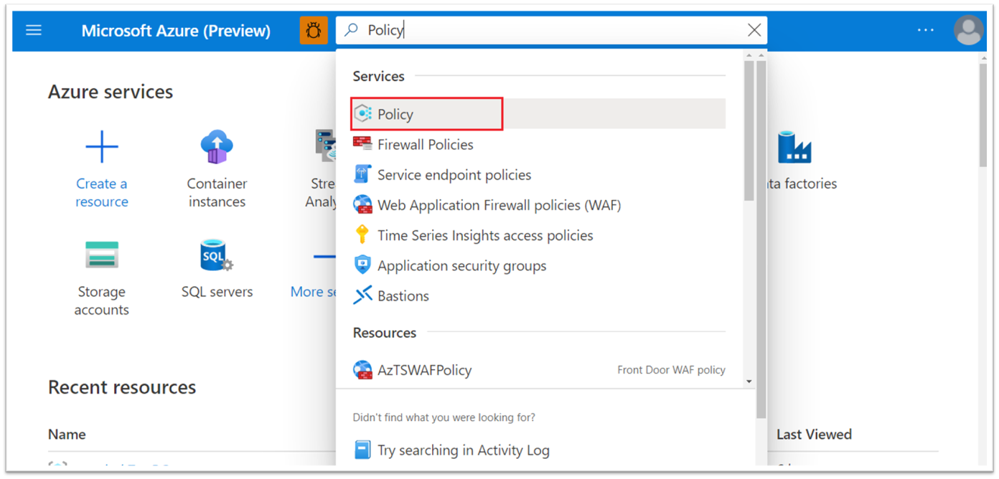
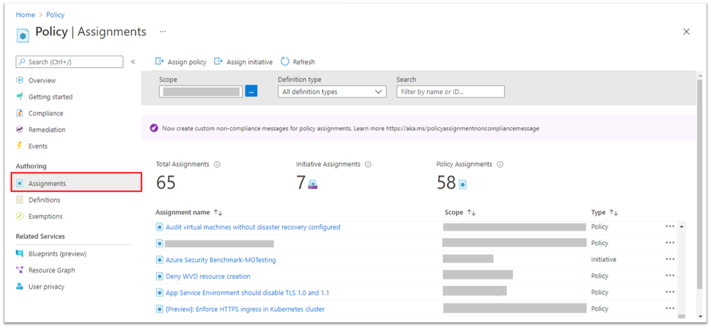
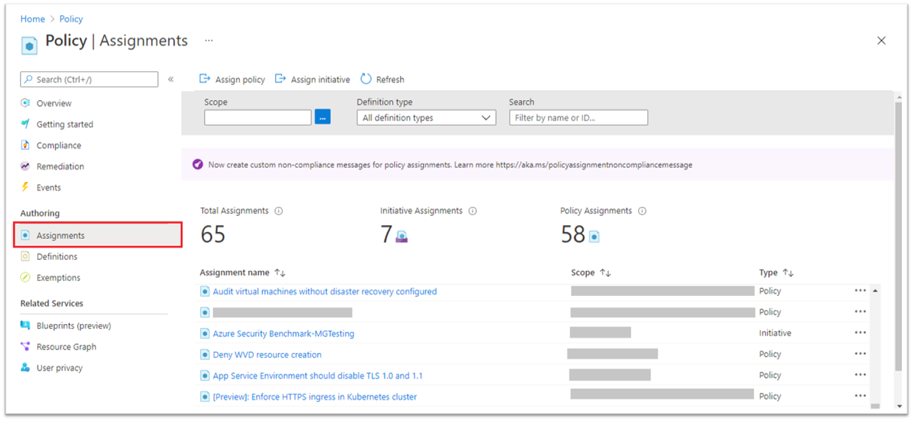
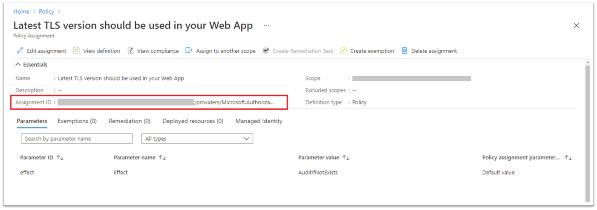
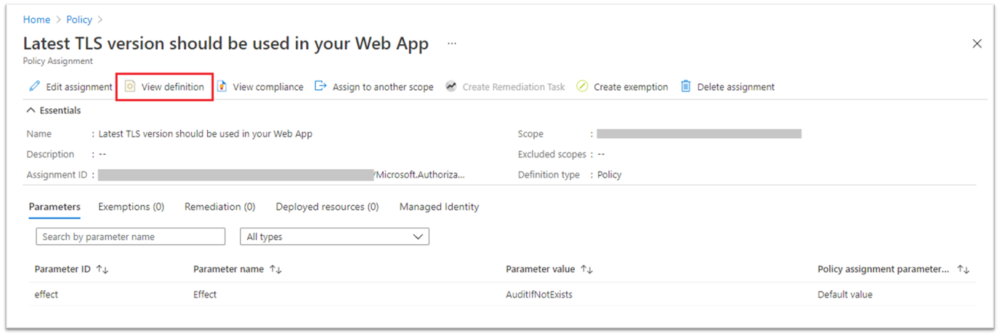
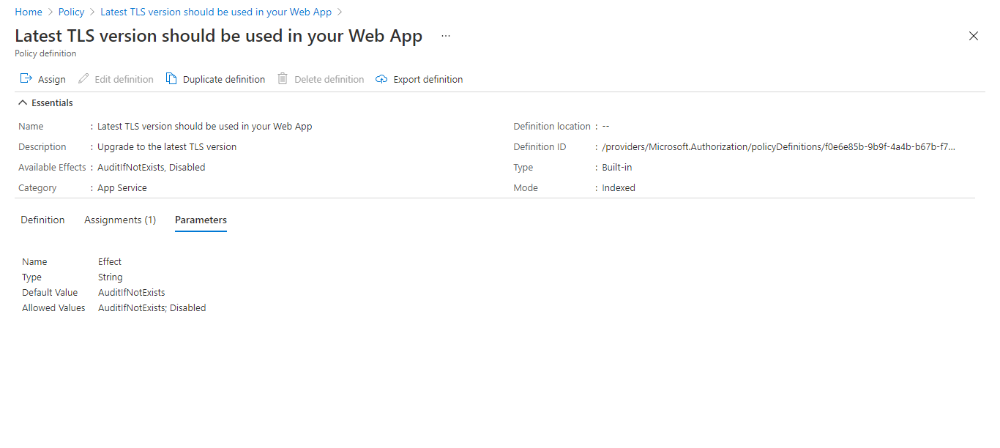

> The Azure Tenant Security Solution (AzTS) was created by the Core Services Engineering & Operations (CSEO) division at Microsoft, to help accelerate Microsoft IT's adoption of Azure. We have shared AzTS and its documentation with the community to provide guidance for rapidly scanning, deploying and operationalizing cloud resources, across the different stages of DevOps, while maintaining controls on security and governance.
 AzTS is not an official Microsoft product – rather an attempt to share Microsoft CSEO's best practices with the community..

# Extending AzTS

## Contents
- [Add new control for existing SVT](Readme.md#steps-to-extend-the-control-svt) 
   - [Add new control by custom Azure policy](Readme.md#add-new-control-by-custom-azure-policy)
   - [Add new control by custom ASC Assessment](./Extending%20AzSK%20Module/Readme.md#add-new-control-by-custom-asc-assessment)
- [FAQ](Readme.md#faqs)  

----------------------------------------------

### Add new control for existing SVT
Azure Tenant Security Solution (AzTS) provides capability to add new controls(for existing services supported by AzTS) to customize the AzTS for your organization as per your need.
Currently you can extend AzTS controls set by either adding a new control based on custom Azure Policy or based on Azure Security Center assessment.

### Add new control by custom Azure policy
Please follow the below mentioned steps to add new controls based on custom Azure Policy:

Step 0: Prerequisites - TBD

Step 1: Assign the required policy definition to root management group of your tenant. To assign a policy definition, please follow the steps mentioned [here](https://docs.microsoft.com/en-us/azure/governance/policy/tutorials/create-and-manage#assign-a-policy).

Step 2: Get the ID of the policy definition and policy assignment. If you already have ID of policy definition and assignment handy, please go to step #3 directly or follow the below mentioned steps to get these details.

2.A- Go to the Azure portal. Search for and select Policy.

2.B- Select Assignments on the left side of the Azure Policy page.

2.C- Change the Scope filter to required management group scope.

2.D- Select the required assignment.

2.E- Copy the Assignement ID.

2.F- Click on View Definition.

2.G- Copy the Definition ID.

Step 3: Go to AzTS UI. (Link to Faqs)

Step 4: Open Control editor tool.
    <Screenshot>

Step 5: Click on Action and select Add new control option.
    <Screenshot>

Step 6: Select the service/feature for which you want to add new control.
    <Screenshot>

Step 7: Select either one of the existing Security Domain for the control or if you want new Security Domain type required domain in text field.
    <Screenshot>

Step 8: Provide the Control ID. Initial part of the control ID is pre-populated based on the service/feature and secuirty domain you choose for the control (Azure_FeatureName_SecurityDomain_XXX).

    **Note:** Please don't use spaces between words instead use underscore '_' to separate words in control ID. 
    To see some of the examples of existing control IDs please check out this list.

Step 9: Set Control Scan Source to 'Policy'.

Step 10: Provide Display Name which is a user friendly name for the control.

Step 11: Provide Policy Assignment ID of the assignment (Check step #2 on how to get policy assignment ID).

Step 12: Provide one or more Policy Definition IDs(Check step #2 on how to get policy definition ID).
    **Note:** To provide multiple definition IDs, presss enter after each definition ID.

Step 13: Select either one of the existing Category (generic security specification of the control) for the control or if none of the existing categories is relevant for the control, enter/type your required category in text field.

Step 14: Keep Enabled switch to 'Yes'.

Step 15: Provide additional details for the control:

|Settings| Description| Examples|
|-------------|------|---------|
|Automated| Whether the control is manual or automated| e.g. Yes/No (keep it Yes for policy based controls)|
|Description| A basic description on what the control is about| e.g. App Service must only be accessible over HTTPS. |
|Tags| Labels that denote the control being of a specific type or belonging to a specific domain | For e.g. Baseline, Automated etc.|
|Control Severity| The severity of the control| e.g. High: Should be remediated as soon as possible. Medium: Should be considered for remediation. Low: Remediation should be prioritized after high and medium.|
|Control Requirements| Prerequisites for the control.| e.g. Monitoring and auditing must be enabled and correctly configured according to prescribed organizational guidance|
|Rationale|  Logical intention for the added control | e.g. Auditing enables log collection of important system events pertinent to security. Regular monitoring of audit logs can help to detect any suspicious and malicious activity early and respond in a timely manner.|
|Recommendations| Steps or guidance on how to remediate non-compliant resources | e.g. Refer https://azure.microsoft.com/en-in/documentation/articles/key-vault-get-started/ for configuring Key Vault and storing secrets |
|Custom Tags| Tags can be used for filtering and referring controls in the future while reporting| e.g. Production, Phase2 etc. |
|Control Settings| Settings specific to the control to be provided for the scan | e.g. Required TLS version for all App services in your tenant (Note: For policy based contols this should be empty) |
|Comments | These comments show up in the changelog for the feature. | e.g. Added new policy based control for App Service |

