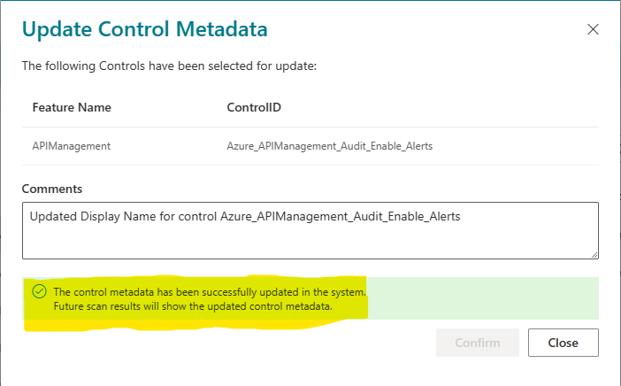

## Update existing control metadata
Control metadata like Display Name, Category, Tags, Description, Recommendations can be updated using Control Metadata Editor Tool(CMET). Please follow the below mentioned steps to update control metadata:

**Step 0:** Following prerequisites are required:
   1. CMET(Control metadata editor tool) is not enabled in AzTS setup by default. To enable this feature, please follow steps mentioned [here](Prerequisites.md#prerequisite-azts-configurations-to-enable-control-medatadata-editor-toolcmet).

   2. CMET is only accessible to privileged users based on AzTS API configurations. Please follow the steps mentioned [here](Prerequisites.md#access-to-cmet-control-metadata-editor-tool) to add yourself as privileged user (This is only required once per user).

**Step 1:** Go to **AzTS UI**. (To get AzTS UI URL, check this [FAQ](https://github.com/azsk/AzTS-docs/blob/main/03-Running%20AzTS%20solution%20from%20UI/README.md#frequently-asked-questions))

**Step 2:** Open **Control metadata editor tool**.

**Step 3:** Select the control to be be updated in CMET. It will open a popup displaying control metadata. Make sure 'Edit' toggle is turned 'ON' as shown in the image below.

**Step 4:** Update metadata and click on 'Queue for Update' button.

**Step 5:** Click on 'Close' button.

**Step 6:** Click on **Action** and select **Update** option.

**Step 7:** Add appropriate comments and click on 'Confirm'.

Post this, you will get success message. Now you are good to **close** 'Update Control Metadata' window.

**Step 8:** To **validate the control addition**, refresh the control metadata editor tool and search for updated control. Control should be available with updated metadata.

**Step 9:** As an **additional validation**, you can also trigger adhoc scan from AzTS UI for one or more subscriptions and check the control scan results for updated control. To get information on how to trigger adhoc scan, you can refer to this [link](https://github.com/azsk/AzTS-docs/tree/main/03-Running%20AzTS%20solution%20from%20UI#how-to-scan-subscription-manually).

