> The Azure Tenant Security Solution (AzTS) was created by the Core Services Engineering & Operations (CSEO) division at Microsoft, to help accelerate Microsoft IT's adoption of Azure. We have shared AzTS and its documentation with the community to provide guidance for rapidly scanning, deploying and operationalizing cloud resources, across the different stages of DevOps, while maintaining controls on security and governance.
<br>AzTS is not an official Microsoft product – rather an attempt to share Microsoft CSEO's best practices with the community..


### [Overview](README.md#overview)
 - [When and why should I set up org policy?](README.md#when-and-why-should-i-setup-org-policy)
 <!-- - [How does AzTS use online policy?](README.md#how-does-azts-use-online-policy) -->

### [Setting up org policy](Readme.md#setting-up-org-policy-1)
 <!-- - [What happens during org policy setup?](Readme.md#what-happens-during-org-policy-setup) -->
 <!-- - [First-time policy setup - an example](Readme.md#first-time-policy-setup---an-example) -->
 
<!-- ### [Consuming custom org policy](Readme.md#consuming-custom-org-policy-1)

 - [Running scan in AzTS-UI with org policy](Readme.md#1-running-scan-in-local-machine-with-custom-org-policy)
 - [Running Tenant Scan with org policy](Readme.md#2-setup-continuous-assurance) -->

 
### [Modifying and customizing org policy](Readme.md#modifying-and-customizing-org-policy-1)
 - [Getting Started](Readme.md#getting-started)
 - [Basic scenarios for org policy customization](Readme.md#basic-scenarios-for-org-policy-customization) 
      - [Update default metadata (display name, recommendation, etc.) for existing controls](README.md#update-default-metadata)
      - [Changing control setting for existing controls](Readme.md#changing-a-control-setting-for-existing-controls)
      - [Update control metadata for controls based on ASC Assessment](README.md#update-control-metadata-for-controls-based-on-ASC-assessment)
      - [Customizing specific controls for an existing service](Readme.md#customizing-specific-controls-for-a-service)
      - [Setting up and updating baselines for your org](Readme.md#creating-a-custom-control-baseline-for-your-org)

<!-- ### [Managing policy/advanced policy usage ](Readme.md#managing-policyadvanced-policy-usage)

- [Maintaining policy in source-control](Readme.md#maintaining-policy-in-source-control)

- [Policy deployment using CICD pipeline](Readme.md#policy-deployment-using-cicd-pipeline) -->


 - [Advanced scenarios for org policy customization](Readme.md#advanced-scenarios-of-org-policy) 
      <!-- - [SVT customization](Readme.md#customizing-the-svts) -->
      - [Update/extend existing control by custom Azure policy](./Extending%20AzSK%20Module/Readme.md#steps-to-override-the-logic-of-existing-svt)
      - [Update/extend existing control by custom ASC Assessment](./Extending%20AzSK%20Module/Readme.md#steps-to-override-the-logic-of-existing-svt)
      - [Add new control for existing service](./Extending%20AzSK%20Module/Readme.md#steps-to-extend-the-control-svt)
      - [Add new service altogether (non-existing service) - Coming soon!](./Extending%20AzSK%20Module/Readme.md#steps-to-add-a-new-svt-to-the-azsk-module)


# Overview

## When and why should I setup org policy

When you run any scan command from AzTS (using AzTS-UI or scheduled scan), it relies on JSON-based policy files to determine various parameters that effect the behavior of the scan it is about to run. These policy files are downloaded 'on the fly' from a policy server. When you run the public version of the scanner, the offline policy files present in the AzTS solution/package are accessed. Thus, whenever you run a scan from a vanilla installation, AzTS accesses the offline file present in the package to get the policy configuration and runs the scan using it.

The JSON inside the policy files dictate the behavior of the security scan. This includes things such as:
 - Which set of controls to evaluate?
 - What control set to use as a baseline?
 - What settings/values to use for individual controls? 
 - What messages to display for recommendations?
 <!-- - Add custom controls, Etc. -->

Note that the policy files needed for security scans are accessed from the last updated deployed AzTS package. 

While the out-of-box files in the package may be good for limited use, in many contexts you may want to "customize" the behavior of the security scans for your environment. You may want to do things such as: 
1. enable/disable some controls, 
2. change control settings to better match specific security policies within your org, 
3. change various messages,
4. modify existing control logic,
5. add additional filter criteria for certain regulatory requirements that teams in your org can leverage,
6. add new controls to existing service, etc.

When faced with such a need, you need a way to create and manage a dedicated policy endpoint customized to the needs of your environment. The organization policy customization setup feature helps you do that in an automated fashion.

In this document, we will look at how to setup an organization-specific policy endpoint, how to make changes 
to and manage the policy files and how to accomplish various common org-specific policy/behavior customizations 
for the AzTS.

<!-- ## How does AzTS use online policy? -->

# Setting up org policy

Basic org policy setup is done by default during AzTS installation. Setup leverages storage account (added along with AzTS setup) to hold various policy artifacts in the subscription. This should be a secure, limited-access subscription to be used only for managing your org's AzTS policy.

<!-- ## What happens during org policy setup? -->
<!-- ## First-time policy setup - an example -->

# Modifying and customizing org policy

## Know more about controls

All our controls inherit from a base class called BaseControlEvaluator which will take care of all the required plumbing from the control evaluation code. Every control will have a corresponding feature json file under the configurations folder. For example, Storage.cs (in the control evaluator folder) has a corresponding Storage.json file under configurations folder. These controls json have a bunch of configuration parameters, that can be controlled by a policy owner, for instance, you can change the recommendation, modify the description of the control suiting your org, change the severity, etc.

Below is the typical schema for each control inside the feature json

```JSON
{
    "ControlID": "Azure_Subscription_AuthZ_Limit_ClassicAdmin_Count",   //Human friendly control Id. The format used is Azure_<FeatureName>_<Category>_<ControlName>
    "Description": "Limit access per subscription to 2 or less classic administrators",  //Description for the control, which is rendered in all the reports it generates (CSV, AI telemetry, emails etc.).
    "Id": "SubscriptionCore160",   //This is internal ID and should be unique. Since the ControlID can be modified, this internal ID ensures that we have a unique link to all the control results evaluation.
    "ControlSeverity": "High", //Represents the severity of the Control. 
    "Automated": "Yes",   //Indicates whether the given control is Manual/Automated.
    "MethodName": "CheckCoAdminCount",  // Represents the Control method that is responsible to evaluate this control. It should be present inside the feature SVT associated with this control.
    "DisplayName": "Limit access per subscription to 2 or less classic administrators", // Represents human friendly name for the control.
    "Recommendation": "You need to remove any 'Classic Administrators/Co-Administrators' who should not be in the role. Please follow these steps: (a) Logon to https://portal.azure.com/ (b) Navigate to Subscriptions (c) Select the subscription (d) Go to 'Access Control (IAM)' and select the 'Classic Administrators' tab. (e) Select the co-administrator account that has to be removed and click on the 'Remove' button. (f) Perform this operation for all the co-administrators that need to be removed from the subscription.",	  //Recommendation typically provides the precise instructions on how to fix this control.
    "Tags": [
         "SDL",
         "TCP",
         "Automated",
         "AuthZ",
         "SubscriptionCore",
         "Baseline",
         "CSEOPilotSub"
    ], // You can decorate your control with different set of tags, that can be used as filters in scan commands.
    "Enabled": true ,  //Defines whether the control is enabled or not.
    "Rationale": "The v1 (ASM-based) version of Azure resource access model did not have much in terms of RBAC granularity. As a result, everyone who needed any access on a subscription or its resources had to be added to the Co-administrator role. These individuals are referred to as 'classic' administrators. In the v2 (ARM-based) model, this is not required at all and even the count of 2 classic admins currently permitted is for backward compatibility. (Some Azure services are still migrating onto the ARM-based model so creating/operating on them needs 'classic' admin privilege.)", //Provides the intent of this control.
    "ControlSettings": {
      "NoOfClassicAdminsLimit": 2
    } //  Settings specific to the control to be provided for the scan
}
```

After Schema of the control json, let us look at the corresponding feature 

<!-- TODO: Mention below what CR is in details and same for resource -->

``` CS
public class SubscriptionCoreEvaluator : BaseControlEvaluator
{
    
    public ControlResult CheckCoAdminCount(ControlResult cr)
    {

        // 1. This is where the code logic is placed
        // 2. ControlResult input to this function, which needs to be updated with the verification Result (Passed/Failed/Verify/Manual/Error) based on the control logic
        // 3. Messages that you add to ControlResult variable will be displayed in the detailed log automatically.
        
        // Note the syntax of how to fetch value from Control Settings from the JSON.
        int noOfClassicAdminsLimit = cr.ControlDetails.ControlSettings?["NoOfClassicAdminsLimit"]?.Value<int>() ?? 2;
        string classicAdminAccountsString = "No classic admin accounts found.";
        int classicAdminAccountsCount = 0;

        // NOTE: While fetching RBAC result, we make three API calls - PIM, ARM, Classic. We are *not* handling partial result scenario if error occurred while fetching any of these RBAC result.
        // If no RBAC is found, mark status as Verify because sufficient data is not available for evaluation.
        if (this.RBACList?.Any() == false)
        {
            cr.VerificationResult = VerificationResultStatus.Verify;
            cr.StatusReason = "No RBAC result found for this subscription.";
            cr.ConsiderForCompliance = false;
            return cr;
        }
        else
        {
            List<RBAC> classicAdminAccounts = new List<RBAC>();
            classicAdminAccounts = RBACList.AsParallel().Where(rbacItem => rbacItem.RoleName.ToLower().Contains("coadministrator") || rbacItem.RoleName.ToLower().Contains("serviceadministrator")).ToList();

            // First start with default value, override this if classic admin account is found.
            if (classicAdminAccounts != null && classicAdminAccounts.Any())
            {
                classicAdminAccountsCount = classicAdminAccounts.Count;
                classicAdminAccountsString = string.Join(",", classicAdminAccounts.Select(a => a.ToStringClassicAssignment()).ToList());
            }

            // Start with failed state, mark control as Passed if all required conditions are met
            cr.StatusReason = $"No. of classic administrators found: [{classicAdminAccountsCount}]. Principal name results based on RBAC inv: [{String.Join(", ", classicAdminAccounts.Select(a => a.PrincipalName))}]";
            cr.VerificationResult = VerificationResultStatus.Failed;

            // Classic admin accounts count does not exceed the limit.
            if (classicAdminAccountsCount <= noOfClassicAdminsLimit)
            {
                cr.VerificationResult = VerificationResultStatus.Passed;
            }
        }

        return cr;
    }
    .
    .
    .
}
```

<!-- Add a block diagram here to show how the overlay happens -->
## Getting Started

The typical workflow for all control changes will remain same and will involve the following basic steps:
1. Set up the AzTS Extended solution following the steps mentioned below.
2. Modify or Author control metadata (Json files).
3. Modify or Author control methods in respective control evaluator files.
4. Build and run the solution in your local system and verify your changes.
<!-- 5. Deploy the solution. -->


## Setting up the solution

In this section, we will walk through the steps of setting up organization-specific policy customizable AzTS Scanner in your local systems.

> **Note**: You would require at least 'Reader' level access on Subscription and 'Contributor' level access to the LA Workspace, Storage, etc.

Let's Start!

1. Clone [this](https://github.com/azsk/AzTS-Samples) GitHub repository in a new Visual Studio. This solution has the required [NuGet package](https://www.nuget.org/packages/Microsoft.AzTS.Azure.Scanner/) reference to the AzTS Solution. It will import the dependencies and libraries of the AzTS Scanner to the user's solution.
2. Go to AzTS_Extended folder and load the AzTS_Extended.sln. <br />
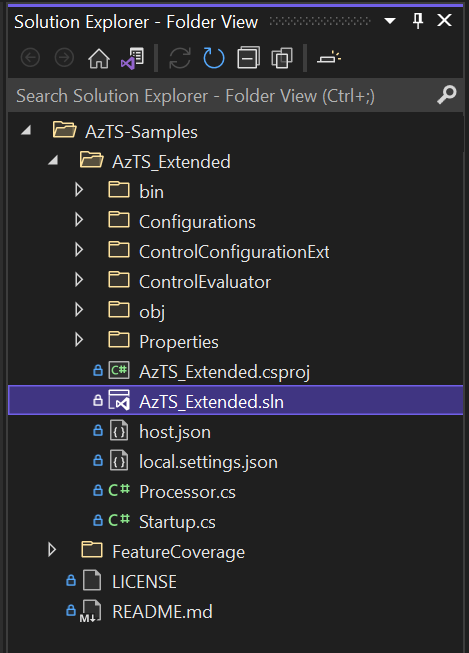

3. Files to update:
    * In local.settings.json file:
         ```JSON
               {
               "IsEncrypted": false,
               "Values": {
                  "ASPNETCORE_ENVIRONMENT": "Local",
                  "AzureWebJobsStorage": "UseDevelopmentStorage=true",
                  "FUNCTIONS_WORKER_RUNTIME": "dotnet",
                  "APPINSIGHTS_INSTRUMENTATIONKEY": "", // more details on App insights instrumentation key can be found below.
                  "AzureStorageSettings__ResourceId": "", // more details on Storage Settings can be found below.
                  "LAConfigurations__WorkspaceId": "",// more details on LA Configurations can be found below.
                  "LAConfigurations__ResourceId": ""
               }
               } 
         ```
        <!-- [TODO] Make LA and Storage details options -->
      1. Application insights collect telemetry data from connected apps and provides Live Metrics, Log Analytics, etc. It has an instrumentation key which we need to configure into our function app i.e. APPINSIGHTS_INSTRUMENTATIONKEY and with this key app insights grab data from our app. Add instrumentation key for Application Insights by entering "APPINSIGHTS_INSTRUMENTATIONKEY"
         <br />Application insights by the name - AzSK-AzTS-AppInsights get created while setting up the AzTS solution. Please refer to [this](https://github.com/azsk/AzTS-docs/tree/main/01-Setup%20and%20getting%20started) link for reference to setting up AzTS for more context.
         <br />You can find the instrumentation key as shown below for your respective App insights resource.<br />
         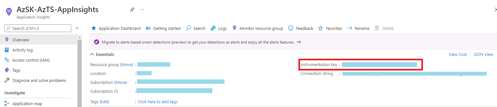
      2. Storage Account and Log Analytic Workspace are used to store the scan events, inventory, subscription scan progress details and results.
	       1. Storage Account: It gets created by the name - azsktsstoragexxxxx while setting up the AzTS solution. Add 'ResourceId' of the Storage Account. 
               <br />You can find the Resource ID as shown below.<br />
               Step 1:<br />
               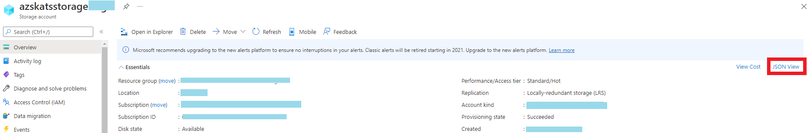
               <br />Step 2:<br />
               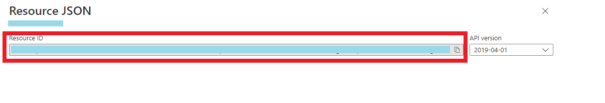

		    2. Log Analytic Workspace: It gets created by the name - AzSK-AzTS-LAWorkspace-xxxxx while setting up the AzTS solution. Add 'WorkspaceId' and 'ResourceId' of the LA Workspace. 
               <br />You can find the Workspace ID as shown below.<br />
               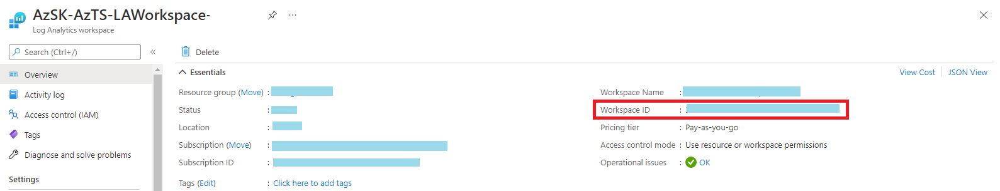
               <br />You can find the Resource ID as shown below.<br />
               Step 1:<br />
               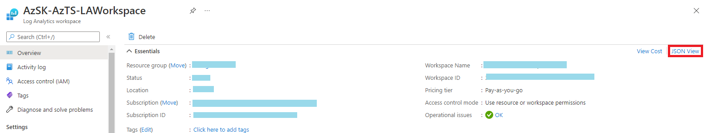
               <br />Step 2:<br />
               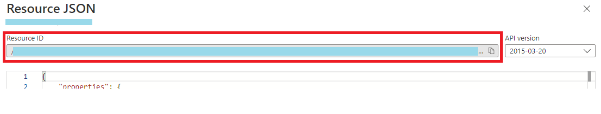
    * In Processor.cs file (line 33), mention the ID of the subscription to be scanned:<br />
               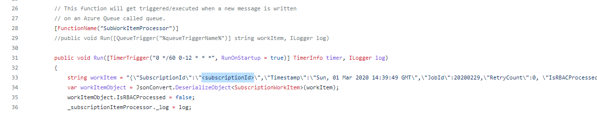

4. Build and Run
   - Click on the AzTS_Extended as shown below to run the project: <br />
      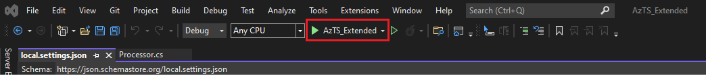<br/>
   - Output looks like below:<br/>
      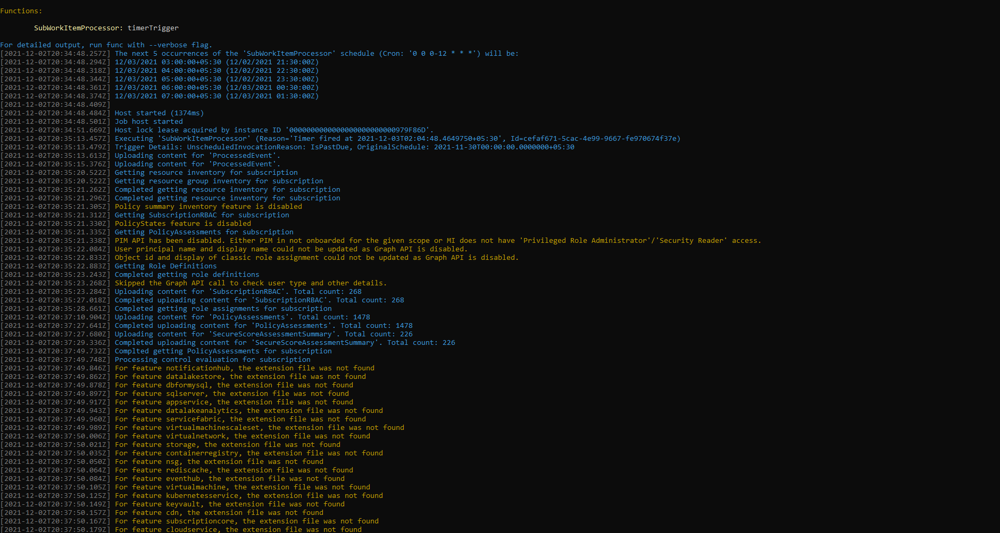<br />
      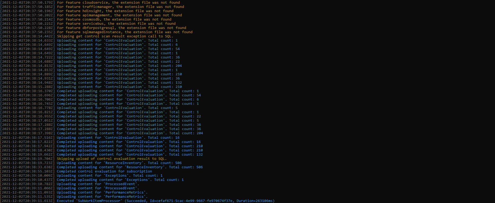
   Congratulations! Set up is complete with this step.

5. Verify the changes:
 You can verify your changes in the Log Analytics Workspace with the help of this [link](https://github.com/azsk/AzTS-docs/tree/main/01-Setup%20and%20getting%20started#4-log-analytics-visualization).
 <br/> Few simple queries are provided in the above link related to the inventory and Control Scan summary for reference.

Before we get started with extending the toolkit, let's understand the structure of the built solution repository. 

   
<!-- TODO : Add details about the structure -->
The following template files are also included in the solution repository to better guide the users in the authoring controls:
| Template File Name | High-level Description 
| ---- | ---- | 
| FeatureNameExt.json <br> [under the ControlConfigurationExt folder] | This file contains the setting of controls of a specific feature. A few meta-data are required for a control to be scanned which are mentioned in detail further ahead.
| FeatureNameControlEvaluatorExt.cs <br> [under the ControlEvaluator folder] | This file is used to override the base control evaluation method.

Next, we will look into basic and advanced applications of organization policy customization through this setup.

## Basic scenarios for org policy customization

In this section let us look at typical scenarios in which you would want to customize the org policy and ways to accomplish them.

> Note: To edit policy JSON files, use a friendly JSON editor such as Visual Studio Code. It will save you lot of debugging time by telling you when objects are not well-formed (extra commas, missing curly-braces, etc.)! This is key because in a lot of policy customization tasks, you will be taking existing JSON objects and removing large parts of them (to only keep the things you want to modify).

### Update default metadata (display name, recommendation, etc.) for existing controls
### Changing control setting for existing controls 
### Update control metadata for controls based on ASC Assessment
### Customizing specific controls for an existing service
### Setting up and updating baselines for your org

## Advanced scenarios for org policy customization

### Update/extend existing control by custom Azure policy
### Update/extend existing control by custom ASC Assessment 
### Add new control for existing service
### Add new service altogether (non-existing service) - Coming soon!
