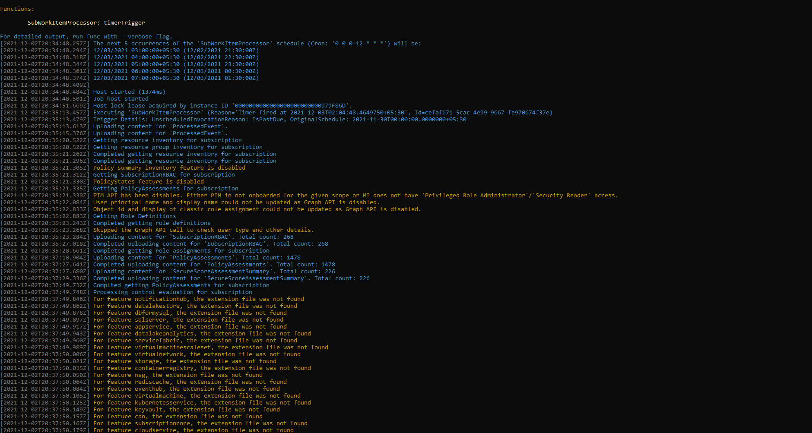

# Customizing specific controls for an existing service


Using Org policy customization, we can modify the Control Result for an existing control. Below is a walk-through example of how to do so leveraging the AzTS-Extended solution that you build using the steps mentioned [here](../README.md#setting-up-the-solution).
<br/><br/>A typical setting you may want to tweak is the Status Reason for a control according to your org's needs. 
Let us customize the Status Reason for the "Azure_Storage_NetSec_Restrict_Network_Access" existing control.
This setting resides in a file called FeatureNameControlEvaluator.cs. 
<br/>Because the first-time org policy setup does not customize anything from this, we will need to follow the following steps to modify the Control Evaluator:

### Steps:
0.  Initially, set up the organization-specific policy customizable AzTS Solution in your local systems by following the steps mentioned [here](../README.md#setting-up-the-solution).
1.  Copy _FeatureNameExt.json_ file and rename it accordingly. For example: StorageExt.json
2.  Fill the parameters according to the feature. For example: 
    ``` JSON
    {
        "FeatureName": "Storage",
        "Reference": "aka.ms/azsktcp/storage", // you can find this from the FeatureName.json as well
        "IsMaintenanceMode": false,
    }
    ```
3.  Add the control json with all parameters given in template. The following meta-data are required for a control to be scanned:
    ``` JSON
    "Controls": [
        {
        // The following parameters can be taken from the FeatureName.json directly as there will no change in them for the scope of this scenario. 
        "ControlID": "Azure_Storage_NetSec_Restrict_Network_Access",
        "Id": "AzureStorage260",
        "Automated": "Yes",
        "MethodName": "CheckStorageNetworkAccess",
        "Enabled": true,
        "DisplayName": "Ensure that Firewall and Virtual Network access is granted to a minimal set of trusted origins"
        }
    ]
    ```

    1. For **Id** above: 
        * Since we are modifying control settings for an existing control here, use the same ID as used previously from the FeatureName.json . 
    2. For **ControlID** above: Initial part of the control ID is pre-populated based on the service/feature and security domain you choose for the control (Azure_FeatureName_SecurityDomain_XXX). Please don't use spaces between words instead use underscore '_' to separate words in control ID. To see some of the examples of existing control IDs please check out this [list](https://github.com/azsk/AzTS-docs/tree/main/Control%20coverage#azure-services-supported-by-azts).
    3. Keep **Enabled** switch to 'Yes' to scan a control.
    4. **DisplayName** is the user friendly name for the control. It does not necessarily needed to be modified.
    5. For **MethodName** above: You can customize the MethodName here. Just make sure to use the same method name in the Control Evaluator in the next steps.

4. Copy _FeatureNameControlEvaluatorExt.cs_ and rename it accordingly. For example: StorageControlEvaluatorExt.cs
5. Change the FeatureNameEvaluatorExt and FeatureNameControlEvaluator according to the baseControlEvaluator name (line 13) as shown below.
    ``` CS
    // class FeatureNameEvaluatorExt : FeatureNameControlEvaluator
    class StorageControlEvaluatorExt : StorageControlEvaluator
    {
        // Add control methods here        
    }
    ```
6. Add the control method according to the [feature documentation](FeatureCoverage/README.md).
    Modify the Status reason of the Control Result in here according to the org's policy. 
    <!-- Note: Use the same method name as mentioned above in the Control JSON file. -->

<!-- TODO : Add details about storage resource here -->

``` CS
public class StorageControlEvaluatorExt : StorageControlEvaluator
{

    // Note: Use the same method name as mentioned above in the Control JSON file.
    public void CheckStorageNetworkAccess(Resource storage, ControlResult cr)
    {
        // 1. This is where the code logic is placed
        // 2. ControlResult input to this function, which needs to be updated with the verification Result (Passed/Failed/Verify/Manual/Error) based on the control logic
        // 3. Messages that you add to ControlResult variable will be displayed in the detailed log automatically.
        
        if (!string.IsNullOrEmpty(storage.CustomField1))
        {
            // Start with failed state, mark control as Passed if all required conditions are met
            cr.VerificationResult = VerificationResultStatus.Failed;
            cr.ScanSource = ScanResourceType.Reader.ToString();

            // CustomField1 has details about which protocol is supported by Storage for traffic
            var stgDetails = JObject.Parse(storage.CustomField1);
            string strNetworkRuleSet = stgDetails["NetworkRuleSet"].Value<string>();

            if (strNetworkRuleSet.Equals("Deny", StringComparison.OrdinalIgnoreCase))
            {
                // Firewall and Virtual Network restrictions are defined for this storage. Hence, Passed
                // Note below we modify the Status Reason in case the control is Passed
                cr.StatusReason = $"According to Org policy: Firewall and Virtual Network restrictions are defined for this storage.";
                cr.VerificationResult = VerificationResultStatus.Passed;
            }
            else
            {
                // No Firewall and Virtual Network restrictions are defined for this storage. Hence, Failed
                // Note below we modify the Status Reason in case the control is Failed
                cr.StatusReason = $"According to Org policy: No Firewall and Virtual Network restrictions are defined for this storage.";
                cr.VerificationResult = VerificationResultStatus.Failed;
            }
        }

        // 'Else' block not required since CustomField1 is never expected to be null
    }
    .
    .
    .
}
```


7. Build and Run
   - Click on the AzTS_Extended as shown below to run the project: <br />
      <br/>
<!-- TODO Add the SubscriptionCore file EXT added log -->
   - Output looks like below:<br/>
      <br />
      
   Congratulations! Customizing the Control Evaluator Scenario is complete with this step.

8. Verify the changes:
 You can verify your changes in the Log Analytics Workspace with the help of this [link](https://github.com/azsk/AzTS-docs/tree/main/01-Setup%20and%20getting%20started#4-log-analytics-visualization).
 <br/> Few simple queries are provided in the above link related to the inventory and Control Scan summary for reference.
