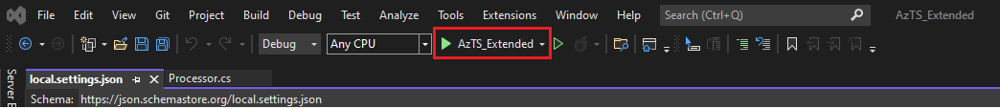

# Updating Control Metadata for controls based on ASC Assessment

Using Org policy customization, we can change some ASC assessment setting for an existing control. Below is a walk-through example of how to do so leveraging the AzTS-Extended solution that you build using the steps mentioned [here](../README.md#setting-up-the-solution).
<br/>
<br/>A typical setting you may want to modify is the name of the ASC assessment that is being scanned for a control according to your org's needs. 
<br/>Let us change the ASC assessment value to "2acd365d-e8b5-4094-bce4-244b7c51d67c" from "00c6d40b-e990-6acf-d4f3-471e747a27c4" for the "Azure_Subscription_AuthZ_Remove_Management_Certs" existing control. 
This setting resides in a file called FeatureName.json. 
<br/>Because the first-time org policy setup does not customize anything from this, we will need to follow the following steps to modify the ASC assessments settings:

### Steps:
0.  Initially, set up the organization-specific policy customizable AzTS Solution in your local systems by following the steps mentioned [here](../README.md#setting-up-the-solution).
1.  Copy _FeatureNameExt.json_ file and rename it accordingly. For example: SubscriptionCoreExt.json
2.  Fill the parameters according to the feature. For example: 
    ``` JSON
    {
        "FeatureName": "SubscriptionCore",
        "Reference": "aka.ms/azsktcp/sshealth", // you can find this from the FeatureName.json as well
        "IsMaintenanceMode": false,
    }
    ```
3.  Add the control json with all parameters given in template. The following meta-data are required for a control to be scanned:
    ``` JSON
    "Controls": [
        {
        // The following parameters can be taken from the FeatureName.json directly as there will no change in them for the scope of this scenario. 
        "ControlID": "Azure_Subscription_AuthZ_Remove_Management_Certs",
        "Id": "SubscriptionCore170",
        "Automated": "Yes",
        "DisplayName": "Do not use management certificates",
        "MethodName": "", // This will be empty since the Control is ASC assessment based
        "Enabled": true,

        // For this scenario, modify the ASC Assessment name under Assessment properties as such:
        "AssessmentProperties": {
                "AssessmentNames": [
                    "2acd365d-e8b5-4094-bce4-244b7c51d67c"
                ]
        } //
        }
    ]
    ```

    1. For **Id** above: 
        * Since we are modifying control settings for an existing control here, use the same ID as used previously from the FeatureName.json . 
    2. For **ControlID** above: Initial part of the control ID is pre-populated based on the service/feature and security domain you choose for the control (Azure_FeatureName_SecurityDomain_XXX). Please don't use spaces between words instead use underscore '_' to separate words in control ID. To see some of the examples of existing control IDs please check out this [list](https://github.com/azsk/AzTS-docs/tree/main/Control%20coverage#azure-services-supported-by-azts).
    3. Keep **Enabled** switch to 'Yes' to scan a control.
    4. **DisplayName** is the user friendly name for the control. It does not necessarily needed to be modified.
    5. For **MethodName** above: If the control is ASCorReader based then, use the same method name for this scenario as no change in the control logic is required.
    6. **AssessmentProperties**: Default enterprise policy settings for Azure Security Center like configuring assessment name in ASC etc. 

4. Build and Run
   - Click on the AzTS_Extended as shown below to run the project: <br />
      <br/>
<!-- TODO Add the SubscriptionCore file EXT added log -->
   - Output looks like below:<br/>
      <br />
      
   Congratulations! Changing Control Setting Scenario is complete with this step.

5. Verify the changes:
 You can verify your changes in the Log Analytics Workspace with the help of this [link](https://github.com/azsk/AzTS-docs/tree/main/01-Setup%20and%20getting%20started#4-log-analytics-visualization).
 <br/> Few simple queries are provided in the above link related to the inventory and Control Scan summary for reference.
