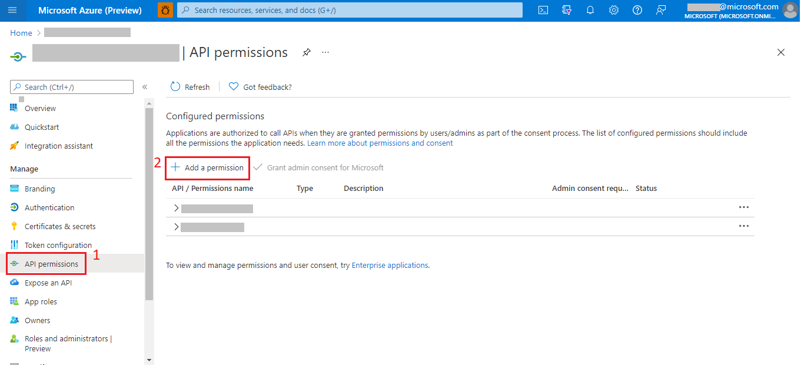
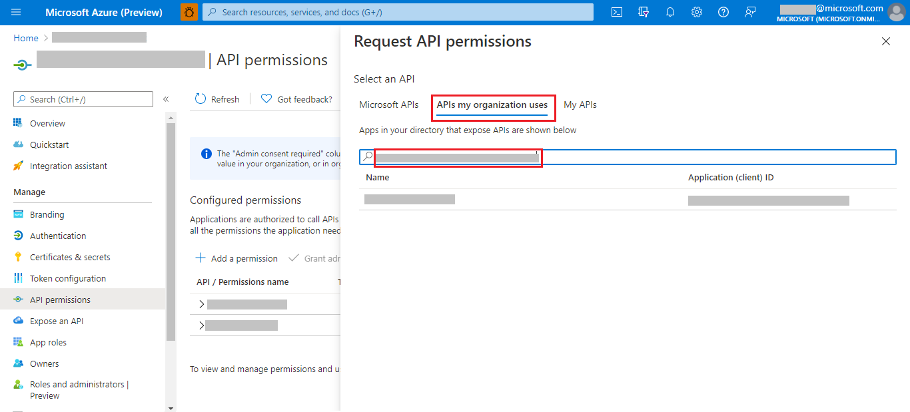
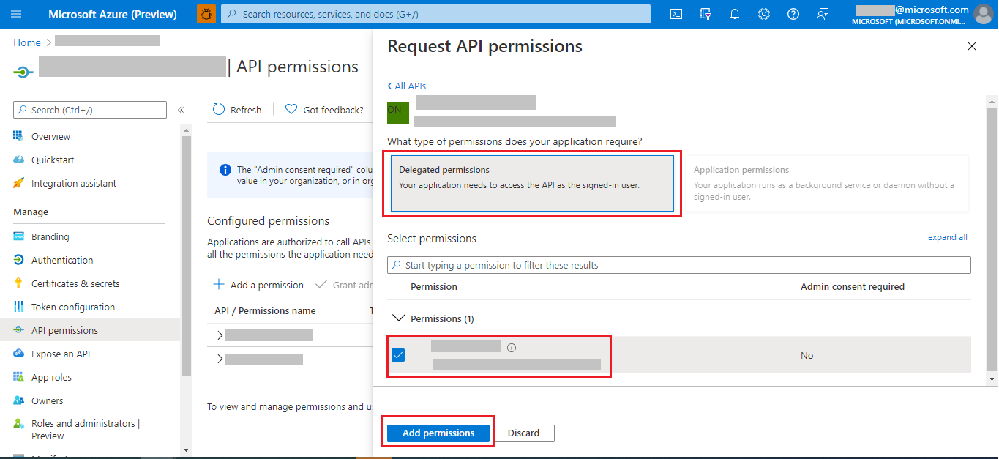

> The Azure Tenant Security Solution (AzTS) was created by the Core Services Engineering & Operations (CSEO) division at Microsoft, to help accelerate Microsoft IT's adoption of Azure. We have shared AzTS and its documentation with the community to provide guidance for rapidly scanning, deploying and operationalizing cloud resources, across the different stages of DevOps, while maintaining controls on security and governance.
 AzTS is not an official Microsoft product – rather an attempt to share Microsoft CSEO's best practices with the community..

# Prerequisites steps
Below are <b>one time steps</b> that need to be executed by <b>AzTS admin</b> in order to use APIs in AzTS. </b>
- [Step 1: Register an application in Azure AD to represent a client application](Prerequisite%20Steps.md#step-1-register-an-application-in-azure-ad-to-represent-a-client-application)
- [Step 2: Configure permissions for WebAPI app registration](Prerequisite%20Steps.md#step-2-configure-permissions-for-webapi-app-registration)
- [Step 3: Get administrator consent for WebAPI app registration](Prerequisite%20Steps.md#step-3-get-administrator-consent-for-webapi-app-registration)

## Prerequisites

> On demand scan as an API feature is disabled by default in AzTS. If you want to enable this feature for your tenant, follow the steps below:
> 1. Go to Azure Portal.
> 2. Go to **Resource Groups**.
> 3. Select your Resource Group where you have configured AzTS set up.
> 4. Select the App Service for API 'AzSK-AzTS-WebApi-xxxxx'.
> 5. In the app's left menu, select **Configuration** > **Application settings**.
> 6. Add/edit app setting **FeatureManagement__OnDemandScanAPI** and set its value to _'true'_.
> 7. Save.

## Step 1: Register an application in Azure AD to represent a client application
In order to generate the token for making an API call, client app registration needs to be created.

 
Follow below steps to create client application:  

1. Go to the Azure portal to register your application.

2. Search for and select **App registrations**.

3. Select **New registration**.

4. When the **Register an application** page appears, enter your application's registration information:

    - In the **Name** section, enter a meaningful application name that will be displayed to users of the app..

    - In the **Supported account types** section, select **Accounts in any organizational directory (Any Azure AD directory - Multitenant)**.

5. In the **Redirect URI** section, select 'Web' and leave the URL field empty for now.

6. Select **Register** to create the application.

7. On the app **Overview** page, find the **Application (client) ID** value and record it for later.

8. Create a client secret for this application to use in a subsequent step (only if you want to use 'Client credential flow' to generate the token).

    - From the list of pages for your client app, select **Certificates & secrets**, and select **New client secret**.

    - Under **Add a client secret**, provide a **Description**. Choose when the key should expire, and select **Add**.

9. When the secret is created, note the key value for use in a subsequent step.

 

[Back to top…](Prerequisite%20Steps.md#prerequisites-steps)

## Step 2: Configure permissions for WebAPI app registration
1. Go to Azure Portal.
2. Go to **App Registration**.
3. Select your WebAPI App Registration.
4. Go to **API Permissions**.
5. Select **Add a permission**.

6. Go to **APIs my organization uses**.
7. Search your WebAPI client id and select.

8. Select **Delegated permissions**.
9. Select permissions.
10. **Add permissions**.

[Back to top…](Prerequisite%20Steps.md#prerequisites-steps)

## Step 3: Get administrator consent for WebAPI app registration
If 'User consent' is restricted to the WebAPI, then WebAPI must have 'Admin consent' granted to expose the APIs.
Grant admin consent for client app registration:
1. Go to Azure Portal.
2. Go to **App Registration**.
3. Search your WebAPI App Registration using client id.
4. Get scope from **Expose an API** > **Scopes**.
5. Go to **API Permissions**.
6. Click **Grant admin consent** for your Tenant at above scope (step-4).

## Get client id of WebAPI App Registration
1. Go to Azure Portal.
2. Go to **Resource Groups**.
3. Select your Resource Group where you have configured AzTS set up.
4. Select the App Service for API 'AzSK-AzTS-WebAPI-xxxxx'.
5. In the app's left menu, select **Configuration** > **Application settings**.
6. Add/edit app setting **AADClientAppDetails__ApplicationId** and use its value as WebAPI Client id. 

[Back to top…](Prerequisite%20Steps.md#prerequisites-steps)
