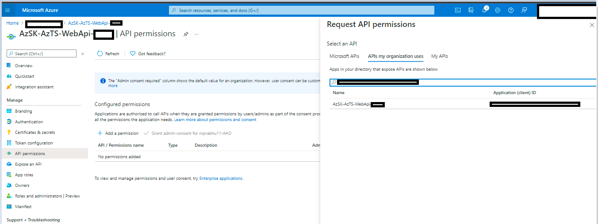
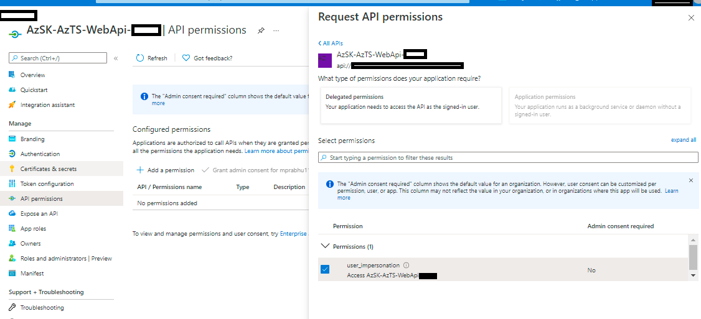

> The Azure Tenant Security Solution (AzTS) was created by the Core Services Engineering & Operations (CSEO) division at Microsoft, to help accelerate Microsoft IT's adoption of Azure. We have shared AzTS and its documentation with the community to provide guidance for rapidly scanning, deploying and operationalizing cloud resources, across the different stages of DevOps, while maintaining controls on security and governance.
 AzTS is not an official Microsoft product – rather an attempt to share Microsoft CSEO's best practices with the community..

 

# AzTS REST API Set Up - Step by step

##  On this page:

1. [Steps to enable AzTS REST API feature](./Set%20up.md#step-1-of-3-enable-azts-rest-api-feature)
2. [Steps to configure AzTS WebAPI's Azure Active Directory (AAD) application to access AzTS REST API](/Set%20up.md#step-2-of-3-steps-to-configure-azts-webapis-azure-active-directory-aad-application-to-access-azts-rest-api)  
 a. [Steps to add `user_impersonation ` permission in AzTS WebAPI AAD application](/Set%20up.md#21-steps-to-get-the-client-id-of-the-azts-webapi-aad-application) 
 b. [Grant Admin consent for `user_impersonation ` permission](./Set%20up.md#23-grant-admin-consent-for-user_impersonation--permission)
3. [(Optional) Register an fresh Azure Active Directory (AAD) application to access AzTS REST API](/Set%20up.md#step-3-of-3-optional-register-an-fresh-azure-active-directory-aad-application-to-access-azts-rest-api)

  

> ###  _Note: This step has to be performed by AzTS Admin Only._

 

## **Step 1 of 3.** Steps to enable AzTS REST API feature

The AzTS REST API feature is disabled by default. To enable this feature for your tenant, follow the steps below:

1. Go to Azure Portal.
2. Go to **Resource Groups**.
3. Select your Resource Group where you have configured AzTS set up.
4. Select the App Service for API 'AzSK-AzTS-WebApi-xxxxx'.
5. In the app's left menu, select **Configuration** > **Application settings**.
6. Add/edit app setting **FeatureManagement__OnDemandScanAPI** and set its value to _'true'_.
7. Save.

## **Step 2 of 3.** Steps to configure AzTS WebAPI's Azure Active Directory (AAD) application to access AzTS REST API 

You'll need to add additional permissions in API permissions section of AzTS Web API AAD application. The permission/scope created in this step will have to be shared with end-users to generat access token for AzTS REST API. The steps to configure AzTS WebAPI AAD application are as follows: 

### **2.1. Steps to get the client id of the AzTS WebAPI AAD application:**
1. Go to Azure Portal.
2. Go to **Resource Groups**.
3. Select your Resource Group where you have configured AzTS set up.
4. Select the App Service for API 'AzSK-AzTS-WebAPI-xxxxx'.
5. In the app's left menu, select **Configuration** > **Application settings**.
6. Add/edit app setting **AADClientAppDetails__ApplicationId** and use its value as WebAPI Client id.

 

### **2.2. Steps to add `user_impersonation ` permission in AzTS WebAPI Azure Active Directory (AAD) application:**

1. Go to Azure Portal.
2. Go to **App Registration**.
3. Select your WebAPI App Registration.
4. Go to **API Permissions**.
5. Select **Add a permission**.

6. Go to **APIs my organization uses**.
7. Search your WebAPI client id and select.

8. Select **Delegated permissions**.
9. Select permissions.
10. **Add permissions**.

 

### **2.3. Grant admin consent for `user_impersonation ` permission:**

> _Note: This step is required only if user consent is restricted in your Azure AD tenant._

To grant admin consent for `user_impersonation ` permission follow the steps below:
1. Go to Azure Portal.
2. Go to **App Registration**.
3. Search your WebAPI App Registration using client id.
4. Get scope from **Expose an API** > **Scopes**.
5. Go to **API Permissions**.
6. Click **Grant admin consent** for your Tenant at above scope (step-4).

## **Step 3 of 3.** (Optional) Register an fresh Azure Active Directory (AAD) application to access AzTS REST API

In order to generate access token, the end-user needs to provide a client id which will be used for authentication with AAD. This client can either be centrally registered for all users in your organization or you can ask each consumer of the REST API to register a new application in the same tenant which can be used for authentication. For steps to register a new AAD application, please follow [this guide](https://docs.microsoft.com/en-us/azure/active-directory/develop/quickstart-register-app#register-an-application).