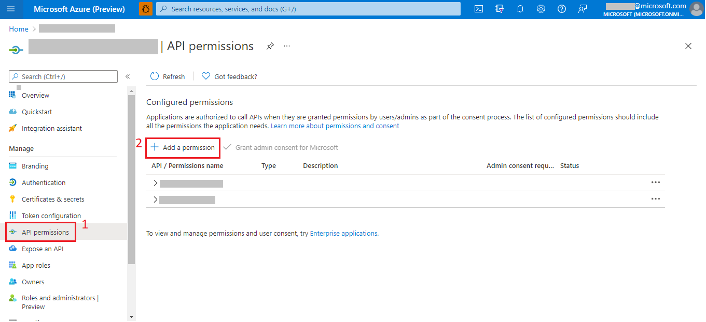

> The Azure Tenant Security Solution (AzTS) was created by the Core Services Engineering & Operations (CSEO) division at Microsoft, to help accelerate Microsoft IT's adoption of Azure. We have shared AzTS and its documentation with the community to provide guidance for rapidly scanning, deploying and operationalizing cloud resources, across the different stages of DevOps, while maintaining controls on security and governance.
 AzTS is not an official Microsoft product – rather an attempt to share Microsoft CSEO's best practices with the community.

 

# AzTS REST API Setup - Step by step

## On this page:

1. [Steps to enable AzTS REST API feature](Setup.md#step-1-of-4-steps-to-enable-azts-rest-api-feature)
2. [Steps to configure AzTS WebAPI's Azure Active Directory (AAD) application to access AzTS REST API](Setup.md#step-2-of-4-steps-to-configure-azts-webapis-azure-active-directory-aad-application-to-access-azts-rest-api)  
 2.1. [Steps to get the client id of the AzTS WebAPI AAD application](Setup.md#21-steps-to-get-the-client-id-of-the-azts-webapi-aad-application) 
 2.2. [Steps to add `user_impersonation` permission in AzTS WebAPI Azure Active Directory (AAD) application](Setup.md#22-steps-to-add-user_impersonation--permission-in-azts-webapi-azure-active-directory-aad-application)  
 2.3. [Grant admin consent for user_impersonation permission](Setup.md#23-grant-admin-consent-for-user_impersonation--permission) 
 2.4. [Get scope of the WebAPI](Setup.md#24-get-scope-of-the-webapi)
3. [(Optional) Register a fresh Azure Active Directory (AAD) application to access AzTS REST API](Setup.md#step-3-of-4-optional-register-a-fresh-azure-active-directory-aad-application-to-access-azts-rest-api)
4. [Get AzTS WebAPI URL](Setup.md#step-4-of-4-get-azts-webapi-url)

  

> ### _Note: This step has to be performed by AzTS Admin Only._

 

## **Step 1 of 4.** Steps to enable AzTS REST API feature

The AzTS REST API feature is disabled by default. To enable this feature for your tenant, follow the steps below:

1. Go to Azure Portal.
2. Go to **Resource Groups**.
3. Select your Resource Group where you have configured AzTS setup.
4. Select the App Service for API 'AzSK-AzTS-WebApi-xxxxx'.
5. In the app's left menu, select **Configuration** > **Application settings**.
6. Add/edit app setting **FeatureManagement__OnDemandScanAPI** and set its value to _'true'_.
7. Save.

## **Step 2 of 4.** Steps to configure AzTS WebAPI's Azure Active Directory (AAD) application to access AzTS REST API 

You'll need to add additional permissions in API permissions section of AzTS WebAPI AAD application. The permission/scope created in this step will have to be shared with end-users to generate access token for AzTS REST APIs. The steps to configure AzTS WebAPI AAD application are as follows: 

### **2.1. Steps to get the client id of the AzTS WebAPI AAD application:**
1. Go to Azure Portal.
2. Go to **Resource Groups**.
3. Select your Resource Group where you have configured AzTS setup.
4. Select the App Service for API 'AzSK-AzTS-WebAPI-xxxxx'.
5. In the app's left menu, select **Configuration** > **Application settings**.
6. Search the app setting **AADClientAppDetails__ApplicationId** and use its value as WebAPI Client id.

 

### **2.2. Steps to add `user_impersonation ` permission in AzTS WebAPI Azure Active Directory (AAD) application:**

1. Go to Azure Portal.
2. Go to **App Registration**.
3. Select your WebAPI App Registration using client id fetched in step 2.1.
4. Go to **API Permissions**.
5. Select **Add a permission**.

6. Go to **APIs my organization uses**.
7. Search your WebAPI client id and select it.

8. Select **Delegated permissions**.
9. Under **Permission**, select the checkbox for `user_impersonation`.
10. Finally, click on **Add permissions**.

After completing these steps, you will see `user_impersonation` permission added to your WebAPI AAD application.

 

### **2.3. Grant admin consent for `user_impersonation ` permission:**

> _Note: This step is required only if user consent is restricted in your Azure AD tenant. Read more about AAD consent [here](https://docs.microsoft.com/en-us/azure/active-directory/manage-apps/configure-user-consent?tabs=azure-portal)_

To grant admin consent for `user_impersonation ` permission follow the steps below:
1. Go to Azure Portal.
2. Go to **App Registration**.
3. Select your WebAPI App Registration using client id fetched in step 2.1.
4. Get scope from **Expose an API** > **Scopes**.
5. Go to **API Permissions**.
6. Click **Grant admin consent** for your Tenant at above scope (step-4).

### **2.4. Get scope of the WebAPI:**

You need to share the scope of the WebAPI with end-user as this required to generate access token.

To get scope for AzTS REST API, follow the steps below:
1. Go to Azure Portal.
2. Go to **App Registration**.
3. Select your WebAPI App Registration using client id fetched in step 2.1.
4. Get scope from **Expose an API** > **Scopes**. Scope is of the format: _`api://<WebAPI-ClientID>/user_impersonation `_

## **Step 3 of 4.** (Optional) Register a fresh Azure Active Directory (AAD) application to access AzTS REST API

In order to generate access token, the end-user needs to provide a client id which will be used for authentication with AAD. This client can either be centrally registered for all users in your organization or you can ask each consumer of the REST API to register a new application in the same tenant which can be used for authentication. For steps to register a new AAD application, please follow [this guide](https://docs.microsoft.com/en-us/azure/active-directory/develop/quickstart-register-app#register-an-application).

## **Step 4 of 4.** Get AzTS WebAPI URL

The AzTS WebAPI URL needs to be shared with the end user to access the AzTS REST APIs. Follow the steps below to get WebAPI URL:

1. Go to Azure Portal.
2. Go to **Resource Groups**.
3. Select your Resource Group where you have configured AzTS setup.
4. Select the App Service for API 'AzSK-AzTS-WebAPI-xxxxx'.
5. In **Overview** section, copy **URL**.

 

**Now your AzTS REST API is ready for use!**

After completing the setup steps, you will have to share the following details with end-users who want to consume these REST APIs:

1. Scope of the AzTS REST API configured in the [step 2](Setup.md#step-2-of-4-steps-to-configure-azts-webapis-azure-active-directory-aad-application-to-access-azts-rest-api) of the setup steps.
2. Client Id of the AAD application registered in [step 3](Setup.md#step-3-of-4-optional-register-an-fresh-azure-active-directory-aad-application-to-access-azts-rest-api) of the setup steps.
3. URL of the AzTS REST API copied in [step 4](Setup.md#step-4-of-4-get-azts-webapi-url) of the setup steps.
4. Tenant Id in which the application is registered.

## FAQ

### **An end-user wants to access AzTS REST API using SPN credentials (i.e. using client credential authentication flow). What are the steps to grant access to an SPN/Azure AD application created by end-user to be able to access AzTS REST API?**

1. Go to Azure Portal.
2. Go to **App Registration**.
3. Select AzTS WebAPI App Registration. If you do not have the client id of your WebAPI, please follow the steps provided [here](Set%20up.md#step-4-of-4-get-azts-webapi-url) to get its client id. 
4. Select the WebAPI and in the left-pane, go to **Expose an API**.
5. Under **Authorized client applications**, click on **Add a client application**.
6. In the pop-up window, enter the client ID of the SPN/Azure AD application shared by the end-user to grant access to the SPN. 
6. Select the `user_impersonation` scope check box under **Authorized scopes**.
7. Click on **Add application**.

With this the requested SPN is granted access to invoke AzTS REST API.
