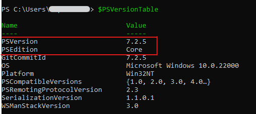

## Installation Guide

>**Pre-requisites**:
> - PowerShell 7.0 or higher. 
> - Windows OS
	
1. First verify that prerequisites are already installed:  
    Ensure that you are using Windows OS and have PowerShell version 7.0 or higher by typing **$PSVersionTable** in the PS/ISE console window and looking at the PSVersion in the output as shown below.) 
    <br><br>
  
 <br><br>
 If the PSVersion is older than 7.0, update PowerShell using command     
```Powershell
    iex "& { $(irm aka.ms/install-powershell.ps1) } -UseMSI"
```

2. Install the Tenant Security Solution for Azure (AzTS) PS module:  
	  
```PowerShell
  Install-Module AzTS -Scope CurrentUser
```


## AzTS command

> **Note**: AzTS cmdlet support 3 letter acronyms (e.g.: IAS). You can invoke cmdlet using these *after* AzTS has been imported in the session. So, to use this alias, make sure you run 'ipmo AzTS' as the first thing in a new PS/ISE console window ('ipmo' itself is an alias for 'import-module'). Apart from cmdlet, parameters also have associated aliases.

| Command (alias) | What it does |	Required Permission |
|----|----|-----|
|Invoke-AzureScan (IAS)|Scans an Azure subscription for security best practices and configuration baselines for things such as alerts,RBAC, MDC, etc.|Reader on subscription|


## List of commonly used parameters

| Parameter (alias) |
|-------------------|
|SubscriptionId (sid)|
|TenantId (tid)|
|FilterTags (ftg)|
|ResourceTypeNames (rtn)|
|ExcludeResourceTypeNames (ertn)|
|ControlIds (cids)|
|ExcludeControlIds (ecids)|

----------------------------------------------------------
## AzTS: Security scanner for Azure

>  **Prerequisites:**
> For all commands in this feature it is assumed that you have:
> 1. Logged in to your Azure account using Connect-AzAccount from a PS/ISE console.
>```PowerShell
>   Connect-AzAccount 
>```
> 2. Selected a subscription using Set-AzContext.
>```PowerShell
>	Set-AzContext -SubscriptionId <SubscriptionId> 
>```

### Overview
 
Security Scanner for Azure scans all the prominent features in Azure (e.g., Web Apps, Storage, SQL DB, Key Vault, etc.) by
executing the security controls and will validate their status as 'Success' or 'Failure' based on the security guidance.

The following aspects of security are also checked:
1. Access control configuration - identity and access management related issues in the subscription.
2. Microsoft Defender for Cloud configuration - configuration of MDC (security point of contact, various MDC policy settings, etc.)

### Scan the security of Azure

The security check script for Azure can be run using the command below after replacing `<SubscriptionId`> 
 with your subscriptionId and  `<TenantId`> with your tenantId of subscription.
```PowerShell
Invoke-AzureScan -SubscriptionId <SubscriptionId> -TenantId <TenantId>
```
The parameters used are:
- SubscriptionId – Subscription ID is the identifier of your Azure subscription
- TenantId - Tenant ID is the identifier for your Azure tenant 

You need to have at least **Reader** role at the subscription scope to run this command. 

### Security scanner for azure - How to fix findings?

AzTS cmdlet generate outputs which are organized as under: 
- Summary information of the control evaluation (pass/fail) status in a CSV file

To address findings, you should do the following:
1. See the summary of control evaluation first in the CSV file. (Open the CSV in XLS. Use "Format as Table", "Hide Columns", "Filter", etc.)
2. Review controls that are marked as "Failed" or "Verify"
3. The 'Remediation Steps' column for each control in the XLS will tell you the command/steps needed to resolve the issue.


### Target specific controls during security scan for azure

The security scanner for Azure supports multiple parameters as specified below:
- SubscriptionId – Subscription ID is the identifier of your Azure subscription 
- TenantId - Tenant ID is the identifier of your Azure subscription
- FilterTags  - Comma separated tags to filter the security controls. e.g.: RBAC, Automated, etc.
- ControlIds  - Comma separated control ids to filter the security controls. e.g.:Azure_Storage_AuthN_Dont_Allow_Anonymous,"Azure_APIManagement_DP_Use_HTTPS_URL_Scheme, etc.
- ResourceTypeNames - Comma separated resource type to filter the security controls. e.g.:Storage,SubsciptionCore, etc.
- ExcludeControlIds - Comma separated control ids to exclude the security controls. e.g.:Azure_Storage_AuthN_Dont_Allow_Anonymous,Azure_APIManagement_DP_Use_HTTPS_URL_Scheme, etc.
- ExcludeResourceTypeNames - Comma separated resource type to exclude the security controls. e.g.:Storage,SubsciptionCore, etc.
```PowerShell
Invoke-AzureScan -SubscriptionId <SubscriptionId> -TenantId <TenantId> [-ControlIds <ControlIds>] [-FilterTags <FilterTags>] [-ResourceTypeNames <ResourceTypeNames>] [-ExcludeControlIds <ExcludeControlIds>] [-ExcludeResourceTypeNames <ExcludeResourceTypeNames>] 
```
These different parameters would enable you to Scan different 'flavors' of secuirty scanner for azure.  
Here are some examples:

1. Scan only RBAC related controls.
```PowerShell
Invoke-AzureScan -SubscriptionId <SubscriptionId> -TenantId <TenantId> -FilterTags "RBAC"
``` 
2. Scan all the controls related to storage resource type.
```PowerShell
Invoke-AzureScan -SubscriptionId <SubscriptionId>  -TenantId <TenantId> ResourceTypeNames "Storage"
``` 
3. Scan specific control related to storage resource type. 
```PowerShell
Invoke-AzureScan -SubscriptionId <SubscriptionId> -TenantId <TenantId> -ControlIds Azure_Storage_AuthN_Dont_Allow_Anonymous
``` 
4. Exclude specific control related to storage resource type from scan. 
```PowerShell
Invoke-AzureScan -SubscriptionId <SubscriptionId> -TenantId <TenantId> -ExcludeControlIds Azure_Storage_AuthN_Dont_Allow_Anonymous
``` 
5. Exclude all the controls related to storage resource type from scan.
```PowerShell
Invoke-AzureScan -SubscriptionId <SubscriptionId>  -TenantId <TenantId> -ExcludeResourceTypeNames "Storage"
``` 
6. Scan all the controls and do not open the output folder.
```PowerShell
Invoke-AzureScan -SubscriptionId <SubscriptionId>  -TenantId <TenantId> -DoNotOpenOutputFolder
```
