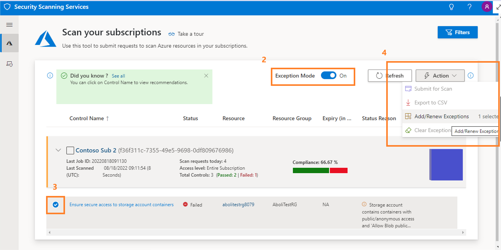
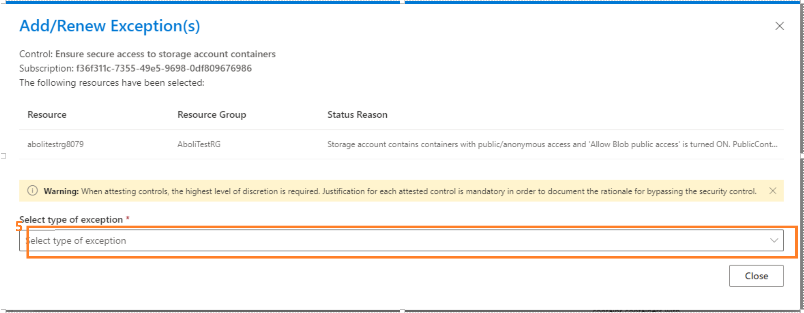
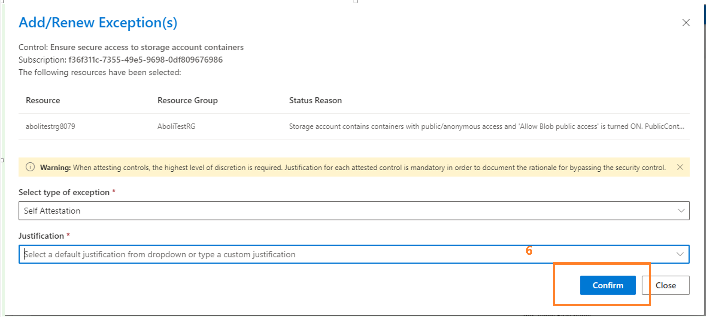

# Self Attestation Exception

## Overview

Self-Attestation is acknowledgement that the security failure poses no security risk. For example, the team mitigated the risk through code implementation, or the control is expected to fail due to the design of the application.

By default the self-attestation feature is not enabled for the AzTS setup. Once the AzTS setup is done, self-attestation feature could be enabled by following these [steps](SelfAttestation.md#1-how-to-enable-self-attestation-feature).

Once the self-attestation feature is enabled, Kindly follow the [instructions](SelfAttestation.md#2-how-to-submit-a-self-attestation-exception) to submit the self-attestation exception.

## 1. How to enable Self-Attestation Exception feature
> **Note**: Self-Attestation Exception feature could only be enabled once the AzTS setup is completed and only if the UI component has been enabled.

> **Warning**: Enabling Self-Attestation feature would incur a minimum additional cost of USD 17.52 per month (For the cosmos db being used as exception datasource). This may increase depending upon the usage of feature.

Enabling self-attestation exception feature involves following steps:
1. [Validate prerequisites on machine.](SelfAttestation.md#step-1-of-4-validate-prerequisites-on-machine)
2. [Installing required Az modules.](SelfAttestation.md#step-2-of-4-installing-required-az-modules)
3. [Download and extract deployment package.](SelfAttestation.md#step-3-of-4-download-and-extract-deployment-package)
4. [Setup self-attestation feature.](SelfAttestation.md#step-4-of-4-setup-self-attestation-feature)

### Step 1 of 4. Validate prerequisites on machine 

  1. a.  Installation steps are supported using following OS options: 	

      - Windows 10
      - Windows Server 2019
  
  </br>

  1. b. PowerShell 5.0 or higher: </br>
  All setup steps will be performed with the help of PowerShell ISE console. If you are unaware of PowerShell ISE, refer [link](PowerShellTips.md) to get a basic understanding.
  Ensure that you are using Windows OS and have PowerShell version 5.0 or higher by typing **$PSVersionTable** in the PowerShell ISE console window and looking at the PSVersion in the output as shown below.) 
  If the PSVersion is older than 5.0, update PowerShell from [here](https://www.microsoft.com/en-us/download/details.aspx?id=54616).  

      

</br>

[Back to top…](SelfAttestation.md#1-how-to-enable-self-attestation-feature)

### Step 2 of 4. Installing required Az modules

Az modules contain cmdlet to deploy Azure resources. These cmdlets are used to create AzTS scan solution resources with the help of ARM template.
Install Az PowerShell Modules using the below command. 
For more details of Az Modules refer [link](https://docs.microsoft.com/en-us/powershell/azure/install-az-ps).

``` PowerShell
# Install required Az modules
# Required versions: 
#   Az.Accounts >= 2.9.0
#   Az.Resources >= 1.10.0
#   Az.Storage >= 2.0.0
#   Az.ManagedServiceIdentity >= 0.7.3
#   Az.Monitor >= 1.5.0
#   Az.OperationalInsights >= 1.3.4
#   Az.ApplicationInsights >= 1.0.3
#   Az.Websites >= 2.8.1
#   Az.Network  >= 2.5.0
#   Az.FrontDoor >= 1.8.0
#   Az.CosmosDB >= 1.8.2
Install-Module -Name Az.Accounts -AllowClobber -Scope CurrentUser -repository PSGallery
Install-Module -Name Az.Resources -AllowClobber -Scope CurrentUser -repository PSGallery
Install-Module -Name Az.Storage -AllowClobber -Scope CurrentUser -repository PSGallery
Install-Module -Name Az.ManagedServiceIdentity -AllowClobber -Scope CurrentUser -repository PSGallery
Install-Module -Name Az.Monitor -AllowClobber -Scope CurrentUser -repository PSGallery
Install-Module -Name Az.OperationalInsights -AllowClobber -Scope CurrentUser -repository PSGallery
Install-Module -Name Az.ApplicationInsights -AllowClobber -Scope CurrentUser -repository PSGallery
Install-Module -Name Az.Websites -AllowClobber -Scope CurrentUser -repository PSGallery
Install-Module -Name Az.Network -AllowClobber -Scope CurrentUser -repository PSGallery
Install-Module -Name Az.FrontDoor -AllowClobber -Scope CurrentUser -repository PSGallery
Install-Module -Name Az.CosmosDB -AllowClobber -Scope CurrentUser -repository PSGallery

# Install AzureAd 
# Required version:
#   AzureAD >= 2.0.2.130
Install-Module -Name AzureAD -AllowClobber -Scope CurrentUser -repository PSGallery
```

[Back to top…](SelfAttestation.md#1-how-to-enable-self-attestation-feature)

### Step 3 of 4. Download and extract deployment package
 
 Deployment package mainly contains:
 1. **ARM templates** which contains resource configuration details that need to be created as part of the setup.
 2. **Deployment setup scripts** which provides the cmdlet to run installation. <br/>

If you have already downloaded the deployment package zip, directly go to step (3.d).

3.a. Download deployment package zip from [here](../TemplateFiles/DeploymentFiles.zip?raw=1) to your local machine. </br>

3.b. Extract zip to local folder location. <br/>

3.c. Unblock the content. The below command will help to unblock files. <br/>

  ``` PowerShell
  Get-ChildItem -Path "<Extracted folder path>" -Recurse |  Unblock-File 
  ```

3.d. Point current path to deployment folder and load AzTS setup script <br/>


  ``` PowerShell
  # Point current path to extracted folder location and load setup script from the deployment folder 

  CD "<LocalExtractedFolderPath>\DeploymentFiles"

  # Load AzTS Setup script in session
  . ".\AzTSSetup.ps1"

  # Note: Make sure you copy  '.' present at the start of the line.

  ```

[Back to top…](SelfAttestation.md#1-how-to-enable-self-attestation-feature)

### Step 4 of 4. Setup self-attestation feature  

Self-Attestation feature could be enabled using following `Enable-ByDesignExceptionFeature` PowerShell command. This PowerShell command creates cosmos db as the datastore for exception management and updates the AzTS API's and Scanner's configurations to support the self-attestation(By-Design) exception feature. 

</br>

Before running the setup command, please log in to Azure Portal and Azure Active Directory (AD) where you have the AzTS solution installed using the following PowerShell command.

``` PowerShell
# Clear existing login, if any

Disconnect-AzAccount
Disconnect-AzureAD

# Connect to AzureAD and AzAccount
# Note: Tenant Id *must* be specified when connecting to Azure AD and AzAccount

$TenantId = "<TenantId>"
Connect-AzAccount -Tenant $TenantId
Connect-AzureAD -TenantId $TenantId
```

**Execute the powershell command to setup self-attestation feature**

``` PowerShell

Enable-ByDesignExceptionFeature `
      -HostSubscriptionId <AzTSHostSubId> `
      -HostResourceGroupName <AzTSHostRGName> `
      -CosmosDBLocationArray @("<Location1>","<Location2>") `
      -KVSubscriptionId <KVSubId> `
      -KVResourceGroupName <KVRGName> `
      -KVLocation <KVLocation> `
      -KeyVaultName <KVName> 

```

**Parameter details:**
|Param Name|Description|Required?
|----|----|----|
|HostSubscriptionId| Subscription id in which AzTS setup is hosted.| Yes|
|HostResourceGroupName| Resource group name in which AzTS setup is hosted.|Yes|
|CosmosDBLocationArray| Primary and secondary location for cosmos db to be created. This cosmos db would be used as datastore for exception management.| Yes|
|KVSubscriptionId| Subscription id in which AzTS KV is hosted or is to be created if not already present.| Yes|
|KVResourceGroupName| Resource group name in which AzTS KV is hosted or is to be created if not already present.|Yes|
|KVLocation| Location for the AzTS Key Vault. Key Vault would be created if not already present.|Yes|
|KeyVaultName| Name of the AzTS Key Vault. Key Vault would be created if not already present.|Yes|

</br>

[Back to top…](SelfAttestation.md#1-how-to-enable-self-attestation-feature)

## 2. How to Submit a Self-Attestation Exception

> **Warning** : When attesting controls, the highest level of discretion is required. Justification is required for each attested control in order to document the rationale for bypassing the security control. By attesting to this decision, you are confirming that you are prepared to take accountability for consequences that may occur due to security configurations not being correctly or fully constituted.

> **Note** : Only following controls are allowed for self-attestation exception.<br/>
> Azure_Storage_AuthN_Dont_Allow_Anonymous<br/>
> Azure_SQLDatabase_AuthZ_Use_AAD_Admin<br/>
> Azure_AppService_Config_Disable_Web_Sockets<br/>
> Azure_AppService_DP_Use_CNAME_With_SSL<br/>
> Azure_CDN_DP_Enable_Https<br/>
> Azure_HDInsight_Deploy_Supported_Cluster_Version<br/>

> **Note** : Self-Attestation Exceptions are applied for a period of 90 days. Once the exception expires, the user need to resubmitt the expectation again.

Below are the steps to submit a self-attestation exception
1. Navigate to the AzTS UI.
2. Select the "Exception Mode" toggle button.
3. Expand the subscription to view scan result and select the non-compliant control which has to be attested.
4. After selecting the control, select the 'Action' button in the right corner of the screen and then select 'Add/Renew Exceptions' from the drop down. This will open a pop-up window.
5. In the pop-up window, select the type of exception as 'Self Attestation' and provide a valid business justification.
6. Verify the entered details and select 'Confirm'.
7. Close the pop-up window and re-scan the subscription.


<br/>

<br/>


