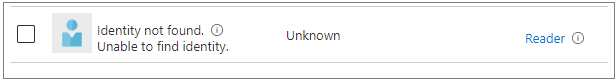

> The Azure Tenant Security Solution (AzTS) was created by the Core Services Engineering & Operations (CSEO) division at Microsoft, to help accelerate Microsoft IT's adoption of Azure. We have shared AzTS and its documentation with the community to provide guidance for rapidly scanning, deploying and operationalizing cloud resources, across the different stages of DevOps, while maintaining controls on security and governance.
<br>AzTS is not an official Microsoft product – rather an attempt to share Microsoft CSEO's best practices with the community.

</br>

# FAQs

- ### Setup
 1. [Getting error "Class keyword is not allowed in ConstrainedLanguage mode"](#1-getting-error--class-keyword-is-not-allowed-in-constrainedlanguage-mode)
 2. [How to add new subscriptions or mangement groups after deploying AzTS?](#2-how-to-add-new-subscriptions-or-management-groups-after-deploying-azts)
 3. [On running the AzTS installation command (`Install-AzSKTenantSecuritySolution`) I am getting an error message "Tenant ID, application ID, principal ID, and scope are not allowed to be updated."](#3-on-running-the-azts-installation-command-install-azsktenantsecuritysolution-i-am-getting-an-error-message-tenant-id-application-id-principal-id-and-scope-are-not-allowed-to-be-updated)
 4. [While installing AzTS solution I have provided my preferences for telemetry collection i.e. anonymous AzTS usage data and organization/team contact details. How do I update my preferences now?](#4-while-installing-azts-solution-i-have-provided-my-preferences-for-telemetry-collection-ie-anonymous-azts-usage-data-and-organizationteam-contact-details-how-do-i-update-my-preferences-now)
5. [On running the Autoupdater function I am encountering an error related to conflicts in function runtime version.](#5-on-running-the-autoupdater-function-i-am-encountering-an-error-related-to-conflicts-in-function-runtime-version)
6. [What are the recommended authentication settings for all App services or Function Apps?](#6-what-are-the-recommended-authentication-settings-for-all-app-services-or-function-apps)
7. [How can I migrate classic Application Insights to Workspace-based resource? If I migrate Application Insights AzSK-AzTS-AppInsights-xxxxx to Workspace-based resource, will there be any impact to AzTS scan](#7-how-can-i-migrate-classic-application-insights-to-workspace-based-resource-if-i-migrate-application-insights-azsk-azts-appinsights-xxxxx-to-workspace-based-resource-will-there-be-any-impact-to-azts-scan)


 - ### Scan
 1. [Today's AzTS scan has completed. How do I re-run the full scan?](#1-todays-azts-scan-has-completed-how-do-i-re-run-the-full-scan)
 2. [How to disable AzTS scan and uninstall the setup?](#2-how-to-disable-azts-scan-and-uninstall-the-setup)
 3. [The subscription scan in AzTS is getting terminated due to function timeout. How can I fix it? OR How can I upgrade the pricing tier of AzTS function apps?](#3-the-subscription-scan-in-azts-is-getting-terminated-due-to-function-timeout-how-can-i-fix-it-or-how-can-i-upgrade-the-pricing-tier-of-azts-function-apps)
 4. [How do I pull data from AzTS scan and push it to different data sources?](#4-how-do-i-pull-data-from-azts-scan-and-push-it-to-different-data-sources)

- ### Monitoring
 1. [I am getting alert mail "AzTS MONITORING ALERT: AzTS Auto-Updater Failure Alert". What does it mean? How to stop/resolve this alert?](#1-i-am-getting-alert-mail-azts-monitoring-alert-azts-auto-updater-failure-alert-what-does-it-mean-how-to-stopresolve-this-alert)
 
- ### Control Remediation
 1. [How can I disable public access on my Key Vault when it is being used by Azure Function Apps on a consumption plan? How do I handle dynamically changing IP addresses?](#1-how-can-i-disable-public-access-on-my-key-vault-when-it-is-being-used-by-azure-function-apps-on-a-consumption-plan-how-do-i-handle-dynamically-changing-ip-addresses)

 - ### UI
 1. [I can't see my subscriptions in the AzTS UI. What prerequisites or settings might I be missing?](#1-i-cant-see-my-subscriptions-in-the-azts-ui-what-prerequisites-or-settings-might-i-be-missing)

--------------------------------------------------
</br>

## FAQs 
- ### **Setup**

 ### **1. Getting error : Class keyword is not allowed in ConstrainedLanguage mode** 
This error can be observed where PowerShell is running in ConstrainedLanguage mode. If local settings for LaguageMode cannot be modified for some reason, AzTS setup can be done using aletrnate options. One of the option is copying deployment files to Azure storage and running the whole deployment procedure within Cloud Shell. 

### **2. How to add new subscriptions or management groups after deploying AzTS**
You just need to provide reader access to scanner Managed Identity at subscription or Management Group level. From next schedule, AzTS will pick up new subscriptions for scanning. 

### **3. On running the AzTS installation command (`Install-AzSKTenantSecuritySolution`) I am getting an error message *"Tenant ID, application ID, principal ID, and scope are not allowed to be updated."***

This is probably happening because the user-assigned managed identity (internal MI) has been deleted from Azure Portal, but the role assignment of this MI is still present at the resource group scope in which the AzTS setup has been installed. The role assignment of a deleted identity looks like below,



To remove role assignment, go to resource group where AzTS solution has been installed --> Access control (IAM) --> Role assignments --> Look for deleted identity (as shown in the screenshot) --> Select the identity and click on 'Remove'.

After deleting the identity, you can run the installation command again.

### **4. While installing AzTS solution I have provided my preferences for telemetry collection i.e. anonymous AzTS usage data and organization/team contact details. How do I update my preferences now?**

To update the telemetry preferences, go to resource group where AzTS solution has been installed --> AzSK-AzTS-AutoUpdater-XXXXX --> Configuration --> Change the values of below listed configurations:

- AIConfigurations\_\_AnonymousUsageTelemetry\_\_LogLevel

  - All --> To opt in for both, Anonymized AzTS usage data and Organization/team contact details.
  - Anonymous --> To opt in for only Anonymized AzTS usage data.
  - Onboarding --> To opt in for only Organization/team contact details.
  - None --> To opt out of both, Anonymized AzTS usage data and Organization/team contact details.

- OnboardingDetails\_\_Organization

  - If AIConfigurations\_\_AnonymousUsageTelemetry\_\_LogLevel is either 'All' or 'Onboarding', then specify the name of your organization in this.
  - If AIConfigurations\_\_AnonymousUsageTelemetry\_\_LogLevel is either 'Anonymous' or 'None', then specify 'N/A' in this.

- OnboardingDetails\_\_Division

  - If AIConfigurations\_\_AnonymousUsageTelemetry\_\_LogLevel is either 'All' or 'Onboarding', then specify the name of your division(division within your organization) in this.
  - If AIConfigurations\_\_AnonymousUsageTelemetry\_\_LogLevel is either 'Anonymous' or 'None', then specify 'N/A' in this.

- OnboardingDetails\_\_ContactEmailAddressList

  - If AIConfigurations\_\_AnonymousUsageTelemetry\_\_LogLevel is either 'All' or 'Onboarding', then specify the team's contact DL in this.
  - If AIConfigurations\_\_AnonymousUsageTelemetry\_\_LogLevel is either 'Anonymous' or 'None', then specify 'N/A' in this.
  
### **5. On running the Autoupdater function I am encountering an error related to conflicts in function runtime version.**

- Step-1: Run below command for AzSK-AzTS-AutoUpdater-xxxxx function app. 
    ``` Powershell

    $appSettings = @{}
    $appSettings.add("FUNCTIONS_EXTENSION_VERSION","~4")
    $appSettings.add("WEBSITE_RUN_FROM_PACKAGE","https://aka.ms/DevOpsKit/AzTS/V4/AutoUpdater")

    # Update function runtime and package path.
    Update-AzFunctionAppSetting -AppSetting $appSettings -Name <APP_NAME> -ResourceGroupName <RESOURCE_GROUP_NAME> -Force

    # Update Net framework version
    Set-AzWebApp -NetFrameworkVersion v6.0 -Name <APP_NAME> -ResourceGroupName <RESOURCE_GROUP_NAME>
    ``` 
- Step-2 : Run below command for AzSK-AzTS-MetadataAggregator-xxxxx and AzSK-AzTS-WorkItemProcessor-xxxxx.

    ``` Powershell
    # Update function runtime. 
    Update-AzFunctionAppSetting -AppSetting @{"FUNCTIONS_EXTENSION_VERSION" = "~4"} -Name <APP_NAME> -ResourceGroupName <RESOURCE_GROUP_NAME> -Force

    # Update Net framework version
    Set-AzWebApp -NetFrameworkVersion v6.0 -Name <APP_NAME> -ResourceGroupName <RESOURCE_GROUP_NAME>
    ```

- Step-3. Re-run the AutoUpdater function after completing Step 2 and the operation should complete successfully. This also ensures that the function runtime is updated to V4 for AzSK-AzTS-AutoUpdater-xxxxx, AzSK-AzTS-MetadataAggregator-xxxxx and AzSK-AzTS-WorkItemProcessor-xxxxx function app.


### **6. What are the recommended authentication settings for all App services or Function Apps?**
Using the native enterprise directory for authentication ensures that there is a built-in high level of assurance in the user identity established for subsequent access control. As a part of rolling out security improvements in AzTS setup, we have updated our auto update feature to use AAD Authentication for Function App deployment instead of basic auth/publishing profile. It is recommended to disable basic authentication for all App services/Function App deployed as part of AzTS setup as it is no more required for AzTS functioning.  You can disable basic authentication by using following steps: 
- Step-1: Find the resource group where the AzTS solution has been installed.

- Step-2: Look for a Function App named "AzSK-AzTS-MetadataAggregator-xxxxx" within that resource group, and then navigate to its "Configuration" menu. Within "General Settings," you'll see an option for "Basic Authentication." Turn this option OFF, then click "Save."

- Step-3: Repeat Step 2 for each of the following Function Apps within the same resource group: "AzSK-AzTS-WorkItemProcessor-xxxxx", "AzSK-ATS-AutoUpdater--xxxxx", "AzSK-AzTS-WebApi-xxxxx", and "AzSK-AzTS-UI-xxxxx". If there are any slots available for these, you should also repeat Step 2 for those.
<br>
<br>

### **7. How can I migrate classic Application Insights to Workspace-based resource? If I migrate Application Insights AzSK-AzTS-AppInsights-xxxxx to Workspace-based resource, will there be any impact to AzTS scan?**
It is recommended to migrate classic Application Insights to Workspace-based resource before retirement date(29th February, 2024) to ensure most reliable experience. You can follow steps mentioned in detail [here](https://learn.microsoft.com/en-us/azure/azure-monitor/app/convert-classic-resource#migrate-your-resource) for migration using any one of the below listed approaches.

> [Azure Portal](https://learn.microsoft.com/en-us/azure/azure-monitor/app/convert-classic-resource#migrate-your-resource)
<br/>

> [Azure CLI](https://learn.microsoft.com/en-us/azure/azure-monitor/app/convert-classic-resource#azure-cli)
<br/>

> [Azure PowerShell](https://learn.microsoft.com/en-us/azure/azure-monitor/app/convert-classic-resource#azure-powershell)
<br/>

You can use either Workspace in AzTS host Resource group (AzSK-AzTS-LAWorkspace-xxxxx) or any other Workspace (new or existing). This migration will not impact AzTS scan in any way.

We have also updated our deployment package to have this change incorporated. Any new setups/ re-run of installtion script using latest deployment package will result in creation or updation of Application Insights to Workspace-based mode. 

As per latest communication from Azure, for Application Insights not migrated to Workspace-based mode by retirement date, ingestion will continue until it is auto-migrated.AzTS scan will not be impacted due to this.  However, for reliable experience, it is recommended to switch to Workspace-based mode by 29th February, 2024.


- ### **Scan**

### **1. Today's AzTS scan has completed. How do I re-run the full scan?**

You can use the on-demand scan command provided [here](../01-Setup%20and%20getting%20started/README.md/) with `-ForceFetch` flag.

### **2. How to disable AzTS scan and uninstall the setup?**
AzTS scans can be disabled by revoking reader access granted to scanner Managed Identity at individual subscription level.
To uninstall or rollback AzTS scaner setup, below steps can be performed:
  1. Revoke scanner MI reader permissions for subscription(s) 
  2. Delete Azure AD application for UI and WebAPI (if created during installtion)
  3. Delete AzTS resource group. 
</br>

### **3. The subscription scan in AzTS is getting terminated due to function timeout. How can I fix it? OR How can I upgrade the pricing tier of AzTS function apps?**

AzTS installation command (`Install-AzSKTenantSecuritySolution`) creates three function apps which are as follows:
1. AzSK-AzTS-MetadataAggregator-xxxxx
2. AzSK-AzTS-WorkItemProcessor-xxxxx
3. AzSK-AzTS-AutoUpdater-xxxxx

These function apps share a common Consumption hosting plan. Azure Functions in a Consumption plan are limited to 10 minutes for a single execution. As a result, subscription scan which take longer than 10 minutes will get terminated. Read more about the hosting plans [here](https://docs.microsoft.com/en-us/azure/azure-functions/functions-scale).

In this case, we recommend you to upgrade the Function app hosting plan (pricing tier) which will give you the flexibility to increase the function timeout value. Following steps will guide you on how to upgrade pricing tier and change function timeout value for AzTS setup.
    
1. To update pricing tier, run `Update-AzFunctionAppPlan` cmdlet as shown below. You can read more about pricing details of function app [here](https://azure.microsoft.com/en-us/pricing/details/functions/).

    ```PowerShell
      # 1. Clear existing login, if any

      Disconnect-AzAccount

      # 2. Connect to AzureAD and AzAccount
      # Note: Tenant Id *must* be specified when connecting to Azure AD and AzAccount

      $TenantId = "<TenantId>"
      Connect-AzAccount -Tenant $TenantId

      # 3. Install module, if not already installed
      # Az.Functions >= 4.8.0

      Install-Module -Name Az.Functions -AllowClobber -Scope CurrentUser -repository PSGallery

      # 4. Import module

      Import-Module -Name Az.Functions

      # 5. Update app service pricing tier

      # AppServicePlanName: Your Function App Service plan (in the Azure portal, go to the AzTS Host RG > select one of function apps, say 'AzSK-AzTS-WorkItemProcessor-xxxxx' > Under the Overview section, copy name of the 'App Service Plan'.)
      # In this example, we are updating service plan to EP2.

      Update-AzFunctionAppPlan -ResourceGroupName <AzTSScanHostRG> `
                                 -Name <AppServicePlanName> `
                                 -Sku EP2

    ```

4. To increase function timeout, go to your function app (say, you want to increase timeout value for 'AzSK-AzTS-WorkItemProcessor-xxxxx'. This app contains function to scan subscription with baseline control.) > Settings > Configuration > Application settings > Update the value of `AzureFunctionsJobHost__functionTimeout` to '01:00:00' to increase the timeout value to 1 hour.

  > _**Note:** In future if you run the AzTS installation command (`Install-AzSKTenantSecuritySolution`) to upgrade your existing AzTS setup, you will have to repeat the above steps._

### **4. How do I pull data from AzTS scan and push it to different data sources?**

Azure Tenant Security Solution centrally scans subscriptions and produces control scan results, processed RBAC data, resource inventory data, subscription metadata, etc., and pushes all the data into a central storage account 'azskaztsstoragexx00x'.<br>
Below are some helpful links for pulling data from Azure blob storage in central storage account 'azskaztsstoragexx00x' and push to different data sources:
1. [Copy data from Azure Blob storage to a database in Azure SQL Database by using Azure Data Factory](https://learn.microsoft.com/en-us/azure/data-factory/tutorial-copy-data-portal)
2. [Copy data from Azure Blob storage to a SQL Database by using the Copy Data tool](https://learn.microsoft.com/en-us/azure/data-factory/tutorial-copy-data-tool)
3. [Copy data from Azure Blob storage to a Azure Data Explorer by using the Event Grid data connection](https://learn.microsoft.com/en-us/azure/data-explorer/create-event-grid-connection?tabs=portal-adx%2Cportal-2)

<br>
<br>

- ### **Monitoring**

### **1. I am getting alert mail "AzTS MONITORING ALERT: AzTS Auto-Updater Failure Alert". What does it mean? How to stop/resolve this alert?** 
Auto updater runs daily and check for any updates available or not, if there are no updates it will not raise any alert or error. Alert mail "AzTS MONITORING ALERT: AzTS Auto-Updater Failure Alert" mostly indicates Auto updater function is not able to complete its job successfully in past runs.

To get more details about reason behind Autoupdate failure:
1.	Please check  if there any exceptions logged in Application Insight (AzSK-AzTS-AppInsights-xxxxx) by running following query:
exceptions
| where timestamp > ago(3d)
| where operation_Name =~ "AutoUpdater"
| order by timestamp desc
 
2.	If there are no exceptions, then please check  traces of the Job in Application Insight (AzSK-AzTS-AppInsights-xxxxx) by running following query:
traces
| where timestamp > ago(3d)
| where operation_Name =~ "AutoUpdater"
| order by timestamp desc
| project timestamp, message, severityLevel

If you see traces "Exception occurred in UpdateFunctionApp function while updating [AzSK-AzTS-UI-xxxxx]. Exception : [System.Exception: App service [AzSK-AzTS-UI-xxxxx] request to swap slot with production failed", then Auto-Updater is failing as staging and production slot swapping is failing for AzTS UI.You can disable the slot swap feature in Auto Updater with below steps:
1. Go to Auto Updater Function App (AzSK-AzTS-AutoUpdater-xxxxx)
2. Configurations -> Application Settings 
3. Click on add new Application Settings 
4. And setting with following Name and Value,
Name: HostEnvironmentDetails__AutoUpdateConfig__3__DeploymentSlotId
Value: production
5. Select ‘Deployment Slot Setting’ and save.
 
The above steps should stop this recurring alert, please validate after 24 hours using the same queries.

<br>
<br>

- ### **Control Remediation**

### **1. How can I disable public access on my Key Vault when it is being used by Azure Function Apps on a consumption plan? How do I handle dynamically changing IP addresses?** 
To remediate the control [Azure_KeyVault_NetSec_Disable_Public_Network_Access](https://github.com/azsk/AzTS-docs/blob/users/vinala/keyvaultiprangescript/Control%20coverage/Feature/KeyVault.md#azure_keyvault_netsec_disable_public_network_access), You need to [configure network settings](https://learn.microsoft.com/en-us/azure/key-vault/general/how-to-azure-key-vault-network-security?tabs=azure-portal) on key vault to allow access only from selected virtual networks and IP Addresses. However, If the key vault is being consumed from Azure Function Apps which is deployed using Consumption plan, the IP Addresses are bound to dynamically change. One way to allow access to Azure Functions Apps (Consumption Plan) is to whitelist all the Azure IP Addresses pertaining to 'App Service' service tag and the corresponding function app deployed region. 

Azure publishes the information [here](https://www.microsoft.com/en-us/download/details.aspx?id=56519) every week. Per their installation instruction mentioned in the download center, New ranges appearing in the file will not be used in Azure for at least one week. Hence, users have atmost one week to update the IP ranges to have uninterrupted access to the key vault from the function apps. 

You can use the below PowerShell command let to whitelist the Azure IP ranges for a particular region on key vault. 

``` Powershell
function AddAzureFunctionAppRegionIPRangesOnKeyVault {

param (
$SubscriptionId,
$KeyVaultResourceId,
$FunctionAppUsageRegion,
$RemoveExistingIPRanges = $false
)

# Connect to the Azure account where the key vault is deployed.
Connect-AzAccount -Subscription $SubscriptionId
Set-AzContext -SubscriptionId $SubscriptionId

# Installing MSIdentityTools Module
Write-Host "Installing MSIdentityTools Module to fetch the Azure published IP ranges..." -ForegroundColor Yellow
Install-Module -Name MSIdentityTools -Scope CurrentUser -Force
# Download the IPRanges from Azure published location and filter the IP ranges for the specific region where the function apps are deployed.
Write-Host "Downloading the Azure published IP ranges..." -ForegroundColor Yellow
$location = Get-AzLocation | Where-Object { $_.Location -eq $FunctionAppUsageRegion -or $_.DisplayName -eq $FunctionAppUsageRegion} | Select-Object -First 1
if ($null -ne $location)
{
    $FunctionAppUsageRegion = $location.Location
}
else
{
  Write-Host "Specified function app region '$($FunctionAppUsageRegion)' is invalid. Exiting..."  -ForegroundColor Red
  return;
}

$IPRanges = Get-MsIdAzureIpRange -ServiceTag AppService -Region $FunctionAppUsageRegion
Write-Host "Successfully downloaded the Azure published IP ranges..." -ForegroundColor Green
Write-Host "Filtering the IP ranges for IPv4 addresses" -ForegroundColor Yellow
$FilteredIPRanges = ($IPRanges | Where-Object {$_.Contains("::") -eq $false })

# Remove existing IP Ranges if flag is set.
if($RemoveExistingIPRanges -eq $true)
{
Write-Host "Overridding the IP Address ranges with the Azure IP ranges for specified function app region:" $FunctionAppUsageRegion -ForegroundColor Yellow
Update-AzKeyVaultNetworkRuleSet -ResourceId $KeyVaultResourceId -IpAddressRange $FilteredIPRanges
Write-Host "Successfully overridden the IP Address ranges with the Azure IP ranges for specified function app region:" $FunctionAppUsageRegion -ForegroundColor Green

}
else
{
Write-Host "Appending the IP Address ranges with the Azure IP ranges for specified function app region:" $FunctionAppUsageRegion -ForegroundColor Yellow
Add-AzKeyVaultNetworkRule -ResourceId $KeyVaultResourceId -IpAddressRange $FilteredIPRanges
Write-Host "Successfully appended the IP Address ranges with the Azure IP ranges for specified function app region:" $FunctionAppUsageRegion -ForegroundColor Green

}

}
```

The same can be integrated into your DevOps pipeline using the YAML below to run it every 3 days on a scheduled basis to have the latest IP ranges updated on the allowed IP Addresses for key vault.

``` yaml
trigger:
  branches:
    include:
    - main
stages:
- stage: __default
  jobs:
  - job: Job
    pool:
      vmImage: ubuntu-latest
    steps:
    - task: AzurePowerShell@5
      displayName: "Add Azure Function App region IPRanges on key vault"
      inputs:
        azureSubscription: $(AZURESUBSCRIPTIONSERVICECONNECTION)
        ScriptType: 'InlineScript'
        Inline: |
          Set-AzContext -SubscriptionId $(SUBSCRIPTIONID)
          # Installing MSIdentityTools Module
          Write-Host "Installing MSIdentityTools Module to fetch the Azure published IP ranges..." -ForegroundColor Yellow
          Install-Module -Name MSIdentityTools -Scope CurrentUser -Force
          # Download the IPRanges from Azure published location and filter the IP ranges for the specific region where the function apps are deployed.
          Write-Host "Downloading the Azure published IP ranges..." -ForegroundColor Yellow
          $location = Get-AzLocation | Where-Object { $_.Location -eq $FunctionAppUsageRegion -or $_.DisplayName -eq $FunctionAppUsageRegion} | Select-Object -First 1
          if ($null -ne $location)
          {
              $FunctionAppUsageRegion = $location.Location
          }
          else
          {
            Write-Host "Specified function app region '$($FunctionAppUsageRegion)' is invalid. Exiting..."  -ForegroundColor Red
            return;
          }
          $IPRanges = Get-MsIdAzureIpRange -ServiceTag AppService -Region $(FUNCTIONAPPUSAGEREGION)
          Write-Host "Successfully downloaded the Azure published IP ranges..." -ForegroundColor Green
          Write-Host "Filtering the IP ranges for IPv4 addresses" -ForegroundColor Yellow
          $FilteredIPRanges = ($IPRanges | Where-Object {$_.Contains("::") -eq $false })

           # Remove existing IP Ranges if flag is set.
          if($(REMOVEEXISTINGIPRANGES) -eq $true)
          {
          Write-Host "Overridding the IP Address ranges with the Azure IP ranges for specified function app region:" $FunctionAppUsageRegion -ForegroundColor Yellow
          Update-AzKeyVaultNetworkRuleSet -ResourceId $(KEYVAULTRESOURCEID) -IpAddressRange $FilteredIPRanges
          Write-Host "Successfully overridden the IP Address ranges with the Azure IP ranges for specified function app region:" $(FUNCTIONAPPUSAGEREGION) -ForegroundColor Green

          }
          else
          {
          Write-Host "Appending the IP Address ranges with the Azure IP ranges for specified function app region:" $FunctionAppUsageRegion -ForegroundColor Yellow
          Add-AzKeyVaultNetworkRule -ResourceId $(KEYVAULTRESOURCEID) -IpAddressRange $FilteredIPRanges
          Write-Host "Successfully appended the IP Address ranges with the Azure IP ranges for specified function app region:" $(FUNCTIONAPPUSAGEREGION) -ForegroundColor Green
          }
        azurePowerShellVersion: 'LatestVersion'
```

- ### **UI**

### **1. I can't see my subscriptions in the AzTS UI. What prerequisites or settings might I be missing?**
If you are not able to see subscriptions in AzTS UI, please check below prerequisites followed by troubleshooting steps:

### Prerequisites:
1. To access AzTS, the signed-in user must have one of the following permissions at the subscription or resource group level:

- Owner
- Contributor
- Service Administrator
- CoAdministrator
- Account Administrator
- Security Reader
- Security Administrator

Please ensure that your user account has one of these permissions set up at the appropriate scope to effectively use AzTS.

2. To ensure the availability of data in AzTS, please ensure that the subscription scan has completed for the day. The automated AzTS scans are typically scheduled to start around 1:00 AM UTC. If you need to trigger a scan immediately after installing AzTS or at any other time, you can use the [On-Demand scan command](../01-Setup%20and%20getting%20started/README.md#2-manually-trigger-azts-on-demand-scan-for-entire-tenant) to initiate the scan process right away. 

3. If access to resources has been recently granted, it may take up to 24 hours for the changes to be reflected in AzTS during the next automated scan. If you would like to see the newly added access reflected immediately, you can use the [On-Demand scan command](../01-Setup%20and%20getting%20started/README.md#2-manually-trigger-azts-on-demand-scan-for-entire-tenant) to trigger a scan outside of the regular schedule. This will ensure that the latest access information is updated in AzTS without waiting for the next automated scan.


### **TroubleShooting Steps:**

Please check if below required permissions are granted. These permissions require admin consent. Therefore, user must be a member of one of the following administrator roles: </br>Global Administrator or Privileged Role Administrator.

**1. 'User.Read' permission for AzTS UI AD application**

This permission is used to read logged in user's details such as name, email, and photo.  

> **Note:** If you do not have the permission to grant this permission, please contact your administrator to complete the setup using [this PowerShell script](../Scripts/ScriptToSetupAzureADApplicationForAzTSUI.ps1?raw=1). To run this script, you need to provide the subscription id and resource group name in which AzTS solution needs to be installed.


**2. MS Graph "PrivilegedAccess.Read.AzureResources" and "Directory.Read.All" permissions for Scanner identity (MI)** 
 
This permission is used to read data in your organization's directory, such as users, groups and apps and to validate Role-based access control (RBAC) using Azure AD Privileged Identity Management (PIM). 
</br>If you do not have the required permission, please contact your administrator to get "PrivilegedAccess.Read.AzureResources" and "Directory.Read.All" permission for your scanner MI in Azure Active Directory using [this PowerShell script](../Scripts/ScriptToGrantGraphPermissionToScannerMI.ps1?raw=1). To run this script, you need to provide the object id of the user-assigned managed identity (scanner MI) which will be available in deployment log file.

In case you are using Privileged Identity Management(PIM) for assigning access, please make sure that below settings are enabled:
1. Go to Azure Portal.
2. Navigate to AzTS host subscription -> AzTS host resource group.
3. Go to AzTS Metadata Aggregator function app (AzSK-AzTS-MetadataAggregator-xxxxx).
4. Go to Configurations under Settings.
5. Check if setting AuthzSettings__IsPIMEnabled is available. If not, add new application setting 'AuthzSettings__IsPIMEnabled' with value as true. Click 'OK'. (This will enable AzTS to fetch role assignemnts using PIM API calls).
6. Click 'Save'.
7. Additionally, please verify if the necessary Microsoft Graph permissions have been granted to the Scanner Managed Identity (MI), as mentioned earlier. If these permissions are granted after the completion of AzTS setup, you will need to rerun the AzTS setup installation command (Install-AzSKTenantSecuritySolution) with the parameter -ScanIdentityHasGraphPermission set to $true. For more detailed information, you can refer [here](../01-Setup%20and%20getting%20started/README.md#step-6-of-6-run-setup-command).

From next AzTS scan run onwards, you should be able to see subsccriptions for which you have PIM based access.

**3. MS Graph "User.Read.All" for AzTS Internal MI identity** 
The AzTS Internal Managed Identity (MI) is utilized by the AzTS UI to retrieve the list of security groups that the user belongs to. In order to perform this task, the internal MI requires the 'User.Read.All' permission. If you don't currently have this permission, kindly reach out to your administrator to request the 'User.Read.All' permission for the internal MI in Azure Active Directory. Your administrator can grant this permission by utilizing a provided [PowerShell script](../Scripts/ScriptToGrantGraphPermissionToInternalMI.ps1?raw=1). To execute the script, you will need to provide the object ID of the user-assigned managed identity (internal MI), which can be found in the deployment logs file.


