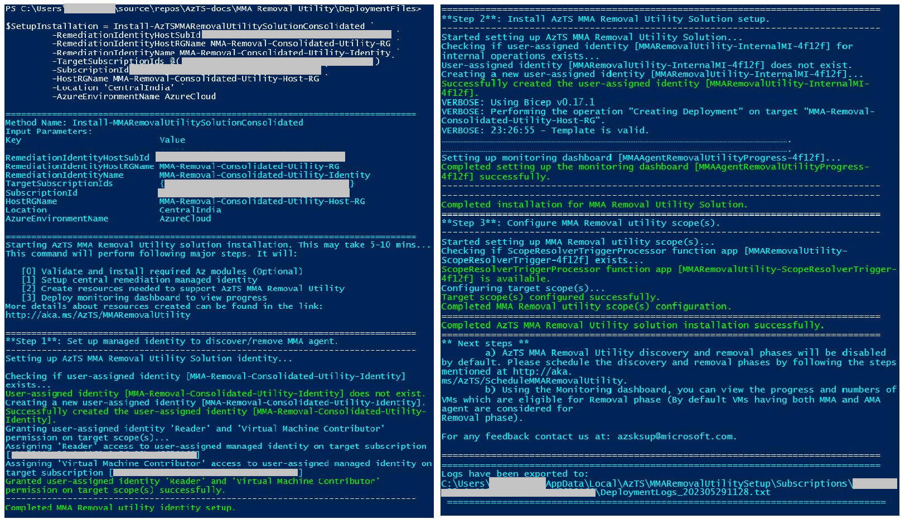

# **Steps to install multi-tenant AzTS MMA Removal Utility**

In this section, we will walk you through the steps for setting up multi-tenant AzTS MMA Removal Utility. This setup may take up to 30 minutes.

Before initiating the setup please validate the prerequisites, download and extract deployment package using the link [here](./Prerequisites.md).

This setup is divided into nine steps:

1. [Load setup script](#step-1-of-9-load-setup-script)
2. [Installing required Az modules](#step-2-of-9-installing-required-az-modules)
3. [Setup multi-tenant remediation identity](#step-3-of-9-setup-multi-tenant-remediation-identity)
4. [Setup secrets storage](#step-4-of-9-setup-secrets-storage)
5. [Setup installation](#step-5-of-9-setup-installation)
6. [Grant remediation identity with access on key vault](#step-6-of-9-grant-remediation-identity-with-access-on-key-vault)
7. [Setup runbook for managing key vault IP ranges](#step-7-of-9-setup-runbook-for-managing-key-vault-ip-ranges)
8. [Setup SPN and grant required roles for each tenant](#step-8-of-9-setup-spn-and-grant-required-roles-for-each-tenant)
9. [Configure scopes per tenant](#step-9-of-9-configure-target-scopes)

Let's start!

> _**Note:** Please validate the prerequisites [here](./Prerequisites.md) and then proceed with the below steps_

<br/>

### **Step 1 of 9. Load setup script**
 
 1. Point the current path to the folder containing the extracted deployment package and load the setup script for AzTS MMA Removal Utility <br/>


  ``` PowerShell
  CD "<LocalExtractedFolderPath>\AzTSMMARemovalUtilityDeploymentFiles"
  # Load AzTS MMA Removal Utility Setup script in session
  . ".\MMARemovalUtilitySetup.ps1"
  # Note: Make sure you copy '.' present at the start of the line.
  ```
[Back to top…](#steps-to-install-multi-tenant-azts-mma-removal-utility)

<br/>

### **Step 2 of 9. Installing required Az modules**

Az modules contain cmdlet to deploy Azure resources. These cmdlets are used to create AzTS MMA Removal Utility resources with the help of templates. Install the required Az PowerShell Modules using the below commands. 
For more details of Az Modules refer [link](https://docs.microsoft.com/en-us/powershell/azure/install-az-ps).

Please make sure you point current path to extracted folder location and then load the setup script. <br/>

``` PowerShell
# Install required modules
Set-Prerequisites
```
[Back to top…](#steps-to-install-multi-tenant-azts-mma-removal-utility)

<br/>

### **Step 3 of 9. Setup multi-tenant remediation identity**  
In multi-tenant setup identity used is the Azure Active Directory (AAD) Application and authentication is driven across tenants via service principal associated to the AAD Application created.

As part of this step, AAD application is setup for the multi-tenant setup using the command AzTSMMARemovalUtilitySolutionMultiTenantRemediationIdentity.

AzTSMMARemovalUtilitySolutionMultiTenantRemediationIdentity PowerShell command will perform the following operations:

- Creates a new multi-tenant AAD application if not provided with preexisting AAD application objectId.
- Creates password credentials for the AAD application.

Before setting up the remediation identity, please log in to Azure Account and Azure Active Directory (AD) where you want to install AzTS MMA Removal Utility multi-tenant setup using the following PowerShell command.

``` PowerShell
# Clear existing login, if any
Disconnect-AzAccount
Disconnect-AzureAD

# Connect to AzureAD and AzAccount
# Note: Tenant Id *must* be specified when connecting to Azure AD and AzAccount
$TenantId = "<TenantId>"
Connect-AzAccount -Tenant $TenantId
Connect-AzureAD -TenantId $TenantId
```

``` PowerShell
# -----------------------------------------------------------------#
# Create remediation identity
# -----------------------------------------------------------------#
$Identity = Set-AzTSMMARemovalUtilitySolutionMultiTenantRemediationIdentity `
         -DisplayName <AADAppDisplayName> `
         -ObjectId <PreExistingAADAppId> `
         -AdditionalOwnerUPNs @("<OwnerUPN1>","<OwnerUPN2>")

# -----------------------------------------------------------------#
# Identity applicationId, objectId, secret properties will be accessed in the execution of next steps 
# -----------------------------------------------------------------#
$Identity.ApplicationId
$Identity.ObjectId
$Identity.Secret
```

**Parameter details:**
|Param Name|Description|Required?
|----|----|----|
|DisplayName| Display Name of the Remediation Identity.| Yes|
|ObjectId| Object Id of the Remediation Identity| No|
|AdditionalOwnerUPNs| User Prinicipal Names (UPNs) of the additional owners for the App to be created.| No|

[Back to top…](#steps-to-install-multi-tenant-azts-mma-removal-utility)

<br/>

### **Step 4 of 9. Setup secrets storage**  
Secrets storage setup can be done using Set-AzTSMMARemovalUtilitySolutionSecretStorage

> _Note:_
> _For creation of the setup in a new RG, user running this script should have **Owner** access on the subscription in which setup is being created. If the setup is being installed in an existing RG, user should have **Owner** access on the RG._
> 

Set-AzTSMMARemovalUtilitySolutionSecretStorage PowerShell command will perform the following operations:

- Creates or updates the resource group for keyvault.
- Creates or updates the keyvault.
- Stores the secret obtained in the above step.

``` PowerShell
# -----------------------------------------------------------------#
# Setup secrets storage
# -----------------------------------------------------------------#
$KeyVault = Set-AzTSMMARemovalUtilitySolutionSecretStorage ` 
         -SubscriptionId <KVHostingSubId> `
         -ResourceGroupName <KVHostingRGName> `
         -Location <Location> `
         -KeyVaultName <KeyVaultName> `
         -AADAppPasswordCredential $Identity.Secret

# -----------------------------------------------------------------#
# Keyvault resourceId, secret uri, log analytics resourceId will be accessed in the execution of next steps 
# -----------------------------------------------------------------#

$KeyVault.Outputs.keyVaultResourceId.Value
$KeyVault.Outputs.secretURI.Value
$KeyVault.Outputs.logAnalyticsResourceId.Value

```

**Parameter details:**
|Param Name|Description|Required?
|----|----|----|
|SubscriptionId| Subscription id in which keyvault needs to be created.| Yes|
|ResourceGroupName| Resource group name in which keyvault needs to be created (preferably in a RG different from where setup is going to be created).| Yes|
|Location| Location in which keyvault needs to be created. For better performance, we recommend creating all the resources related setup in one location. Default value is 'EastUS2'| No|
|KeyVaultName| Name of the Key Vault to be created.| Yes|
|AADAppPasswordCredential| AzTS MMA Removal Utility solution AAD application's password credentials.| Yes|

[Back to top…](#steps-to-install-multi-tenant-azts-mma-removal-utility)

<br/>

### **Step 5 of 9. Setup installation**  
Setup installation can be done using Install-AzTSMMARemovalUtilitySolution. This command will install the MMA Removal Utility which helps to discover and remove MMA agent installed on Virtual Machines.

> _Note:_
> _For creation of the setup in a new RG, user running this script should have **Owner** access on the subscription in which setup is being created. If the setup is being installed in an existing RG, user should have **Owner** access on the RG._
> 

Install-AzTSMMARemovalUtilitySolution PowerShell command will perform the following operations:

- Prompts and collects onboarding details for usage telemetry collection based on user preference.
- Creates the RG if it does not exist.
- Creates or updates the resources with MIs assigned.
- Creates or updates the monitoring dashboard.

``` PowerShell
# -----------------------------------------------------------------#
# Setup installation
# -----------------------------------------------------------------#

$Solution = Install-AzTSMMARemovalUtilitySolution ` 
         -SubscriptionId <HostingSubId> `
         -HostRGName <HostingRGName> `
         -Location <Location> `
         -SupportMultipleTenant `
         -IdentityApplicationId $Identity.ApplicationId `
         -IdentitySecretUri ('@Microsoft.KeyVault(SecretUri={0})' -f $KeyVault.Outputs.secretURI.Value)

# -----------------------------------------------------------------#
# Internal MI object id will be accessed in the execution of next steps
# -----------------------------------------------------------------#
$Solution.Outputs.internalMIObjectId.Value
```

**Parameter details:**
|Param Name|Description|Required?
|----|----|----|
|SubscriptionId| Subscription id in which setup needs to be created.| Yes|
|HostRGName| Resource group name in which setup needs to be created. Default value is 'AzTS-MMARemovalUtility-Host-RG'| No|
|Location| Location in which setup needs to be created. For better performance, we recommend hosting the MI and AzTS MMA Removal Utility setup in the same location. Default value is 'EastUS2'| No|
|SupportMultiTenant| Switch to support multi-tenant setup. Please note to use this switch in case of multi-tenant setup. | No|
|IdentityApplicationId| AAD application Id.| Yes|
|IdentitySecretUri| AAD application secret uri.| No|

[Back to top…](#steps-to-install-multi-tenant-azts-mma-removal-utility)

<br/>

### **Step 6 of 9. Grant internal remediation identity with access on key vault**  
As part of the above step, user-assigned managed identity is created within the setup to enable function apps created to read the keyvault secrets for authentication. In this step we grant the user-assigend MI with access on key vault secrets using Grant-AzTSMMARemediationIdentityAccessOnKeyVault.

> _Note:_
> _For execution of this step, user running this script should have **Owner** access on the RG._
> 

``` PowerShell
# -----------------------------------------------------------------#
# Grant remediation identity with access on keyvault, choose one of the below commands (preferably the one with monitoring alert for secure interactions)
# -----------------------------------------------------------------#

# Command with monitoring alert
Grant-AzTSMMARemediationIdentityAccessOnKeyVault ` 
    -SubscriptionId <HostingSubId> `
    -ResourceId $KeyVault.Outputs.keyVaultResourceId.Value `
    -UserAssignedIdentityObjectId $Solution.Outputs.internalMIObjectId.Value `
    -SendAlertsToEmailIds @("<EmailId1>","<EmailId2>") `
    -IdentitySecretUri $KeyVault.Outputs.secretURI.Value `
    -LAWorkspaceResourceId $KeyVault.Outputs.logAnalyticsResourceId.Value `
    -DeployMonitoringAlert

# Command without monitoring alert
Grant-AzTSMMARemediationIdentityAccessOnKeyVault ` 
    -SubscriptionId <HostingSubId> `
    -ResourceId $KeyVault.Outputs.keyVaultResourceId.Value `
    -UserAssignedIdentityObjectId $Solution.Outputs.internalMIObjectId.Value `
    -SecretUri $KeyVault.Outputs.secretURI.Value

```

**Parameter details:**
|Param Name|Description|Required?
|----|----|----|
|SubscriptionId| Subscription id in which setup needs to be created.| Yes|
|ResourceId| Resource Id of existing key vault.| Yes|
|UserAssignedIdentityObjectId| Object id of user managed identity.| Yes|
|SendAlertsToEmailIds| User email Ids to whom monitoring alert mails should be sent.| No, Yes if DeployMonitoringAlert switch is enabled.|
|SecretUri| Key Vault SecretUri of the MMA Removal Utility solution App's credentials.| No, Yes if DeployMonitoringAlert switch is enabled.|
|LAWorkspaceResourceId| ResourceId of the LA Workspace to be associated with key vault.| No, Yes if DeployMonitoringAlert switch is enabled.|
|DeployMonitoringAlert| Switch to deploy alerts on top of Key Vault auditing logs.| No, Yes if DeployMonitoringAlert switch is enabled.|

[Back to top…](#steps-to-install-multi-tenant-azts-mma-removal-utility)

<br/>

### **Step 7 of 9. Setup runbook for managing key vault IP ranges**  
Keyvault created is secure by default with public network access disabled. For supporting the access over keyvault from function apps, IP Ranges associated to the function apps should be allowed to access keyvault. This can be addressed using Set-AzTSMMARemovalUtilityRunbook command.

> _Note:_
> _For execution of this step, user running this script should have **Owner** access on the RG._
> 

Set-AzTSMMARemovalUtilityRunbook PowerShell command will perform the following operations:

- Creates/updates the automation account.
- Grants access for automation account using system-assigned managed identity on keyvault.
- Setup the runbook with script to fetch the IP ranges published by Azure every week.
- Runs the runbook one-time at the time of setup and creates/updates the recurring schedule to run every week.

``` PowerShell
# -----------------------------------------------------------------#
# Setup runbook for managing key vault IP ranges
# -----------------------------------------------------------------#

Set-AzTSMMARemovalUtilityRunbook ` 
    -SubscriptionId <HostingSubId> `
    -ResourceGroupName <HostingRGName> `
    -Location <Location> `
    -FunctionAppUsageRegion <FunctionAppUsageRegion> `
    -KeyVaultResourceId $KeyVault.Outputs.keyVaultResourceId.Value

```

**Parameter details:**
|Param Name|Description|Required?
|----|----|----|
|SubscriptionId| Subscription id in which automation account and key vault are present.| Yes|
|ResourceGroupName| Name of the resource group in which automation account and key vault are present.| Yes|
|Location| Location where automation account should be created. For better performance, we recommend creating all the resources related to setup in the same location. Default value is 'EastUS2'| No|
|FunctionAppUsageRegion| Location for which dynamic ip addresses should be allowed on keyvault. Default location is EastUS2.| Yes|
|KeyVaultResourceId| Resource id of the keyvault on which ip addresses should be allowed.| Yes|

[Back to top…](#steps-to-install-multi-tenant-azts-mma-removal-utility)

<br/>

### **Step 8 of 9. Setup SPN and grant required roles for each tenant**  
This step involves creating SPN associated to identity for each tenant using Set-AzSKTenantSecuritySolutionMultiTenantIdentitySPN and helps in granting required role permissions to SPN on target scope(s) using Grant-AzSKAzureRoleToMultiTenantIdentitySPN.

The AzTS MMA Removal Utility solution works in 2 phases:
1. Discovers VMs and VM Extensions to identify the VMs from which MMA Agent will be removed for which setup requires ***Reader*** access on the scope being configured.
2. Removes MMA Extensions from the eligible VMs for which setup requires ***Virtual Machine Contributor*** access on the scopes being configured. Scopes Configured can be a Tenant/ManagementGroup(s)/Subscription(s) or both ManagementGroup(s) and Subscription(s).

> _Note:_
> 1. _For granting SPN with above mentioned roles on the target scopes, user running this script should have **User Access Administrator (UAA) or Owner** on the configured scopes. For example, the setup is being configured for a subscription 'X', user should be having UAA role assignment on the subscription 'X' to be able to grant the SPN with the required permissions._
>

For each tenant, perform the below steps and make sure you have enough permissions on the other tenant for creating SPNs.

``` PowerShell
# -----------------------------------------------------------------#
# Setup SPN and grant required roles per tenant
# -----------------------------------------------------------------#

$TenantId = "<TenantId>"
Disconnect-AzureAD
Connect-AzureAD -TenantId $TenantId

$SPN = Set-AzSKTenantSecuritySolutionMultiTenantIdentitySPN -AppId $Identity.ApplicationId

Grant-AzSKAzureRoleToMultiTenantIdentitySPN -AADIdentityObjectId $SPN.ObjectId `
    -TargetSubscriptionIds @("<SubId1>","<SubId2>","<SubId3>") `
    -TargetManagementGroupNames @("<MGName1>","<MGName2>","<MGName3>")

```

**Parameter details:**
For Set-AzSKTenantSecuritySolutionMultiTenantIdentitySPN,

|Param Name|Description|Required?
|----|----|----|
|AppId| Application Id of the identity created.| Yes|

For Grant-AzSKAzureRoleToMultiTenantIdentitySPN,

|Param Name|Description|Required?
|----|----|----|
|AADIdentityObjectId| .| Yes|
|TargetSubscriptionIds| List of target subscription id(s) on which AzTS MMA Removal Utility Setup will run.| No|
|TargetManagementGroupNames| List of target management group name(s) on which AzTS MMA Removal Utility Setup will run.| No|

[Back to top…](#steps-to-install-multi-tenant-azts-mma-removal-utility)

<br/>

### **Step 9 of 9. Configure target scopes**  
Target scopes can be configured using Set-AzTSMMARemovalUtilitySolutionScopes. This command will configure the target scopes on which MMA Removal Utility setup will run.

``` PowerShell
# -----------------------------------------------------------------#
# Configure target scopes
# -----------------------------------------------------------------#

$ConfiguredTargetScopes = Set-AzTSMMARemovalUtilitySolutionScopes ` 
         -SubscriptionId <HostingSubId> `
         -ResourceGroupName <HostingRGName> `
         -ScopesFilePath <ScopesFilePath>
```
**Sample output snapshot:**



**Parameter details:**
|Param Name|Description|Required?
|----|----|----|
|SubscriptionId| Subscription id in which setup is installed.| Yes|
|ResourceGroupName| Resource group name in which setup is installed.| Yes|
|ScopesFilePath| File path with target scope configurations. Refer to the format of scope configuration file [here](./DeploymentFiles/MMARemovalUtilityScopes.csv)| Yes|

[Back to top…](#steps-to-install-multi-tenant-azts-mma-removal-utility)

<br/>

> _**Note:** AzTS MMA Removal Utility discovery and removal phases will be disabled by default. Please schedule the discovery and removal phases by following the steps mentioned [here](./README.md#schedule-or-trigger)._

<br/>