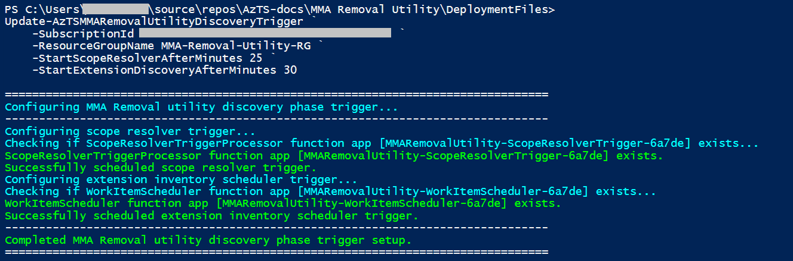
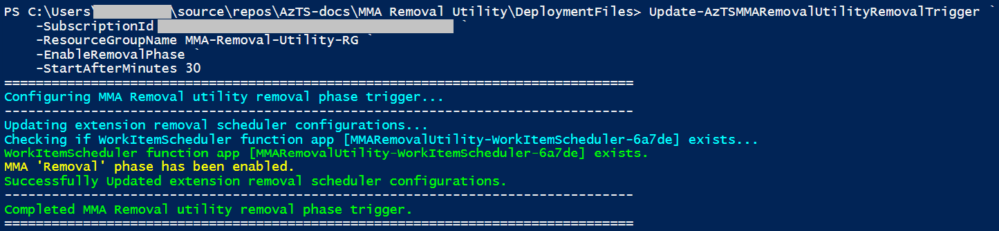

----------------------------------------------

> The Azure Tenant Security Solution (AzTS) was created by the Core Services Engineering & Operations (CSEO) division at Microsoft, to help accelerate Microsoft IT's adoption of Azure. We have shared AzTS and its documentation with the community to provide guidance for rapidly scanning, deploying and operationalizing cloud resources, across the different stages of DevOps, while maintaining controls on security and governance.
<br>AzTS is not an official Microsoft product – rather an attempt to share Microsoft CSEO's best practices with the community.

# AzTS MMA Discovery and Removal Utility

-----------------------------------------------------------------
## Overview 

AzTS MMA Discovery and Removal Utility can be used to remove MMA extension/agent from Azure Virtual Machine (VMs), Virtual Machine Scale Sets (VMSS) and Azure Arc Servers across subscriptions. Microsoft Monitoring Agent (MMA) [will be retired on 31 August 2024](https://azure.microsoft.com/en-us/updates/were-retiring-the-log-analytics-agent-in-azure-monitor-on-31-august-2024/) and users need to migrate to Azure Monitor Agent (AMA). If you have already migrated all of your mentioned resources to start using AMA for monitoring, it is recommended to remove MMA agent to avoid duplication of logs.

AzTS MMA Discovery and Removal Utility can help to remove MMA extension from Azure Virtual Machine (VMs), Virtual Machine Scale Sets (VMSS) and Azure Arc Servers which already have AMA extension present, in bulk/at tenant scale in centralized manner instead of doing it per resource manually.

## How does it work?

AzTS MMA Discovery and Removal Utility works in two phases:
1. Discovery Phase
2. Removal Phase

**1- Discovery Phase**

In this phase, it will prepare the inventory of all VM(s), VMSS(s), Azure Arc Servers and their extensions to identify, which resources have both MMA and AMA or only MMA agents installed. In next phase (i.e., 'Removal Phase'), users can choose to remove MMA extension from the resources having either both MMA and AMA agents or just MMA agent. 

It is recommended to avoid creating new VMs, VMSS and Azure Arc Servers with MMA extension or installing MMA extension on existing Azure resources after AzTS MMA Discovery and Removal utility starts processing. For this you can assign Azure policy with 'Deny' effect on your subscriptions before running this utility. Guidance for same is available [here](./MMAAgentDenyPolicyInstructions.md).

**2- Removal Phase**

Resources having both MMA and AMA agents are picked up in this phase for removal of MMA extensions. Users have the option to disable this phase, and enable/run it after validating the inventory of these resources list prepared in the Discovery phase.
Users also have the option to run this phase on resources which have just MMA agents (But recommended approach is to first migrate all dependencies to AMA agent and then remove MMA agent).

## Installation

For the single-tenant setup, please refer [here](./SingleTenantSetupInstallation.md) and for the multi-tenant setup, please refer [here](./MultiTenantSetupInstallation.md), to install and configure AzTS MMA Discovery and Removal utility.

## Schedule or Trigger

Once the installation is completed, users can choose to either run the 'Discovery phase' immediately or schedule it to run after specific time interval.

Similarly once 'Discovery phase' is completed, users can choose to either trigger 'Removal phase' immediately or schedule it to run after specific time interval.

### Schedule or Trigger Discovery phase
Discovery phase is disabled by default, users need to enable and schedule it using the command **Update-AzTSMMARemovalUtilityDiscoveryTrigger**.


> **Note:** Please validate the prerequisites [here](./Prerequisites.md). You can download the deployment package zip from [here](https://github.com/azsk/AzTS-docs/raw/main/TemplateFiles/AzTSMMARemovalUtilityDeploymentFiles.zip) and before extracting the zip file, right click on the zip file --> click on 'Properties' --> Under the General tab in the dialog box, select the 'Unblock' checkbox --> Click on 'OK' button. Extract the zip file and use **MMARemovalUtilitySetup.ps1** present in this package to run the commands mentioned in below section.

``` PowerShell
# -----------------------------------------------------------------#
# Schedule Discovery phase
# -----------------------------------------------------------------#

Update-AzTSMMARemovalUtilityDiscoveryTrigger ` 
    -SubscriptionId <HostingSubId> `
    -ResourceGroupName <HostingRGName> `
    -StartScopeResolverAfterMinutes 60 `
    -StartExtensionDiscoveryAfterMinutes 30 

```

**Sample output snapshot:**



**Parameter details:**
|Param Name|Description|Required?
|----|----|----|
|SubscriptionId| Subscription id where AzTS MMA Removal Utility solution is installed. | Yes|
|ResourceGroupName| Name of ResourceGroup where AzTS MMA Removal Utility solution is installed.| Yes|
|StartScopeResolverAfterMinutes| Time interval in minutes after which discovery phase should be triggered.| Yes (Mutually exclusive with param '-StartScopeResolverImmediatley')|
|StartScopeResolverImmediatley| Switch to trigger discovery phase immediately. Discovery phase will get started in next 2-3 minutes.| Yes (Mutually exclusive with param '-StartScopeResolverAfterMinutes')|
|StartExtensionDiscoveryAfterMinutes| Time interval in minutes after which second step (extensions discovery) of discovery phase should be triggered post first step is triggered.| Yes (Mutually exclusive with param '-StartExtensionDiscoveryImmediatley')|
|StartExtensionDiscoveryImmediatley | Switch to trigger second step (extensions discovery) of discovery phase immediately.| Yes (Mutually exclusive with param '-StartExtensionDiscoveryAfterMinutes')|

**Examples:**
``` PowerShell
# -----------------------------------------------------------------#
# Example #1: Trigger discovery phase (first step) immediately and second step after 30 minutes. 
# -----------------------------------------------------------------#

Update-AzTSMMARemovalUtilityDiscoveryTrigger ` 
    -SubscriptionId <HostingSubId> `
    -ResourceGroupName <HostingRGName> `
    -StartScopeResolverImmediatley `
    -StartExtensionDiscoveryAfterMinutes 30 

# -----------------------------------------------------------------#
# Example #2: Schedule discovery phase (first step) for after 30 mins and second step after 60 minutes. 
# -----------------------------------------------------------------#

Update-AzTSMMARemovalUtilityDiscoveryTrigger ` 
    -SubscriptionId <HostingSubId> `
    -ResourceGroupName <HostingRGName> `
    -StartScopeResolverAfterMinutes 30 `
    -StartExtensionDiscoveryAfterMinutes 60 

# -----------------------------------------------------------------#
# Example #3: Trigger second step of discovery as soon as possible. (Recommended only when first step of discovery phase is completed.) 
# -----------------------------------------------------------------#

Update-AzTSMMARemovalUtilityDiscoveryTrigger ` 
    -SubscriptionId <HostingSubId> `
    -ResourceGroupName <HostingRGName> `
    -StartExtensionDiscoveryImmediatley 

```
### Schedule or Trigger Removal phase
Removal phase is disabled by default. Users need to enable/schedule it after validating the inventory of resource list prepared in the Discovery phase. Command **Update-AzTSMMARemovalUtilityRemovalTrigger** can be used to:

1. Enable/disable removal phase
2. Trigger/Schedule removal phase

``` PowerShell
# -----------------------------------------------------------------#
# Enable and Schedule Removal phase
# -----------------------------------------------------------------#

Update-AzTSMMARemovalUtilityRemovalTrigger ` 
    -SubscriptionId <HostingSubId> `
    -ResourceGroupName <HostingRGName> `
    -StartAfterMinutes 60 `
    -EnableRemovalPhase `
    -RemovalCondition 'CheckForAMAPresence'

```

**Sample output snapshot:**




**Parameter details:**
|Param Name|Description|Required?
|----|----|----|
|SubscriptionId| Subscription id where AzTS MMA Removal Utility solution is installed. | Yes|
|ResourceGroupName| Name of ResourceGroup where AzTS MMA Removal Utility solution is installed.| Yes|
|StartAfterMinutes| Time interval in minutes after which removal phase should be triggered.| Yes (Mutually exclusive with param '-StartImmediately')|
|StartImmediately| Switch to trigger removal phase immediately. Removal phase will get started as soon as possible.| Yes (Mutually exclusive with param '-StartAfterMinutes')|
|EnableRemovalPhase| Switch to 'Enable' removal phase.| Yes (Mutually exclusive with param '-DisableRemovalPhase')|
|RemovalCondition | Configure when MMA extension should be removed. Possible values, </br>ChgeckForAMAPresence (Remove MMA extension when AMA extension already present) </br> SkipAMAPresenceCheck (Remove MMA extension irrespective of whether AMA extension is present or not) | No |
|DisableRemovalPhase | Switch to 'Disable' removal phase.| Yes (Mutually exclusive with param '-EnableRemovalPhase')|

**Examples:**
``` PowerShell
# -----------------------------------------------------------------#
# Example #1: Enable and trigger removal phase as soon as possible.
# -----------------------------------------------------------------#

Update-AzTSMMARemovalUtilityRemovalTrigger ` 
    -SubscriptionId <HostingSubId> `
    -ResourceGroupName <HostingRGName> `
    -StartImmediately `
    -EnableRemovalPhase

# -----------------------------------------------------------------#
# Example #2: Enable and schedule removal phase trigger. 
# -----------------------------------------------------------------#

Update-AzTSMMARemovalUtilityRemovalTrigger ` 
    -SubscriptionId <HostingSubId> `
    -ResourceGroupName <HostingRGName> `
    -StartAfterMinutes 30 `
    -EnableRemovalPhase

# -----------------------------------------------------------------#
# Example #3: Enable and specify removal condition to remove MMA extension irrespective of whether AMA extension is present or not.  
# -----------------------------------------------------------------#

Update-AzTSMMARemovalUtilityRemovalTrigger ` 
    -SubscriptionId <HostingSubId> `
    -ResourceGroupName <HostingRGName> `
    -StartImmediately `
    -EnableRemovalPhase `
    -RemovalCondition 'SkipAMAPresenceCheck'

# -----------------------------------------------------------------#
# Example #4: Disable removal phase.  
# -----------------------------------------------------------------#

Update-AzTSMMARemovalUtilityRemovalTrigger ` 
    -SubscriptionId <HostingSubId> `
    -ResourceGroupName <HostingRGName> `
    -DisableRemovalPhase 

```

## FAQs

### **1. At what scope(s) can the AzTS MMA Discovery and Removal utility run?** 
The AzTS MMA Discovery and Removal utility is highly flexible and configurable. It allows you to choose the desired scope(s) where you want to run the utility. You can configure it to operate at selected subscription scopes, specific management group scopes, the entire tenant, or even across multiple tenants.

### **2. What permissions does the AzTS MMA Discovery and Removal utility require?** 
To operate effectively, the AzTS MMA Discovery and Removal utility creates a remediation identity. The specific permissions required for this identity depend on the scope and context. In the case of a single tenant, a user-assigned managed identity with the 'Reader', 'Virtual Machine Contributor' and 'Azure Arc ScVmm VM Contributor' roles is used. For multi-tenant scopes, an Azure AD App/SPN is employed. It is essential to grant the appropriate permissions to this identity at the configured scopes for successful execution.

### **3. After MMA agents have been removed from all VM(s), VMSS(s) and Azure Arc Servers should I clean up the setup?**
Once all MMA agents have been successfully removed from the above Azure resources, it is recommended to perform a cleanup of the setup resources. It is important to note that while you may want to delete the setup resources, it is advisable to retain any inventory or process logs for future reference. The cleanup steps have been provided [here](./SetupCleanUp.md) in the documentation.

### **4. What's the cost of running the AzTS MMA Discovery and Removal Utility?**
Estimated average cost for a single run (both discovery and removal phase) of utility on a scope of approx 100K VMs is less than 5$.
It is important to consider that if you choose to retain inventory or process logs, the cost may increase depending on the selected retention period.

### **5. How much time AzTS MMA Discovery and Removal Utility will take to remove MMA agents?**
Estimated average time required for a single run (both discovery and removal phase) of utility on a scope of approx. 100K VMs is around 30 Mins.

### **6. How I can get list of all the Azure Virtual Machines, Virtual Machine scale sets and Azure Arc servers available in configured scope(s)?**
Resources inventory (Virtual Machines, Virtual Machine scale sets and Azure Arc servers) is collected in Log Analytics workspace. To list all resources discovered by utility, go to Log Analytics workspace created during setup --> Select Logs and run following query: 

``` KQL
Inventory_CL
| where TimeGenerated > ago(7d)
| summarize arg_max(TimeGenerated,*) by ResourceId = tolower(ResourceId)
| extend OSType = tostring(parse_json(Metadata_s).OSType)
```

### **7. How I can get list of all the VM(s), VMSS(s) and Azure Arc Servers which have both MMA & AMA agent present and are eligible for removal phase?**
Azure resources and Extensions inventory is collected in Log Analytics workspace. To list all the resources which have both MMA & AMA agent present, go to Log Analytics workspace created during setup --> Select Logs and run following query: 

For Virtual Machines (VM):

``` KQL
let timeago = timespan(7d);
let virtualMachines = Inventory_CL
| where TimeGenerated > ago(timeago)
| where ResourceType =~ "VirtualMachine"
| summarize arg_max(TimeGenerated,*) by ResourceId = tolower(ResourceId)
| extend  OSType = tostring(parse_json(Metadata_s).OSType)
| project VMResourceID = ResourceId, OSType;
let virtualMachinesExtensions = Inventory_CL
| where TimeGenerated > ago(timeago)
| where ResourceType =~ "VMExtension" and Source_s =~ "AzTS_05_VMExtensionInventoryProcessor"
| summarize arg_max(TimeGenerated,*) by ResourceId = tolower(ResourceId)
| extend VMResourceID = tolower(substring(ResourceId,0,indexof(ResourceId, '/', 0, -1, 9 )))
| extend ExtensionType = tostring(parse_json(Metadata_s).ExtensionType)
| project ResourceId, VMResourceID, ExtensionType;
let virtualMachinesWithBothExtensions = virtualMachines
| join kind=leftouter (virtualMachinesExtensions) on VMResourceID
| summarize Extensions = make_list(ExtensionType) by VMResourceID, OSType
|where (Extensions contains "MicrosoftMonitoringAgent" or Extensions contains "OmsAgentForLinux") and (Extensions contains "AzureMonitorWindowsAgent" or Extensions contains "AzureMonitorLinuxAgent");
virtualMachinesWithBothExtensions
```

For Virtual Machines Scale Set (VMSS):

``` KQL
let timeago = timespan(7d);
let virtualMachineScaleSets = Inventory_CL
| where TimeGenerated > ago(timeago)
| where ResourceId contains "microsoft.compute/virtualmachinescalesets"
| summarize arg_max(TimeGenerated,*) by ResourceId = tolower(ResourceId)
| extend  OSType = tostring(parse_json(Metadata_s).OSType)
| project VMResourceID = ResourceId, OSType;
let vmssExtensions = Inventory_CL
| where TimeGenerated > ago(timeago)
| where ResourceType =~ "VMExtension" and Source_s =~ "AzTS_05_VMExtensionInventoryProcessor"
| summarize arg_max(TimeGenerated,*) by ResourceId = tolower(ResourceId)
| extend VMResourceID = tolower(substring(ResourceId,0,indexof(ResourceId, '/', 0, -1, 9 )))
| extend ExtensionType = tostring(parse_json(Metadata_s).ExtensionType)
| project ResourceId, VMResourceID, ExtensionType;
let vmssExtensions = virtualMachineScaleSets
| join kind=leftouter (vmssExtensions) on VMResourceID
| summarize Extensions = make_list(ExtensionType) by VMResourceID, OSType
|where (Extensions contains "MicrosoftMonitoringAgent" or Extensions contains "OmsAgentForLinux") and (Extensions contains "AzureMonitorWindowsAgent" or Extensions contains "AzureMonitorLinuxAgent");
vmssWithBothExtensions
```

For Azure Arc Servers:

``` KQL
let timeago = timespan(7d);
let virtualMachines = Inventory_CL
| where TimeGenerated > ago(timeago)
| where ResourceId contains "microsoft.hybridcompute"
| summarize arg_max(TimeGenerated,*) by ResourceId = tolower(ResourceId)
| extend  OSType = tostring(parse_json(Metadata_s).OSType)
| project VMResourceID = ResourceId, OSType;
let VirtualMachinesExtensions = Inventory_CL
| where TimeGenerated > ago(timeago)
| where ResourceType =~ "VMExtension" and Source_s =~ "AzTS_05_VMExtensionInventoryProcessor"
| summarize arg_max(TimeGenerated,*) by ResourceId = tolower(ResourceId)
| extend VMResourceID = tolower(substring(ResourceId,0,indexof(ResourceId, '/', 0, -1, 9 )))
| extend ExtensionType = tostring(parse_json(Metadata_s).ExtensionType)
| project ResourceId, VMResourceID, ExtensionType;
let virtualMachinesWithBothExtensions = virtualMachines
| join kind=leftouter (VirtualMachinesExtensions) on VMResourceID
| summarize Extensions = make_list(ExtensionType) by VMResourceID, OSType
|where (Extensions contains "MicrosoftMonitoringAgent" or Extensions contains "OmsAgentForLinux") and (Extensions contains "AzureMonitorWindowsAgent" or Extensions contains "AzureMonitorLinuxAgent");
virtualMachinesWithBothExtensions
```


### **8. How I can get list of all the VMs, VMSS and Azure Arc Servers which have MMA agent present?**
Azure resource data and Extensions inventory is collected in Log Analytics workspace. To list all the resources which have both MMA agent present, go to Log Analytics workspace created during setup --> Select Logs and run following query: 

For all resourcess having MMA agent present:

``` KQL
let timeago = timespan(7d);
let virtualMachines = Inventory_CL
| where TimeGenerated > ago(timeago)
| summarize arg_max(TimeGenerated,*) by ResourceId = tolower(ResourceId)
| extend  OSType = tostring(parse_json(Metadata_s).OSType)
| project VMResourceID = ResourceId, OSType;
let virtualMachinesMMAExtensions = Inventory_CL
| where TimeGenerated > ago(timeago)
| where ResourceType =~ "VMExtension" and Source_s =~ "AzTS_05_VMExtensionInventoryProcessor"
| summarize arg_max(TimeGenerated,*) by ResourceId = tolower(ResourceId)
| extend VMResourceID = tolower(substring(ResourceId,0,indexof(ResourceId, '/', 0, -1, 9 )))
| extend ExtensionType = tostring(parse_json(Metadata_s).ExtensionType)
| where ExtensionType =~ "OmsAgentForLinux" or ExtensionType =~ "MicrosoftMonitoringAgent"
| project ResourceId, VMResourceID, ExtensionType, ExtensionResourceId = ResourceId;
let virtualMachinesWithMMAExtensions = virtualMachines
| join kind=inner  (virtualMachinesMMAExtensions) on VMResourceID
| project VMResourceID, OSType, ExtensionResourceId, ExtensionType;
virtualMachinesWithMMAExtensions
```

For VM(s) having MMA agent present:

``` KQL
let timeago = timespan(7d);
let virtualMachines = Inventory_CL
| where TimeGenerated > ago(timeago)
| where ResourceType =~ "VirtualMachine"
| summarize arg_max(TimeGenerated,*) by ResourceId = tolower(ResourceId)
| extend  OSType = tostring(parse_json(Metadata_s).OSType)
| project VMResourceID = ResourceId, OSType;
let virtualMachinesMMAExtensions = Inventory_CL
| where TimeGenerated > ago(timeago)
| where ResourceType =~ "VMExtension" and Source_s =~ "AzTS_05_VMExtensionInventoryProcessor"
| summarize arg_max(TimeGenerated,*) by ResourceId = tolower(ResourceId)
| extend VMResourceID = tolower(substring(ResourceId,0,indexof(ResourceId, '/', 0, -1, 9 )))
| extend ExtensionType = tostring(parse_json(Metadata_s).ExtensionType)
| where ExtensionType =~ "OmsAgentForLinux" or ExtensionType =~ "MicrosoftMonitoringAgent"
| project ResourceId, VMResourceID, ExtensionType, ExtensionResourceId = ResourceId;
let virtualMachinesWithMMAExtensions = virtualMachines
| join kind=inner  (virtualMachinesMMAExtensions) on VMResourceID
| project VMResourceID, OSType, ExtensionResourceId, ExtensionType;
virtualMachinesWithMMAExtensions
```

For VMSS(s) having MMA agent present:

``` KQL
let timeago = timespan(7d);
let vmss = Inventory_CL
| where TimeGenerated > ago(timeago)
| where ResourceId contains "microsoft.compute/virtualmachinescalesets"
| summarize arg_max(TimeGenerated,*) by ResourceId = tolower(ResourceId)
| extend  OSType = tostring(parse_json(Metadata_s).OSType)
| project VMResourceID = ResourceId, OSType;
let vmssMMAExtensions = Inventory_CL
| where TimeGenerated > ago(timeago)
| where ResourceType =~ "VMExtension" and Source_s =~ "AzTS_05_VMExtensionInventoryProcessor"
| summarize arg_max(TimeGenerated,*) by ResourceId = tolower(ResourceId)
| extend VMResourceID = tolower(substring(ResourceId,0,indexof(ResourceId, '/', 0, -1, 9 )))
| extend ExtensionType = tostring(parse_json(Metadata_s).ExtensionType)
| where ExtensionType =~ "OmsAgentForLinux" or ExtensionType =~ "MicrosoftMonitoringAgent"
| project ResourceId, VMResourceID, ExtensionType, ExtensionResourceId = ResourceId;
let vmssWithMMAExtensions = vmss
| join kind=inner  (vmssMMAExtensions) on VMResourceID
| project VMResourceID, OSType, ExtensionResourceId, ExtensionType;
vmssWithMMAExtensions
```

For Azure Arc Server(s) having MMA agent present:

``` KQL
let timeago = timespan(7d);
let virtualMachines = Inventory_CL
| where TimeGenerated > ago(timeago)
| where ResourceId contains "microsoft.hybridcompute"
| summarize arg_max(TimeGenerated,*) by ResourceId = tolower(ResourceId)
| extend  OSType = tostring(parse_json(Metadata_s).OSType)
| project VMResourceID = ResourceId, OSType;
let virtualMachinesMMAExtensions = Inventory_CL
| where TimeGenerated > ago(timeago)
| where ResourceType =~ "VMExtension" and Source_s =~ "AzTS_05_VMExtensionInventoryProcessor"
| summarize arg_max(TimeGenerated,*) by ResourceId = tolower(ResourceId)
| extend VMResourceID = tolower(substring(ResourceId,0,indexof(ResourceId, '/', 0, -1, 9 )))
| extend ExtensionType = tostring(parse_json(Metadata_s).ExtensionType)
| where ExtensionType =~ "OmsAgentForLinux" or ExtensionType =~ "MicrosoftMonitoringAgent"
| project ResourceId, VMResourceID, ExtensionType, ExtensionResourceId = ResourceId;
let virtualMachinesWithMMAExtensions = virtualMachines
| join kind=inner  (virtualMachinesMMAExtensions) on VMResourceID
| project VMResourceID, OSType, ExtensionResourceId, ExtensionType;
virtualMachinesWithMMAExtensions
```


### **9. Installation command is failing with error message, 'The deployment MMARemovalenvironmentsetup-20233029T103026 failed with error(s). Showing 1 out of 1 error(s). Status Message:  (Code:BadRequest). What should I do now?**

We have observed this intermittent issue with App service deployment, please re-run the installation command with same parameter values. Command should proceed without any error in next attempt. If this doesn't help, please reach out to support team at aztssup@microsoft.com or log an issue.

### **10. Extension removal phase progress tile on Monitoring dashboards shows some failures, what should I do to fix those?**

Progress tile groups failures by error code, some known error code, reason and next steps to resolve them are listed below: 

|Error Code|Description/Reason|Next steps
|----|----|----|
|AuthorizationFailed| Remediation Identity don't have enough permission to perform 'Extension delete' operation on VM(s), VMSS, Azure Arc Servers.| Grant 'VM Contributor' role to Remediation Identity on VM(s) and Grant 'Azure Arc ScVmm VM Contributor' role to Remediation Identity on VMSS and re-run removal phase.
|OperationNotAllowed| Resource(s) are in deallocated state or Lock is applied on the resource(s).| Turn on failed resource(s)/Remove Lock and re-run removal phase.|

Error details are collected in Log Analytics workspace. For more details on error, go to Log Analytics workspace created during setup --> Select Logs and run following query: 

``` KQL
let timeago = timespan(7d);
InventoryProcessingStatus_CL
| where TimeGenerated > ago(timeago)
| where ResourceType =~ "VMExtension" and Source_s == "AzTS_07_ExtensionRemovalProcessor"
| where ProcessingStatus_s !~ "Initiated"
| summarize arg_max(TimeGenerated,*) by tolower(ResourceId)
| project ResourceId, ProcessingStatus_s, ProcessErrorDetails_s
```
