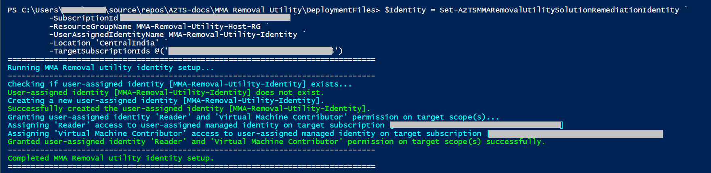
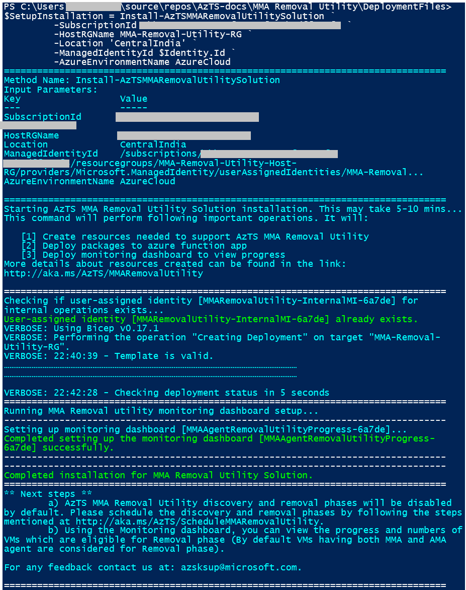
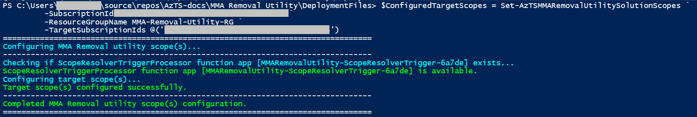

# **Steps to install single-tenant AzTS MMA Removal Utility**

In this section, we will walk you through the steps of setting up AzTS MMA Removal Utility. This setup can take up to 30 minutes.

Before initiating the setup please validate the prerequisites, download and extract deployment package using the link [here](./Prerequisites.md).

There are two methods to setup AzTS MMA Removal Utility solution: 

- [**Method A:**](#method-a) This method provides granular level details of the different steps involved in setting up AzTS MMA Removal Utility. Setup process is divided into five steps and a separate command is provided for each step.

- [**Method B:**](#method-b) Provides a faster way to install AzTS MMA Removal Utility solution by wrapping up multiple steps into a single (consolidated) command. 
____________________________________________________________________

## **Method A:**

> _**Note:** Please validate the prerequisites [here](./Prerequisites.md) and then proceed with the below steps_

This setup is divided into five steps: 

1. [Load setup script](#step-1-of-5-load-setup-script)
2. [Installing required Az modules](#step-2-of-5-installing-required-az-modules)
3. [Setup remediation user-assigned managed identity](#step-3-of-5-setup-remediation-user-assigned-managed-identity)
4. [Setup installation](#step-4-of-5-setup-installation)
5. [Configure target scopes](#step-5-of-5-configure-target-scopes)

Let's start!


### **Step 1 of 5. Load setup script**
 
 1. Point the current path to the folder containing the extracted deployment package and load the setup script for AzTS MMA Removal Utility <br/>


  ``` PowerShell
  CD "<LocalExtractedFolderPath>\AzTSMMARemovalUtilityDeploymentFiles"

  # Load AzTS MMA Removal Utility Setup script in session
  . ".\MMARemovalUtilitySetup.ps1"

  # Note: Make sure you copy '.' present at the start of the line.
  ```
[Back to top…](#steps-to-install-single-tenant-azts-mma-removal-utility)

<br/>

### **Step 2 of 5. Installing required Az modules**

Az modules contain cmdlet to deploy Azure resources. These cmdlets are used to create AzTS MMA Removal Utility resources with the help of templates. Install the required Az PowerShell Modules using the below commands. 
For more details of Az Modules refer [link](https: //docs.microsoft.com/en-us/powershell/azure/install-az-ps).

Please make sure Step 1 has been completed successfully before proceeding with this step. <br/>
``` PowerShell
# Install required modules
Set-Prerequisites
```

[Back to top…](#steps-to-install-single-tenant-azts-mma-removal-utility)

<br/>

### **Step 3 of 5. Setup remediation user-assigned managed identity**  
The AzTS MMA Removal Utility solution works in 2 phases: 
1. Discovers VMs, VMSS and Azure Arc Servers and there Extensions to identify the services from which MMA Agent will be removed for which setup requires ***Reader*** access on the scope being configured.
2. Removes MMA Extensions from the eligible Azure services for which setup requires ***Virtual Machine Contributor*** and ***Azure Arc ScVmm VM Contributor*** access on the scopes being configured. Scopes Configured can be a Tenant/ManagementGroup(s)/Subscription(s) or both ManagementGroup(s) and Subscription(s).

For executing the above phases, setup requires a [User-Assigned Managed Identity (MI)](https: //docs.microsoft.com/en-us/azure/active-directory/managed-identities-azure-resources/overview) (identity part of the setup) which has 'Reader and Virtual Machine Contributor' access on target scopes configured.

> _Note:_
> 1. _For creation of remediation user-assigned MI setup (preferably in a separate new RG), user running this script should have **Owner** access on the subscription in which MI is being created. If the MI is being created in an existing RG, user should have **Contributor** access on the RG._
> 
> 2. _For granting remediation user-assigned MI with above mentioned roles on the target scopes, user running this script should have **User Access Administrator (UAA) or Owner** on the configuredscopes. For example, the setup is being configured for a subscription 'X', user should be having UAA role assignment on the subscription 'X' to be able to grant the remediation user-assigned MI with the required permissions._
>

Before setting up the remediation user-assigned MI, please log in to Azure Account using the following PowerShell command.

``` PowerShell

# Connect to AzAccount
# Note: Tenant Id *must* be specified when connecting to AzAccount

$TenantId = "<TenantId>"
Connect-AzAccount -Tenant $TenantId
```

Setup the remediation user-assigned MI using Set-AzTSMMARemovalUtilitySolutionRemediationIdentity command. When this command is run successfully, the remediation user-assigned MI is created and the created identity is granted with 'Reader' and 'Virtual Machine Contributor' permissions on target scopes.

``` PowerShell
# -----------------------------------------------------------------#
# Create remediation user-assigned MI
# -----------------------------------------------------------------#

$Identity = Set-AzTSMMARemovalUtilitySolutionRemediationIdentity ` 
         -SubscriptionId <MIHostingSubId> `
         -ResourceGroupName <MIHostingRGName> `
         -UserAssignedIdentityName <MIName> `
         -Location <Location> `
         -TargetSubscriptionIds @("<SubId1>","<SubId2>","<SubId3>") `
         -TargetManagementGroupNames @("<MGName1>","<MGName2>","<MGName3>") `
        [-TenantScope]

# -----------------------------------------------------------------#
# Identity resource id will be accessed in the execution of next steps 
# -----------------------------------------------------------------#
$Identity.Id
```

**Sample output snapshot:**



**Parameter details:**
|Param Name|Description|Required?
|----|----|----|
|SubscriptionId| Subscription id in which remediation MI needs to be created.| Yes|
|ResourceGroupName| Resource group name in which remediation MI needs to be created. Default value is 'AzTS-MMARemovalUtility-RG'| No|
|Location| Location in which remediation MI needs to be created. For better performance, we recommend hosting the MI and AzTS MMA Removal Utility setup in the same location. Default value is 'EastUS2'| No|
|UserAssignedIdentityName| Name of the remediation MI.| Yes|
|TargetSubscriptionIds| List of target subscription id(s) on which AzTS MMA Removal Utility setup will run.| No|
|TargetManagementGroupNames| List of target management group name(s) on which AzTS MMA Removal Utility setup will run.| No|
|TenantScope| Switch for tenant scope in case you want to scope the run at tenant level, which helps in assigning appropriate roles at the tenant scope for the tenant id from the context of user.| No|

[Back to top…](#steps-to-install-single-tenant-azts-mma-removal-utility)

<br/>

### **Step 4 of 5. Setup installation**  
Setup installation can be done using Install-AzTSMMARemovalUtilitySolution. This command will install the MMA Removal Utility which helps to discover and remove MMA agent installed on Virtual Machines.

> _Note:_
> _For creation of the setup in a new RG, user running this script should have **Owner** access on the subscription in which setup is being created. If the setup is being installed in an existing RG, user should have **Owner** access on the RG._
> 

Install-AzTSMMARemovalUtilitySolution PowerShell command will perform the following operations: 

- Prompts and collects onboarding details for usage telemetry collection based on user preference.
- Creates the RG if it does not exist.
- Creates or updates the resources with MIs assigned.
- Creates or updates the monitoring dashboard.

``` PowerShell
# -----------------------------------------------------------------#
# Setup installation
# -----------------------------------------------------------------#

$SetupInstallation = Install-AzTSMMARemovalUtilitySolution ` 
         -SubscriptionId <HostingSubId> `
         -HostRGName <HostingRGName> `
         -Location <Location> `
         -ManagedIdentityId $Identity.Id `
         -AzureEnvironmentName <AzureEnvironmentName>
```

**Sample output snapshot:**



**Parameter details:**
|Param Name|Description|Required?
|----|----|----|
|SubscriptionId| Subscription id in which setup needs to be created.| Yes|
|HostRGName| Resource group name in which setup needs to be created. Default value is 'AzTS-MMARemovalUtility-Host-RG'| No|
|Location| Location in which setup needs to be created. For better performance, we recommend hosting the MI and AzTS MMA Removal Utility setup in the same location. Default value is 'EastUS2'| No|
|ManagedIdentityId| ResourceId of the remediation MI.| Yes|
|AzureEnvironmentName| Azure environment in which MMA Removal Utility Solution needs to be installed. The acceptable values for this parameter are: AzureCloud, AzureGovernmentCloud. Default value is 'AzureCloud'| No|

[Back to top…](#steps-to-install-single-tenant-azts-mma-removal-utility)

<br/>

### **Step 5 of 5. Configure target scopes**
Target scopes can be configured using Set-AzTSMMARemovalUtilitySolutionScopes. This command will configure the target scopes on which MMA Removal Utility setup will run.

``` PowerShell
# -----------------------------------------------------------------#
# Configure target scopes
# -----------------------------------------------------------------#

$ConfiguredTargetScopes = Set-AzTSMMARemovalUtilitySolutionScopes ` 
         -SubscriptionId <HostingSubId> `
         -ResourceGroupName <HostingRGName> `
         -TargetSubscriptionIds @("<SubId1>","<SubId2>","<SubId3>") `
         [-TenantScope]
```

**Sample output snapshot:**



**Parameter details:**
|Param Name|Description|Required?
|----|----|----|
|SubscriptionId| Subscription id in which setup is installed.| Yes|
|ResourceGroupName| Resource group name in which setup is installed.| Yes|
|TargetSubscriptionIds| List of target subscription id(s) to be configured as part of target scopes.| No|
|TenantScope| Switch for tenant scope in case you want to scope the run at tenant level, configures scope at tenant level using tenant id from the context of user.| No|

> _**Note:** If **-TenantScope** flag is passed then solution will fetch VM,VMSS and Azure Arc servers and extension inventory for all the subscriptions in tenant on which 'Remediation Identity' has access._

[Back to top…](#steps-to-install-single-tenant-azts-mma-removal-utility)

<br/>

> _**Note:** AzTS MMA Removal Utility discovery and removal phases will be disabled by default. Please schedule the discovery and removal phases by following the steps mentioned [here](./README.md#schedule-or-trigger)._

<br/>
___________________________________________________________________

## **Method B:**

> _**Note:** Please validate the prerequisites [here](./Prerequisites.md) and then proceed with the below steps_

This setup is divided into two steps: 

1. [Load consolidated script](#step-1-of-2-load-consolidated-setup-script)
4. [Consolidated installation](#step-2-of-2-consolidated-installation)

Let's start!


### **Step 1 of 2. Load consolidated setup script**
 
1. Point current path to deployment folder and load AzTS MMA Removal Utility consolidated setup script <br/>

  ``` PowerShell
  # Point current path to extracted folder location and then load the setup script from the deployment folder 

  CD "<LocalExtractedFolderPath>\AzTSMMARemovalUtilityDeploymentFiles"

  # Load AzTS MMA Removal Utility Setup script in session
  . ".\MMARemovalUtilitySetupConsolidated.ps1"

  # Note: Make sure you copy '.' present at the start of the line.
  ```
[Back to top…](#steps-to-install-single-tenant-azts-mma-removal-utility)

<br/>

### **Step 2 of 2. Consolidated installation**  
Consolidated installation can be done using Install-AzTSMMARemovalUtilitySolutionConsolidated.

The AzTS MMA Removal Utility solution works in 2 phases: 
1. Discovers VMs, VMSS and Azure Arc Servers and there Extensions to identify the services from which MMA Agent will be removed for which setup requires ***Reader*** access on the scope being configured.
2. Removes MMA Extensions from the eligible VMs, VMSS and Azure Arc Servers for which setup requires ***Virtual Machine Contributor*** and ***Azure Arc ScVmm VM Contributor*** access on the scopes being configured. Scopes Configured can be a Tenant/ManagementGroup(s)/Subscription(s) or both ManagementGroup(s) and Subscription(s).

For executing the above phases, setup requires a [User-Assigned Managed Identity (MI)](https: //docs.microsoft.com/en-us/azure/active-directory/managed-identities-azure-resources/overview) (identity part of the setup) which has 'Reader and Virtual Machine Contributor' access on target scopes configured.

> _Note:_
> 1. _For creation of remediation user-assigned MI and the setup (preferably in separate new RGs), user running this script should have **Owner** access on the subscription in which MI is being created. If the setup is being done in an existing RG, user should have **Owner** access on the RG._
> 
> 2. _For granting remediation user-assigned MI with above mentioned roles on the target scopes, user running this script should have **User Access Administrator (UAA) or Owner** on the configured scopes. For example, the setup is being configured for a subscription 'x', user should be having UAA role assignment on the subscription 'x' to be able to grant the remediated user-assigned MI with the required permissions._
>

Install-AzTSMMARemovalUtilitySolutionConsolidated PowerShell command will perform the following operations: 

- Installs required Az modules.
- Setup remediation user-assigned managed identity.
- Prompts and collects onboarding details for usage telemetry collection based on user preference.
- Creates or updates the RG.
- Creates or updates the resources with MIs assigned.
- Creates or updates the monitoring dashboard.
- Configures target scopes.

Before executing the installation command, please log in to Azure Account using the following PowerShell command.

``` PowerShell

# Connect to AzAccount
# Note: Tenant Id *must* be specified when connecting to AzAccount

$TenantId = "<TenantId>"
Connect-AzAccount -Tenant $TenantId
```

``` PowerShell
# -----------------------------------------------------------------#
# Consolidated installation
# -----------------------------------------------------------------#

$SetupInstallation = Install-AzTSMMARemovalUtilitySolutionConsolidated `
         -RemediationIdentityHostSubId <MIHostingSubId> `
         -RemediationIdentityHostRGName <MIHostingRGName> `
         -RemediationIdentityName <MIName> `
         -TargetSubscriptionIds @("<SubId1>","<SubId2>","<SubId3>") `
         -TargetManagementGroupNames @("<MGName1>","<MGName2>","<MGName3>") `
         -TenantScope `
         -SubscriptionId <HostingSubId> `
         -HostRGName <HostingRGName> `
         -Location <Location> `
         -AzureEnvironmentName <AzureEnvironmentName>
```

**Parameter details:**
|Param Name|Description|Required?
|----|----|----|
|RemediationIdentityHostSubId| Subscription id in which remediation MI needs to be created.| Yes|
|RemediationIdentityHostRGName| Resource group name in which remediation MI needs to be created. Default value is 'AzTS-MMARemovalUtility-RG'| No|
|RemediationIdentityName| Name of the remediation MI.| Yes|
|TargetSubscriptionIds| List of target subscription id(s) on which AzTS MMA Removal Utility Setup will run.| No|
|TargetManagementGroupNames| List of target management group name(s) on which AzTS MMA Removal Utility Setup will run.| No|
|TenantScope| Switch for tenant scope in case you want to scope the run at tenant level, configures scope and assigns appropriate roles at the tenant level using tenant id from the context of user.| No|
|SubscriptionId| Subscription id in which setup is installed.| Yes|
|HostRGName| Resource group name in which remediation MI needs to be created. Default value is 'AzTS-MMARemovalUtility-Host-RG'| No|
|Location| Location in which AzTS MMA Removal Utility setup is created. Default value is 'EastUS2'| No|
|AzureEnvironmentName| Azure environment in which MMA Removal Utility Solution needs to be installed. The acceptable values for this parameter are: AzureCloud, AzureGovernmentCloud. Default value is 'AzureCloud'| No|

[Back to top…](#steps-to-install-single-tenant-azts-mma-removal-utility)

<br/>

> _**Note:** AzTS MMA Removal Utility discovery and removal phases will be disabled by default. Please schedule the discovery and removal phases by following the steps mentioned [here](./README.md#schedule-or-trigger)._

<br/>
